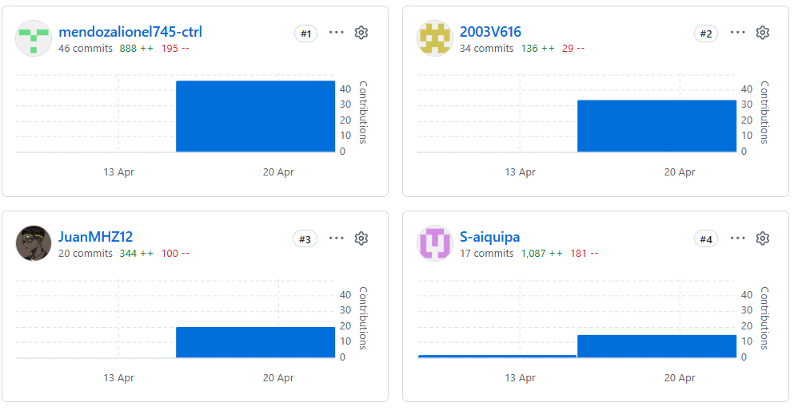
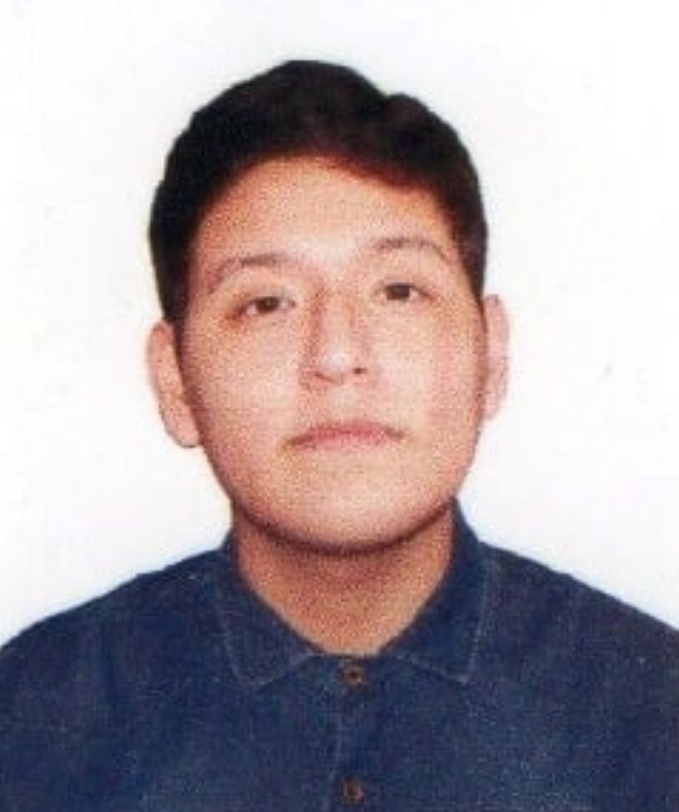

  

  <strong>UNIVERSIDAD PERUANA DE CIENCIAS APLICADAS</strong>

  <strong>INGENIERÍA DE SOFTWARE</strong>

  <strong>CICLO 5</strong>

  <strong>1ASI0730 – APLICACIONES WEB</strong>

  <strong>SECCIÓN: 10215</strong>

  <strong>PROFESOR: VELASQUEZ NUÑEZ, ANGEL AUGUSTO</strong>

 

  <strong>“INFORME DEL TRABAJO FINAL”</strong>

 

  <strong>NOMBRE DE STARTUP:</strong> 
  <strong>MINETRACK</strong>

 

  <strong>INTEGRANTES:</strong>

  <table style="margin-left: auto; margin-right: auto;">
    <thead>
      <tr>
        <th>APELLIDOS Y NOMBRES</th>
        <th>CÓDIGO</th>
      </tr>
    </thead>
    <tbody>
      <tr>
        <td>SANCHEZ ARENAS, ZAHIR EMMANUEL</td>
        <td>U202315324</td>
      </tr>
      <tr>
        <td>MENDOZA MACHOA, LIONEL</td>
        <td>U202417433</td>
      </tr>
      <tr>
        <td>MEZA HUANACUNE, JUAN JOSÉ</td>
        <td>U202320574</td>
      </tr>
      <tr>
        <td>AIQUIPA POMA, SEBASTIAN ANDRES</td>
        <td></td>
      </tr>
      <tr>
        <td>FIGUEROA SANCHEZ, ALVARO</td>
        <td>U20231A269</td>
      </tr>
      <tr>
        <td>MOLINA UMERES, NESTOR MARCIAL</td>
        <td></td>
      </tr>
    </tbody>
  </table>

 

  <strong> LIMA 24 DE ABRIL DEL 2026</strong>

### Registro de Versiones del Informe

| Versión | Fecha | Autor | Descripción de modificación |
| :--- | :--- | :--- | :--- |
| Tb1 | 24/04/2026 | -SANCHEZ ARENAS, ZAHIR EMMANUEL  -MENDOZA MACHOA, LIONEL  -MEZA HUANACUNE, JUAN JOSÉ  -AIQUIPA POMA, SEBASTIAN ANDRES  -FIGUEROA SANCHEZ, ALVARO  -MOLINA UMERES, NESTOR MARCIAL | Entrega inicial del informe TB1  que incluye especificación de requisitos y diseño inicial del sistema y los capitulos 1, 2, 3, 4 y 5. |

## Project Report Collaboration Insights

URL del repositorio del Projecto:

https://github.com/minedev-upc-startup/upc-pre-202610-1asi0730-report.git

A continuación, se presentan las evidencias del trabajo colaborativo realizado por los integrantes del equipo en el repositorio de GitHub.

# Índice del Informe del Trabajo Final - MineTrack

# Tabla de contenidos

## [Capítulo I: Introducción](Capitulo_1.md)

- [1.1 Startup Profile](Capitulo_1.md#11-startup-profile)
  - [1.1.1 Descripción de la Startup](Capitulo_1.md#111-descripción-de-la-startup)
  - [1.1.2 Perfiles de integrantes del equipo](Capitulo_1.md#112-perfiles-de-integrantes-del-equipo)
- [1.2 Solution Profile](Capitulo_1.md#12-solution-profile)
  - [1.2.1 Antecedentes y problemática](Capitulo_1.md#121-antecedentes-y-problemática)
  - [1.2.2 Lean UX Process](Capitulo_1.md#122-lean-ux-process)
    - [1.2.2.1 Lean UX Problem Statements](Capitulo_1.md#1221-lean-ux-problem-statements)
    - [1.2.2.2 Lean UX Assumptions](Capitulo_1.md#1222-lean-ux-assumptions)
    - [1.2.2.3 Lean UX Hypothesis Statements](Capitulo_1.md#1223-lean-ux-hypothesis-statements)
    - [1.2.2.4 Lean UX Canvas](Capitulo_1.md#1224-lean-ux-canvas)
- [1.3 Segmentos Objetivo](Capitulo_1.md#13-segmentos-objetivo)

## [Capítulo II: Requirements Elicitation & Analysis](Capitulo_2.md)

- [2.1 Competidores](Capitulo_2.md#21-competidores)
  - [2.1.1 Análisis competitivo](Capitulo_2.md#211-análisis-competitivo)
  - [2.1.2 Estrategias y tácticas frente a competidores](Capitulo_2.md#212-estrategias-y-tácticas-frente-a-competidores)
- [2.2 Entrevistas](Capitulo_2.md#22-entrevistas)
  - [2.2.1 Diseño de entrevistas](Capitulo_2.md#221-diseño-de-entrevistas)
  - [2.2.2 Registro de entrevistas](Capitulo_2.md#222-registro-de-entrevistas)
  - [2.2.3 Análisis de entrevistas](Capitulo_2.md#223-análisis-de-entrevistas)
- [2.3 Needfinding](Capitulo_2.md#23-needfinding)
  - [2.3.1 User Personas](Capitulo_2.md#231-user-personas)
  - [2.3.2 User Task Matrix](Capitulo_2.md#232-user-task-matrix)
  - [2.3.3 User Journey Mapping](Capitulo_2.md#233-user-journey-mapping)
  - [2.3.4 Empathy Mapping](Capitulo_2.md#234-empathy-mapping)
- [2.4 Big Picture EventStorming](Capitulo_2.md#24-big-picture-eventstorming)
- [2.5 Ubiquitous Language](Capitulo_2.md#25-ubiquitous-language)

## [Capítulo III: Requirements Specification](Capitulo_3.md)

- [3.1 User Stories](Capitulo_3.md#31-user-stories)
- [3.2 Impact Mapping](Capitulo_3.md#32-impact-mapping)
- [3.3 Product Backlog](Capitulo_3.md#33-product-backlog)

## [Capítulo IV: Product Design](Capitulo_4.md)

- [4.1 Style Guidelines](Capitulo_4.md#41-style-guidelines)
  - [4.1.1 General Style Guidelines](Capitulo_4.md#411-general-style-guidelines)
  - [4.1.2 Web Style Guidelines](Capitulo_4.md#412-web-style-guidelines)
- [4.2 Information Architecture](Capitulo_4.md#42-information-architecture)
  - [4.2.1 Organization Systems](Capitulo_4.md#421-organization-systems)
  - [4.2.2 Labeling Systems](Capitulo_4.md#422-labeling-systems)
  - [4.2.3 SEO Tags and Meta Tags](Capitulo_4.md#423-seo-tags-and-meta-tags)
  - [4.2.4 Searching Systems](Capitulo_4.md#424-searching-systems)
  - [4.2.5 Navigation Systems](Capitulo_4.md#425-navigation-systems)
- [4.3 Landing Page UI Design](Capitulo_4.md#43-landing-page-ui-design)
  - [4.3.1 Landing Page Wireframe](Capitulo_4.md#431-landing-page-wireframe)
  - [4.3.2 Landing Page Mock-up](Capitulo_4.md#432-landing-page-mock-up)
- [4.4 Web Applications UX/UI Design](Capitulo_4.md#44-web-applications-uxui-design)
  - [4.4.1 Web Applications Wireframes](Capitulo_4.md#441-web-applications-wireframes)
  - [4.4.2 Web Applications Wireflow Diagrams](Capitulo_4.md#442-web-applications-wireflow-diagrams)
  - [4.4.3 Web Applications Mock-ups](Capitulo_4.md#443-web-applications-mock-ups)
  - [4.4.4 Web Applications User Flow Diagrams](Capitulo_4.md#444-web-applications-user-flow-diagrams)
- [4.5 Web Applications Prototyping](Capitulo_4.md#45-web-applications-prototyping)
- [4.6 Domain-Driven Software Architecture](Capitulo_4.md#46-domain-driven-software-architecture)
  - [4.6.1 Design-Level EventStorming](Capitulo_4.md#461-design-level-eventstorming)
  - [4.6.2 Software Architecture Context Diagram](Capitulo_4.md#462-software-architecture-context-diagram)
  - [4.6.3 Software Architecture Container Diagrams](Capitulo_4.md#463-software-architecture-container-diagrams)
  - [4.6.4 Software Architecture Components Diagrams](Capitulo_4.md#464-software-architecture-components-diagrams)
- [4.7 Software Object-Oriented Design](Capitulo_4.md#47-software-object-oriented-design)
  - [4.7.1 Class Diagrams](Capitulo_4.md#471-class-diagrams)
- [4.8 Database Design](Capitulo_4.md#48-database-design)
  - [4.8.1 Database Diagrams](Capitulo_4.md#481-database-diagrams)

## [Capítulo V: Product Implementation, Validation & Deployment](Capitulo_5.md)

- [5.1 Software Configuration Management](Capitulo_5.md#51-software-configuration-management)
  - [5.1.1 Software Development Environment Configuration](Capitulo_5.md#511-software-development-environment-configuration)
  - [5.1.2 Source Code Management](Capitulo_5.md#512-source-code-management)
  - [5.1.3 Source Code Style Guide & Conventions](Capitulo_5.md#513-source-code-style-guide--conventions)
  - [5.1.4 Software Deployment Configuration](Capitulo_5.md#514-software-deployment-configuration)
- [5.2 Landing Page, Services & Applications Implementation](Capitulo_5.md#52-landing-page-services--applications-implementation)
  - [5.2.1 Sprint 1](Capitulo_5.md#521-sprint-1)
    - [5.2.1.1 Sprint Planning 1](Capitulo_5.md#5211-sprint-planning-1)
    - [5.2.1.2 Aspect Leaders and Collaborators](Capitulo_5.md#5212-aspect-leaders-and-collaborators)
    - [5.2.1.3 Sprint Backlog 1](Capitulo_5.md#5213-sprint-backlog-1)
    - [5.2.1.4 Development Evidence for Sprint Review](Capitulo_5.md#5214-development-evidence-for-sprint-review)
    - [5.2.1.5 Execution Evidence for Sprint Review](Capitulo_5.md#5215-execution-evidence-for-sprint-review)
    - [5.2.1.6 Services Documentation Evidence for Sprint Review](Capitulo_5.md#5216-services-documentation-evidence-for-sprint-review)
    - [5.2.1.7 Software Deployment Evidence for Sprint Review](Capitulo_5.md#5217-software-deployment-evidence-for-sprint-review)
    - [5.2.1.8 Team Collaboration Insights during Sprint](Capitulo_5.md#5218-team-collaboration-insights-during-sprint)
- [5.3 Validation Interviews](Capitulo_5.md#53-validation-interviews)
  - [5.3.1 Diseño de Entrevistas](Capitulo_5.md#531-diseño-de-entrevistas)
  - [5.3.2 Registro de Entrevistas](Capitulo_5.md#532-registro-de-entrevistas)
  - [5.3.3 Evaluaciones según heurísticas](Capitulo_5.md#533-evaluaciones-según-heurísticas)
- [5.4 Video About-the-Product](Capitulo_5.md#54-video-about-the-product)

## [Conclusiones](Conclusiones_bibliografia.md#conclusiones)

- [Conclusiones y recomendaciones](Conclusiones_bibliografia.md#conclusiones-y-recomendaciones)
- [Video About-the-Team](Conclusiones_bibliografia.md#video-about-the-team)

## Student Outcome

| Criterio Específico | Acciones Realizadas | Conclusiones |
| :--- | :--- | :--- |
| **Participa en equipos multidisciplinarios con eficacia, eficiencia y objetividad, en el marco de un proyecto en soluciones de ingeniería de software.** | **---------- TB1 ----------**  **Juan Jose Mesa:** Lideró la coordinación del equipo y la estructuración inicial del proyecto en GitHub.  **Lionel Mendoza:** Responsable de la especificación de requisitos, elaborando las Epics, User Stories y el Product Backlog técnico.  **Alvaro Figueroa:** Desarrolló el modelado de la arquitectura y los diagramas de contexto/contenedores para MineTrack.  **Sebastian Aiquipa,  y Nestor Molina:** Realizaron el análisis competitivo, diseño de entrevistas y la elaboración de los perfiles de usuario (User Personas). | **---------- TB1 ----------**  Nuestro Brainstorm demostró una sólida capacidad para trabajar de manera colaborativa y efectiva, utilizando herramientas virtuales como Microsoft Teams y Discord para coordinar y ejecutar las tareas del proyecto.   La comunicación fluida y el compromiso con los objetivos permitieron un avance significativo en la fase de elicitación de requisitos, logrando un diseño ordenado y alineado con las necesidades del sector minero. La participación activa de cada miembro fue fundamental para resolver problemas técnicos durante las sesiones virtuales y cumplir estrictamente con los plazos establecidos. |

# 1. Introducción

## 1.1. Startup Profile

### 1.1.1. Descripción de la Startup

MineTrack es una startup tecnológica impulsada por el grupo Brainstorm que busca revolucionar la gestión de activos en el sector minero. Nuestra solución consiste en una plataforma web integral diseñada para centralizar tanto la comercialización como el monitoreo técnico de maquinaria pesada.

A diferencia de los sistemas de venta tradicionales, MineTrack extiende su valor agregado al ciclo de vida operativo del equipo. Mediante la integración de dispositivos IoT con sensores especializados, la plataforma captura datos críticos en tiempo real, tales como niveles de vibración, presión y temperatura.

Nuestra misión es proporcionar a distribuidores y empresas de servicios de mantenimiento una herramienta avanzada que permita:

- Gestionar el ciclo completo de ventas y garantías de forma simplificada.
- Visualizar el estado de salud de las máquinas a través de dashboards interactivos.
- Reducir los tiempos de inactividad mediante alertas tempranas y recomendaciones de mantenimiento preventivo basadas en datos reales.

Con este enfoque, MineTrack no solo facilita la adquisición de maquinaria, sino que se convierte en el centro de control técnico indispensable para optimizar la productividad y seguridad en las operaciones mineras.

**Misión**
Transformar la gestión de activos en la industria minera mediante una plataforma web que integre procesos de venta eficientes y monitoreo técnico avanzado basado en dispositivos IoT. Buscamos optimizar la operatividad de nuestros clientes, facilitando la toma de decisiones preventivas y minimizando los tiempos de inactividad de la maquinaria pesada a través de datos precisos en tiempo real.

**Visión**
Consolidarnos para el año 2030 como la plataforma líder en el sector minero regional, reconocida por nuestra capacidad de convertir datos complejos en soluciones predictivas que impulsen una minería más inteligente, segura y de alta productividad a través de la innovación tecnológica constante.

### 1.1.2 Perfiles de integrantes del equipo

| Imagen                                                              | Información                                                                                                           | Descripción                                                                                                                                                                                                                                                                                                                                                                                             |
| ------------------------------------------------------------------- | --------------------------------------------------------------------------------------------------------------------- | ------------------------------------------------------------------------------------------------------------------------------------------------------------------------------------------------------------------------------------------------------------------------------------------------------------------------------------------------------------------------------------------------------- |
|                      | **Nombre:** Lionel Mendoza Machoa   **Código:** U202417433   **Rol:** Trabajador del equipo                  | Con conocimientos sobre lenguajes como: C++, Python, Html, Css y Java Script, con enfoque en trabajos de equipo.    **Evidencia TB1:** Avances del capitulo 1, Avanzes en el analisis competitivo y el user persona, Desarollo de las user stories y el product backlog                                                                                                                           |
|  | **Nombre:** Sebastian Andres Aiquipa Poma   **Código:** u201916755   **Rol:** Diseño de la aplicacion     | Con conocimientos en lenguajes como: C++, Python, Html, Css y Java Script, con enfoque en trabajos de equipo. Ademas de contar en experiencia en desarrollo en proyectos React y Node.js    **Evidencia TB1:** Avances del capitulo 1, Desarrollo del Product Design                                                                                                                              |
|                  | **Nombre:** Juan José Meza Huanacune   **Código:** U202320574   **Rol:** Frontend Engineer & API Owner       | Responsable del desarrollo del frontend del sistema MineTrack, incluyendo la implementación de APIs y la gestión de datos para el monitoreo de maquinaria mediante IoT. Participa en la estructuración del sistema y en la integración de la lógica del proyecto.    **Evidencia TB1:** configuración del entorno backend, estructura inicial del sistema y definición de endpoints.              |
|                      | **Nombre:** Alvaro Figueroa Sanchez   **Código:** U2023A269   **Rol:** Backend Developer & System Designer   | Responsable del diseño y desarrollo de los diagramas UML del sistema, así como de la estructuración del backend orientado a la gestión de usuarios, ventas de maquinaria y monitoreo de equipos.    **Evidencia TB1:** elaboración de diagramas de clases (User Management, Machinery Sales y Equipment Monitoring), configuración del entorno de desarrollo y modelado de la lógica del sistema. |
|                                                                | **Nombre:** Zahir Emmanuel Sanchez Arenas   **Código:** U202315324   **Rol:** Trabajador del equipo   | Desarrollador de software con más de 4 años de experiencia trabajando con .NET + Angular. Especializado en arquitectura en microservicios e implementar las mejores prácticas de desarrollo. Busco implementar soluciones tecnológicas a problemas cotidianos del día a día.
                                                                                                                                                                                                                                                                                                        

## 1.2. Solution Profile

### 1.2.1. Antecedentes y problemática (Uso de la técnica The 5'W's y 2'H's)

Presentación del modelo de las preguntas 5Ws y 2Hs con las que se analizaron los antecedentes y la problemática que abarca nuestro proyecto MineTrack.

| LAS 5W y 2H | Pregunta | Descripción |
| :--- | :--- | :--- |
| **Who?** | **¿Quién es afectado?** | Los distribuidores de maquinaria pesada  que enfrentan pérdidas por garantías mal aplicadas y los jefes de soporte técnico (como Javier Espinoza) encargados de la operatividad en campamentos mineros. |
| **What?** | **¿Cuál es el problema?** | La fragmentación y falta de visibilidad técnica real en el monitoreo de equipos. El 100% de la gestión de inventario y seguimiento técnico se basa en procesos manuales y comunicación informal (WhatsApp/Excel). |
| **Where?** | **¿Dónde surge el problema?** | Se origina en los yacimientos mineros remotos, donde la maquinaria opera bajo condiciones críticas de presión y calor, y se extiende a las oficinas de soporte donde la falta de datos centralizados impide un control eficiente. |
| **When?** | **¿Cuándo sucede el problema?** | Se manifiesta durante el tiempo de inactividad (downtime) no programado y en los procesos de reclamo de garantía, donde no existe evidencia histórica de sensores para determinar si la falla fue por error humano o defecto de fábrica. |
| **Why?** | **¿Cuál es la causa del problema?** | La causa principal es el desaprovechamiento de la tecnología IoT y telemetría. Los sistemas actuales no integran variables físicas críticas (calor, presión, vibración) en una plataforma única, forzando una respuesta reactiva ante averías. |
| **How?** | **¿Cómo se maneja actualmente?** | Mediante macros de Excel y reportes manuales que demandan seguimiento constante. El personal técnico debe viajar de 2 a 3 horas por tramo solo para realizar diagnósticos visuales que podrían ser remotos. |
| **How Much?** | **¿Cuánto es el impacto?** | El impacto económico es severo debido a los altos costos por hora de máquina parada. Además, se generan gastos logísticos innecesarios por traslados técnicos y pérdidas por reparaciones preventivas no detectadas a tiempo. |

### 1.2.2. Lean UX Process

#### 1.2.2.1. Lean UX Problem Statements

El estado actual de la gestión de maquinaria minera es ineficiente debido a que los procesos de venta y el monitoreo técnico están desconectados. Esto causa que los distribuidores y empresas de mantenimiento tengan dificultades para dar seguimiento a las garantías y al estado real de los equipos, lo que resulta en paradas no programadas y altos costos operativos.

Nuestra solución, MineTrack, busca resolver este problema integrando un catálogo de ventas con un dashboard de monitoreo IoT en tiempo real. Sabremos que hemos tenido éxito cuando veamos que las empresas de mantenimiento utilicen nuestra plataforma como su centro de control técnico principal y se reduzcan los tiempos de inactividad de las máquinas.

**Domain:** Gestión y monitoreo técnico de maquinaria pesada en el sector minero.

**Current State & Pain Points:**
La gestión operativa actual está fragmentada. Los distribuidores y jefes de mantenimiento dependen de procesos manuales (Excel) y comunicación informal (WhatsApp) para el seguimiento de activos. Esta falta de visibilidad técnica real resulta en paradas de equipo no programadas y una gestión deficiente de las garantías, donde no se puede determinar si una falla fue por error humano o defecto mecánico. El personal técnico pierde entre 4 a 6 horas semanales en traslados innecesarios solo para diagnósticos visuales.

**Gap & Opportunity:**
Existe una brecha tecnológica entre la operación en campo y la administración comercial. MineTrack identifica la oportunidad de integrar telemetría IoT multimarca en una plataforma centralizada para transformar el mantenimiento reactivo en proactivo, reduciendo drásticamente el downtime.

**Vision & Strategy:**
Nuestra plataforma MineTrack se define como el centro de control técnico integral que centraliza la comercialización y el monitoreo IoT en tiempo real (calor, presión, vibración). Sabremos que hemos tenido éxito cuando los distribuidores reduzcan sus costos por garantías injustificadas en un 15% y las empresas de mantenimiento disminuyan el downtime operativo en un 20%.

**Initial Segment:** Distribuidores de maquinaria pesada y empresas de servicios de mantenimiento en Lima con operaciones en provincias.

---

#### 1.2.2.2. Lean UX Assumptions

**Business Assumptions:**
1. Creemos que los distribuidores necesitan una herramienta de auditoría técnica para validar reclamos de garantía basados en datos reales y no en reportes manuales.
2. Creemos que la integración de variables críticas como presión hidráulica reducirá las fallas catastróficas por sobreesfuerzo del operario.
3. Asumimos que la centralización de contratos y stock en una nube pública reducirá el tiempo administrativo de ventas en un 30%.
4. Asumimos que el modelo SaaS será rentable al disminuir los costos logísticos de traslados técnicos innecesarios.

**User Assumptions:**
1. Los Jefes de Mantenimiento (como Javier Espinoza) prefieren recibir alertas preventivas al celular antes de que la máquina se detenga por completo.
2. Los Distribuidores (como Manuel Sanchez) están dispuestos a compartir datos en vivo con sus clientes como un valor agregado para cerrar más ventas.
3. Los operarios de cabina necesitan interfaces simplificadas de alto contraste para visualizar datos críticos en entornos de alta vibración.

---

#### 1.2.2.3. Lean UX Hypothesis Statements

1. **Hipótesis de Garantías:** Creemos que **reduciremos los costos por garantías injustificadas en un 15%** si los **Distribuidores** logran **validar el uso técnico correcto de la máquina** mediante el **Módulo de Auditoría de Historial de Sensores**.
2. **Hipótesis de Disponibilidad:** Creemos que **disminuiremos el downtime minero en un 20%** si los **Jefes de Mantenimiento** logran **intervenir antes de una rotura crítica** mediante el **Sistema de Alertas Preventivas al celular**.
3. **Hipótesis Logística:** Creemos que **optimizaremos el tiempo de mano de obra técnica en 5 horas semanales** si los **Técnicos de Campo** logran **diagnosticar fallas de forma remota** mediante el **Dashboard de Monitoreo IoT en tiempo real**.
4. **Hipótesis de Fidelización:** Creemos que **aumentaremos la confianza y cierre de ventas** si los **Gestores de Flota** obtienen **transparencia total de sus activos** mediante el **Módulo de Visualización de Salud de Flota**.

#### 1.2.2.4. Lean UX Canvas

#### 1.3. Segmentos objetivo

1. **Distribuidores de Maquinaria Pesada:** Organizaciones que venden maquinaria compleja y requieren un control riguroso de sus activos para gestionar garantías, contratos de servicio post-venta y conocer el estado técnico de las máquinas entregadas.
2. **Empresas de Servicios de Mantenimiento:** Compañías especializadas en soporte técnico y prevención de fallas contratadas para asegurar la continuidad operativa, utilizando la plataforma como su centro de control técnico predictivo mediante IoT.
