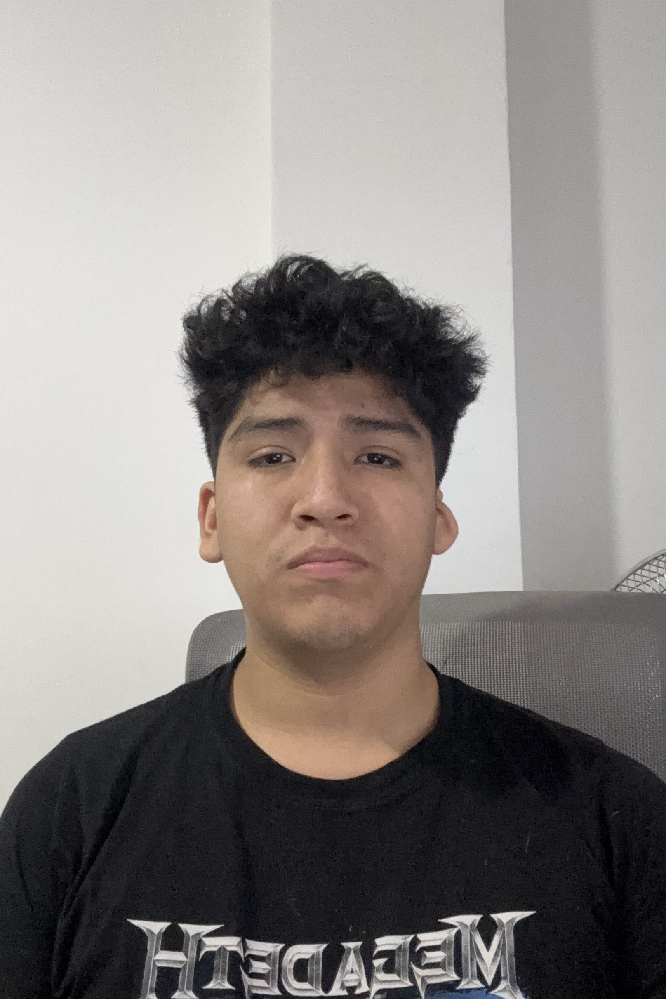

# Capítulo I: Introducción

## 1.1. Startup Profile

### 1.1.1. Descripción de la Startup

MineTrack es una startup tecnológica impulsada por el grupo Brainstorm que busca transformar el acceso a maquinaria pesada en el sector minero y de construcción en el Perú. Nuestra solución es una plataforma web B2B de alquiler de maquinaria pesada que conecta a Propietarios de equipos —empresas e independientes que poseen activos de alto valor sin querer asumir la carga operativa de administrarlos— con Clientes —empresas mineras y constructoras que requieren maquinaria por proyecto o temporada sin necesidad de adquirirla.

A diferencia de los canales informales y fragmentados que dominan el mercado actual (WhatsApp, contactos personales, brokers sin plataforma), MineTrack centraliza el catálogo, el proceso de solicitud y aprobación de alquiler, y el seguimiento de la flota en un único entorno digital. Como diferenciador estratégico, la plataforma incorpora una capa de telemetría IoT que permite monitorear en tiempo real las variables críticas de los equipos alquilados —temperatura, vibración y presión hidráulica— generando valor tanto para el Propietario, que puede demostrar el uso correcto de sus activos, como para el Cliente, que puede anticipar fallas y planificar el mantenimiento preventivo.

**Misión**
Democratizar el acceso a maquinaria pesada en el sector minero y de construcción del Perú, conectando de forma segura y eficiente a Propietarios de equipos con empresas que los necesitan, a través de una plataforma digital que simplifica el proceso de alquiler e integra monitoreo IoT en tiempo real para garantizar la disponibilidad y el uso responsable de cada activo.

**Visión**
Consolidarnos para el año 2030 como el marketplace líder de alquiler de maquinaria pesada en América Latina, reconocidos por transformar un mercado históricamente informal en un ecosistema digital transparente, seguro y basado en datos, donde cada máquina genera su máximo valor económico y cada operación minera tiene acceso a los activos que necesita, cuando los necesita.

---

### 1.1.2. Perfiles de integrantes del equipo

| Imagen | Información | Descripción |
| :--- | :--- | :--- |
|  | **Nombre:** Lionel Mendoza Machoa   **Código:** U202417433   **Rol:** Profiles & Maintenance BC Developer | Con conocimientos en C++, Python, HTML, CSS y JavaScript, con enfoque en trabajo colaborativo y desarrollo de software orientado a objetos. Aporta al equipo habilidades en diseño de requisitos y especificación de funcionalidades.    **TB1:** Responsable de la especificación de Epics y User Stories, elaboración del Product Backlog, y redacción del Capítulo 1 y análisis competitivo.    **AV2:** Lideró el desarrollo del Dashboard IoT en el Frontend, integrando Chart.js para la visualización de telemetría de temperatura y presión hidráulica en tiempo real. |
|  | **Nombre:** Sebastian Andres Aiquipa Poma   **Código:** U201916755   **Rol:** Tech Lead & IAM/Rentals BC Developer | Con experiencia en desarrollo full-stack con Vue 3, ASP.NET Core, y arquitectura Domain-Driven Design. Especializado en configuración de entornos de CI/CD, integración frontend-backend y liderazgo técnico en equipos ágiles.    **TB1:** Responsable del Product Design (Capítulo 4), diseño de wireframes y mockups, configuración de repositorios de la organización GitHub `minedev-upc-startup` y despliegue de la Landing Page en GitHub Pages.    **AV2:** Lideró la arquitectura y configuración del backend en ASP.NET Core (.NET 10), implementación del Bounded Context IAM y Rentals, configuración de Entity Framework Core con MySQL, y despliegue del backend en Render. Coordinó la integración entre las capas frontend y backend. |
|  | **Nombre:** Juan José Meza Huanacune   **Código:** U202320574   **Rol:** Frontend Engineer & IoT BC Developer | Responsable del desarrollo del Frontend del sistema MineTrack, con experiencia en Vue 3, PrimeVue y Chart.js. Participa en la estructuración del sistema y en la integración de la lógica de negocio en las vistas.    **TB1:** Responsable de la coordinación del equipo, configuración del entorno de desarrollo del Frontend y estructura inicial de componentes.    **AV2:** Co-lideró el desarrollo del Dashboard IoT y el Command Center de telemetría, integrando datos simulados de sensores (temperatura, vibración y presión) en gráficas interactivas con Chart.js y componentes PrimeVue. |
|  | **Nombre:** Alvaro Figueroa Sanchez   **Código:** U20231A269   **Rol:** Telemetry BC Developer & System Designer | Responsable del diseño de los diagramas UML del sistema y del modelado de arquitectura. Con experiencia en diseño de sistemas orientados a objetos y documentación técnica.    **TB1:** Elaboración de los diagramas de clases (User Management, Machinery y Equipment Monitoring), configuración del entorno de desarrollo y modelado de la lógica del sistema en los diagramas de contexto y contenedores.    **AV2:** Lideró la implementación de las vistas transaccionales del Frontend (registro de maquinaria, filtros del catálogo y modal de solicitudes de alquiler), y condujo las entrevistas de validación y la evaluación de usabilidad por heurísticas. |
|  | **Nombre:** Zahir Emmanuel Sanchez Arenas   **Código:** U202315324   **Rol:** IAM BC Developer | Desarrollador de software con más de 4 años de experiencia en el stack .NET. Especializado en implementación de arquitecturas de microservicios, autenticación basada en JWT y buenas prácticas de desarrollo backend.    **TB1:** Contribuyó al diseño de la arquitectura de software y la configuración del entorno backend inicial.    **AV2:** Co-lideró la implementación del Bounded Context IAM en ASP.NET Core, incluyendo el sistema de registro, autenticación JWT, middleware de autorización y la corrección de bugs de integración entre el backend y el frontend. |
|  | **Nombre:** Nestor Marcial Molina Umeres   **Código:** U202317631   **Rol:** Machinery BC Developer | Con conocimientos en desarrollo de software y patrones de diseño. Aporta al equipo habilidades en implementación de bounded contexts siguiendo el patrón DDD definido por el equipo.    **TB1:** Contribuyó al análisis competitivo, diseño de entrevistas y elaboración de perfiles de usuario (User Personas).    **AV2:** Lideró la implementación del Bounded Context Machinery en el backend (ASP.NET Core), aplicando el patrón de capas Domain/Application/Infrastructure/Interfaces, configuración de EF Core con conversores de valor para `Photos` y `Specs`, y definición de la entidad `Machine` con `MachineStatus` como constante de cadena. |

---

## 1.2. Solution Profile

### 1.2.1. Antecedentes y problemática

El mercado de alquiler de maquinaria pesada en el sector minero y de construcción en el Perú opera hoy principalmente de forma informal. Los propietarios de equipos —desde empresas contratistas hasta operadores independientes— carecen de un canal estructurado para publicar su disponibilidad y gestionar contratos de arrendamiento. Del lado contrario, los directores de obra y jefes de operaciones de empresas mineras y constructoras coordinan la búsqueda de maquinaria alquilada a través de redes de contactos y mensajes de WhatsApp, sin visibilidad sobre la disponibilidad real, el estado técnico de los equipos o las condiciones contractuales.

La siguiente tabla presenta el análisis de antecedentes y problemática mediante la técnica de las 5W y 2H:

| Las 5W y 2H | Pregunta | Descripción |
| :--- | :--- | :--- |
| **Who?** | **¿Quién es afectado?** | Dos actores principales: los **Propietarios de maquinaria pesada** (empresas contratistas, independientes con equipos de alto valor) que no logran monetizar sus activos de forma constante por la falta de un canal formal; y los **Clientes** (empresas mineras y constructoras) que necesitan maquinaria alquilada para proyectos específicos y no tienen un marketplace confiable donde consultar disponibilidad y condiciones. |
| **What?** | **¿Cuál es el problema?** | La ausencia de un marketplace digital formal para el alquiler de maquinaria pesada en el Perú obliga a ambos actores a depender de intermediarios informales, contactos personales y canales no estructurados. Esto genera ineficiencia, opacidad en precios, riesgo contractual para ambas partes, y la imposibilidad de verificar el estado técnico real de los equipos antes y durante el alquiler. |
| **Where?** | **¿Dónde surge el problema?** | En todo el ecosistema de proyectos mineros y de construcción del Perú, desde las sedes administrativas de Lima hasta los campamentos en Arequipa, Cajamarca y Pasco, donde la necesidad de equipar una operación rápidamente choca con la falta de oferta organizada y verificable. |
| **When?** | **¿Cuándo sucede el problema?** | Al inicio de cada proyecto o licitación, cuando la empresa necesita movilizar equipos que no posee. También durante la ejecución del proyecto, cuando un equipo falla y la empresa necesita un reemplazo urgente sin tiempo para procesos informales de búsqueda. |
| **Why?** | **¿Cuál es la causa del problema?** | La causa raíz es la fragmentación del mercado: no existe una plataforma neutral que centralice la oferta de propietarios y la demanda de clientes, que estandarice los contratos y que permita evaluar el estado técnico de los equipos antes de comprometerse con un alquiler. |
| **How?** | **¿Cómo se maneja actualmente?** | A través de redes de contactos personales, grupos de WhatsApp, corredores informales sin plataforma digital, y contratos en papel sin trazabilidad. El proceso de verificación técnica del equipo depende de visitas presenciales al campamento, lo que implica desplazamientos de 2 a 3 horas por tramo solo para un diagnóstico visual. |
| **How Much?** | **¿Cuánto es el impacto?** | El impacto económico es doble: el Propietario pierde días de ingresos por equipos ociosos que no logra arrendar por falta de visibilidad; el Cliente incurre en sobrecostos por equipos que fallan sin previo aviso y por los tiempos muertos que genera la búsqueda de un reemplazo. El costo de una hora de máquina parada en operaciones mineras se estima en miles de dólares. |

---

### 1.2.2.1. Lean UX Problem Statements

#### Problem Statement 1: Informalidad en el alquiler de maquinaria pesada

El mercado actual de alquiler de maquinaria pesada en el Perú se gestiona principalmente mediante canales informales como redes de contactos, WhatsApp y acuerdos verbales. Esta situación afecta a propietarios de maquinaria pesada y a empresas mineras o constructoras, quienes enfrentan dificultades para publicar, encontrar, comparar y alquilar equipos de forma segura.

#### Problem Statement 2: Falta de trazabilidad y monitoreo del activo arrendado

Las soluciones existentes no integran un flujo transaccional completo con monitoreo IoT en tiempo real. Por ello, durante el periodo de alquiler, los propietarios tienen poca visibilidad sobre el estado, ubicación y uso de sus equipos, mientras que los clientes no cuentan con información técnica confiable del activo arrendado.

#### Problem Statement 3: Brecha que aborda MineTrack

MineTrack abordará esta brecha mediante un marketplace B2B para el alquiler de maquinaria pesada, integrando catálogo, solicitud, aprobación, contrato y monitoreo IoT. La solución conectará propietarios y clientes mediante un proceso digital formalizado que busca reducir riesgos, mejorar la confianza y facilitar la gestión del alquiler.

#### Alcance inicial

El enfoque inicial estará dirigido a propietarios de maquinaria pesada con flota disponible para arrendar en Lima y operaciones en provincias, así como a empresas mineras y constructoras de mediana escala que necesitan maquinaria por proyecto sin adquirirla.

---

### 1.2.2.2. Lean UX Assumptions

#### Business Assumptions

1. Creemos que los Propietarios de maquinaria necesitan un canal digital para publicar la disponibilidad de sus equipos y recibir solicitudes de alquiler formales, reduciendo la dependencia de contactos personales y acuerdos verbales.

2. Creemos que las empresas mineras y constructoras están dispuestas a pagar por acceder a maquinaria verificada con historial técnico disponible, disminuyendo el riesgo de utilizar equipos en condiciones inadecuadas al inicio de un proyecto.

3. Creemos que la integración de telemetría IoT durante el periodo de alquiler será un diferenciador clave que incrementará la confianza entre Propietarios y Clientes al proporcionar trazabilidad técnica en tiempo real.

4. Creemos que un modelo de negocio basado en una comisión por alquiler completado, sin costos fijos iniciales, facilitará la adopción de la plataforma por parte de Propietarios con poca experiencia en soluciones digitales.

5. Creemos que centralizar el catálogo, el proceso de solicitud, la aprobación y los contratos dentro de una única plataforma reducirá significativamente el tiempo necesario para completar un proceso de alquiler.

---

#### User Assumptions

1. Creemos que los Propietarios prefieren una plataforma donde puedan administrar directamente qué equipos publicar, establecer tarifas y definir las condiciones de alquiler sin depender de intermediarios.

2. Creemos que los Clientes priorizan la confiabilidad técnica, el historial de mantenimiento y el estado operativo de la maquinaria antes que el precio al momento de seleccionar un equipo para un proyecto.

3. Creemos que los Propietarios están dispuestos a compartir la información de telemetría en tiempo real de sus equipos durante el periodo de alquiler como evidencia del uso adecuado del activo.

4. Creemos que los Clientes necesitan una interfaz sencilla e intuitiva que les permita visualizar el estado de sus solicitudes y contratos en tiempo real, evitando la necesidad de realizar seguimiento mediante llamadas o mensajes.

5. Creemos que tanto Propietarios como Clientes prefieren acceder a la plataforma mediante una aplicación web desde computadoras de escritorio durante sus actividades laborales, debido a que la mayor parte de la gestión del alquiler se realiza en oficinas o centros de operaciones.

---

#### 1.2.2.3. Lean UX Hypothesis Statements

1. **Hipótesis de Disponibilidad de Flota:** Creemos que **reduciremos el tiempo de inactividad de la flota de Propietarios en un 30%** si los **Propietarios** logran **publicar sus máquinas disponibles y recibir solicitudes de alquiler formalizadas** mediante el **Catálogo público y el módulo de gestión de solicitudes de MineTrack**.

2. **Hipótesis de Acceso a Maquinaria:** Creemos que **los Clientes podrán contratar maquinaria verificada en menos de 48 horas** si los **Clientes** logran **filtrar el catálogo, consultar el estado técnico de cada equipo y enviar una solicitud de alquiler formal** mediante el **Catálogo de Máquinas con filtros y el flujo de Solicitud de Alquiler de MineTrack**.

3. **Hipótesis de Monitoreo IoT:** Creemos que **aumentaremos la confianza de ambas partes en el proceso de alquiler** si los **Propietarios y Clientes** logran **visualizar en tiempo real las variables críticas del equipo arrendado (temperatura, vibración y presión hidráulica)** mediante el **Dashboard de Monitoreo IoT del Command Center de MineTrack**.

4. **Hipótesis de Reducción de Downtime:** Creemos que **reduciremos el downtime no programado de equipos en alquiler en un 20%** si los **Clientes** logran **detectar anomalías técnicas antes de que se produzca una falla catastrófica** mediante el **Sistema de Alertas Preventivas basado en umbrales configurables de telemetría IoT**.

---

#### 1.2.2.4. Lean UX Canvas

<!-- > **Nota para TB2:** Actualizar la imagen del Lean UX Canvas para reflejar el modelo de marketplace de alquiler, con los segmentos Propietario y Cliente, las hipótesis revisadas y los criterios de éxito actualizados. -->

---

## 1.3. Segmentos objetivo

Nuestro proyecto se enfoca en dos segmentos principales dentro del ecosistema minero y de construcción peruano, identificados como los actores clave del marketplace de alquiler de maquinaria pesada:

### 1.3.1. Segmento 1: Propietarios de Maquinaria Pesada

Este segmento comprende a empresas contratistas e independientes que poseen activos de alto valor —excavadoras, cargadores frontales, volquetes, perforadoras, tractores— y buscan generar ingresos continuos arrendándolos sin asumir la carga administrativa y operativa de gestionar contratos, seguimiento técnico y facturación de forma manual.

**Características Demográficas:**

- **Ubicación:** Sedes administrativas principalmente en Lima (distritos como Ate, Callao, Lurín y San Isidro) con equipos desplegados en zonas mineras (Arequipa, Cajamarca, Pasco, Cusco).
- **Perfil del Usuario Principal:** Gerentes de flota, Jefes de equipos y propietarios directos de maquinaria contratista, con formación técnica en Ingeniería Mecánica o Administración, entre 30 y 55 años.
- **Nivel Tecnológico:** Manejo intermedio de herramientas digitales. Familiarizados con WhatsApp, correo electrónico y hojas de cálculo, pero sin experiencia en plataformas especializadas de gestión de activos.
- **Motivación central:** Maximizar la tasa de ocupación de su flota y reducir los periodos de ociosidad entre contratos.

**Información Estadística de Sustento:**

- Según datos del Ministerio de Energía y Minas, el sector minero peruano concentra más de 5,000 unidades de maquinaria pesada activa en operación, con una alta rotación de contratos de arrendamiento entre proyectos.
- Los Propietarios entrevistados estiman que sus equipos permanecen ociosos entre el 20% y el 35% del tiempo por falta de un canal formal para encontrar arrendatarios, lo que representa pérdidas directas de ingresos potenciales.
- El 100% de los propietarios entrevistados gestionan sus alquileres actualmente a través de contactos personales o intermediarios informales, sin contrato digital ni trazabilidad técnica del uso del equipo.

---

### 1.3.2. Segmento 2: Empresas Mineras y Constructoras

Este segmento comprende a las empresas mineras y constructoras de mediana escala que necesitan maquinaria pesada para la ejecución de proyectos específicos, sin necesidad —ni capacidad financiera inmediata— de adquirirla. Son organizaciones con operaciones en campo que requieren acceso rápido a equipos verificados, condiciones contractuales claras y visibilidad técnica del activo durante el periodo de uso.

**Características Demográficas:**

- **Ubicación:** Oficinas de planificación y licitación en Lima, con operaciones en campamentos mineros y obras de construcción a nivel nacional.
- **Perfil del Usuario Principal:** Directores de Obra, Jefes de Operaciones y Coordinadores de Equipos de empresas mineras y constructoras, entre 28 y 50 años, con formación en Ingeniería de Minas, Civil o Mecánica.
- **Nivel Tecnológico:** Usuario habitual de plataformas de gestión de proyectos (SAP, ERPs locales) y herramientas colaborativas, con apertura a adoptar nuevas soluciones digitales que reduzcan fricción operativa.
- **Motivación central:** Acceder rápidamente a maquinaria disponible y técnicamente confiable que minimice el riesgo de paradas no programadas durante la ejecución de un proyecto.

**Información Estadística de Sustento:**

- Los Clientes entrevistados reportaron que el proceso de conseguir una máquina alquilada a través de canales informales les toma entre 3 y 7 días hábiles, incluyendo llamadas, visitas presenciales para verificar el estado del equipo y negociación de condiciones.
- El costo promedio de una hora de máquina parada en operaciones mineras de mediana escala se estima entre USD 500 y USD 2,000, dependiendo del tipo de equipo y la etapa del proyecto, lo que convierte la disponibilidad técnica del activo en una prioridad de primer orden.
- El 80% de los Clientes entrevistados declaró haber tenido al menos una experiencia negativa en los últimos 12 meses por recibir un equipo en condiciones técnicas deficientes, sin posibilidad de reclamar al no contar con evidencia objetiva del estado inicial del activo.
