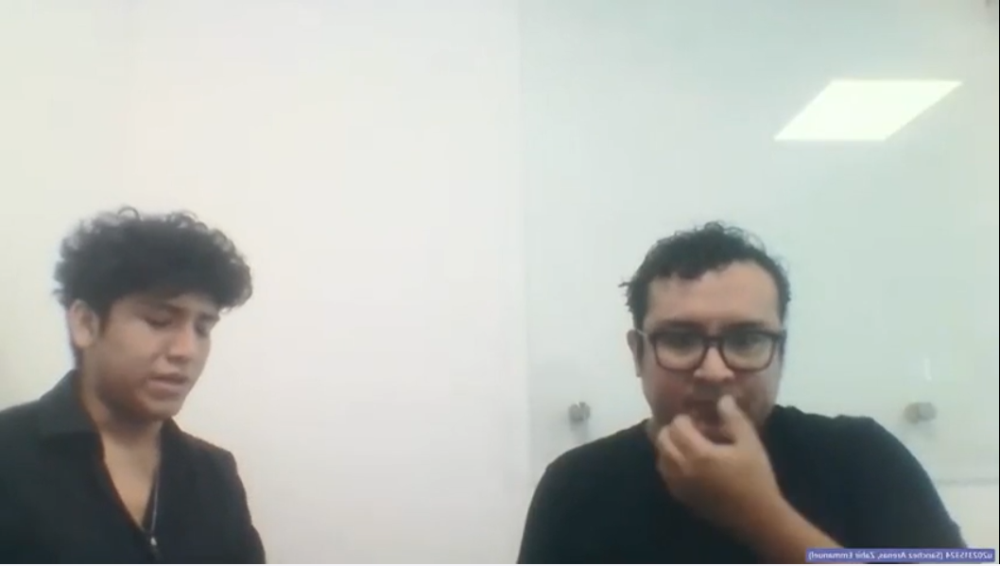
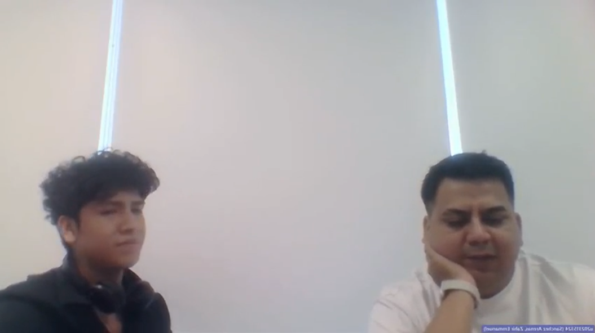
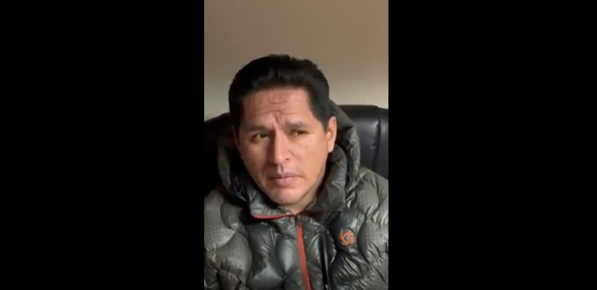

## 2.1. Competidores

### 2.1.1. Análisis competitivo

#### Competidores Directos
1. **Trackunit:** Plataforma de telemática agnóstica para maquinaria pesada que recolecta datos de sensores para optimizar el tiempo de actividad y proporcionar una visión centralizada de la flota independientemente del fabricante.
2. **Hexagon Mining (Asset Health):** Suite tecnológica para la "mina conectada" especializada en monitorización de condiciones en tiempo real mediante sensores IoT y análisis predictivo para fallas en componentes críticos.
3. **VisionLink (Caterpillar):** Estándar de gestión de flotas para equipos Caterpillar que permite rastrear ubicación, uso de combustible y salud de la máquina a través de códigos de falla y telemetría para distribuidores y clientes.

#### Competitive Analysis Landscape

| Categoría  | MineTrack | Trackunit | Hexagon (Asset Health) | VisionLink (Caterpillar) |
| :--- | :--- | :--- | :--- | :--- |
| **Perfil: Overview** | Plataforma web centralizada para la venta y gestión técnica de maquinaria minera con monitoreo de sensores. | Plataforma global de telemática para maquinaria pesada, independiente de la marca del fabricante. | Tecnología industrial avanzada enfocada en la "salud de activos" y minería conectada a gran escala. | Sistema oficial de gestión de flotas de Caterpillar para sus distribuidores y clientes. |
| **Ventaja Competitiva** | Integración única de catálogo de ventas y monitoreo IoT en una sola herramienta simple para distribuidores. | Gran escala global y compatibilidad extrema con hardware de cualquier marca (agnóstico). | Profundidad técnica en análisis predictivo y automatización de procesos mineros complejos. | Integración nativa total con el hardware de Caterpillar y su red global de distribuidores. |
| **Perfil de Marketing: Mercado Objetivo** | Distribuidores de maquinaria y empresas de servicios de mantenimiento minero. | Empresas de construcción, alquiler de equipos y flotas mixtas a nivel mundial. | Grandes corporaciones mineras y operaciones industriales de alta complejidad. | Propietarios de equipos Caterpillar y distribuidores oficiales de la marca (Cat Dealers). |
| **Estrategias de Marketing** | Venta directa B2B, demostraciones técnicas personalizadas y alianzas estratégicas universitarias. | Alianzas con fabricantes (OEM) y enfoque en branding de software como servicio (SaaS). | Venta consultiva corporativa y presencia en las ferias mineras más importantes del mundo. | Servicios incluidos en la compra de maquinaria y capacitación exclusiva a través de su red de ventas. |
| **Perfil de Producto: Productos y Servicios** | Catálogo, gestión de ventas, dashboard IoT (vibración, temperatura, presión) y alertas. | Hardware telemático, plataforma en la nube y APIs de integración de datos. | Software de salud de activos, sistemas de prevención de colisiones y planificación minera. | Aplicaciones web y móviles para rastreo, alertas de fallas y programación de mantenimiento. |
| **Precios y Costos** | Modelo de suscripción mensual (SaaS) escalable por número de máquinas monitoreadas. | Suscripciones por dispositivo conectado y costos iniciales por hardware de rastreo. | Precios corporativos de alta gama (personalizados bajo cotización por proyecto). | Generalmente incluido en el costo del equipo o suscripciones premium por servicios de datos. |
| **Canales de Distribución** | Aplicación web de acceso directo y plataforma en la nube administrada por el grupo. | Red de distribuidores de hardware y ventas directas a través de su plataforma digital. | Consultores regionales especializados y fuerza de ventas corporativa directa. | Red exclusiva de distribuidores locales de Caterpillar en todo el mundo. |

#### Análisis SWOT  

| Categoría | MineTrack | Trackunit | Hexagon | VisionLink |
| :--- | :--- | :--- | :--- | :--- |
| **Fortalezas** | Centralización de ventas y monitoreo técnico en una sola vista simple. | Enorme base de datos global y versatilidad para cualquier tipo de flota. | Capacidad técnica superior en predicción de fallas mediante IA y sensores. | Respaldo total de la marca Caterpillar y lealtad de sus clientes. |
| **Debilidades** | Startup nueva en el mercado con experiencia limitada en hardware propio. | Menor enfoque en la parte transaccional (ventas) del ciclo de vida del equipo. | Costos de implementación muy elevados para empresas pequeñas o medianas. | Limitado principalmente a equipos de la propia marca Caterpillar. |
| **Oportunidades** | Creciente digitalización de pequeñas empresas de servicios mineros en la región. | Expansión hacia nuevos tipos de sensores y automatización de flotas. | Integración con sistemas de minería autónoma. | Lanzamiento de versiones ligeras para competir en flotas mixtas. |
| **Amenazas** | Competidores establecidos lanzando versiones simplificadas. | Fabricantes desarrollando sus propios sistemas telemáticos cerrados. | Nuevas startups con tecnologías más ágiles y económicas. | Plataformas multimarca que ofrecen más libertad al dueño de la flota. |

### 2.1.2. Estrategias y tácticas frente a competidores

Para posicionar nuestra app frente a gigantes establecidos como Trackunit o VisionLink, = implementaremos las siguientes estrategias:

* **Estrategia de Diferenciación por Integración:** A diferencia de la competencia que se centra solo en telemetría (Trackunit) o solo en ventas , MineTrack ofrece una solución todo en uno que une el ciclo comercial con el monitoreo técnico.
* **Enfoque en el Mercado Regional (Localismo):** Mientras que Hexagon y Caterpillar se enfocan en grandes corporaciones globales, MineTrack atacará a los distribuidores locales y medianas empresas de mantenimiento en Perú, ofreciendo soporte personalizado y adaptado a la realidad minera regional.
* **Táctica de Usabilidad Superior:** Aprovechando el diseño centrado en el usuario , nuestra plataforma será más intuitiva y fácil de configurar que los sistemas corporativos complejos, reduciendo la curva de aprendizaje para los técnicos de campo.
* **Modelo de Escalabilidad B2B:** Implementaremos un modelo SaaS escalable que permita a las pequeñas empresas de mantenimiento monitorear flotas reducidas a un bajo costo, algo que los competidores de alta gama no permiten.

## 2.2. Entrevistas

### 2.2.1. Diseño de entrevistas

Para validar nuestras hipótesis y entender las necesidades reales del mercado, hemos diseñado dos guiones de entrevista dirigidos a nuestros segmentos objetivo principales.

#### Segmento 1: Distribuidores de Maquinaria Pesada (Ventas y Garantías)
1. ¿Cómo llevan hoy el control de las máquinas que ya le entregaron a sus clientes?
2. ¿Cuál es el mayor dolor de cabeza que tienen cuando un cliente reclama una garantía?
3. ¿De qué forma se enteran si una máquina que vendieron falló en plena operación?
4. ¿Qué programas o aplicaciones usan actualmente para ver su inventario o stock?
5. ¿Creen que mostrarle al cliente datos en vivo de su máquina ayudaría a cerrar más ventas?
6. De datos como calor, vibración o presión, ¿cuál es el que más les piden monitorear?
7. ¿Sienten que el equipo de ventas y los técnicos están bien comunicados sobre el estado de los equipos?
8. Si pudieran cambiar algo de su sistema actual para que sea más fácil de usar, ¿qué sería?

#### Segmento 2: Empresas de Servicios de Mantenimiento (Técnicos)
1. ¿Cómo revisan hoy si una máquina necesita mantenimiento sin tener que ir hasta el sitio?
2. ¿Qué tan seguido se detienen las máquinas por fallas que nadie vio venir?
3. ¿En qué se basan para decidir que a una máquina ya le toca mantenimiento preventivo?
4. ¿Es muy complicado manejar máquinas de marcas distintas en una misma plataforma?
5. ¿Les ayudaría recibir alertas al celular cuando una máquina empieza a vibrar o calentar de más?
6. ¿Pasan más tiempo arreglando máquinas que ya se malograron o tratando de que no fallen?
7. ¿Cómo le demuestran a sus clientes que están haciendo un buen trabajo de seguimiento técnico?
8. ¿Cuánto tiempo a la semana pierden viajando solo para chequear si una máquina está bien?

### 2.2.2. Registro de entrevistas

#### Entrevista N°1 – Segmento: Distribuidores de Maquinaria Pesada
 
- Nombres: Manuel
- Apellidos: Sanchez
- Edad: 25 años
- Departamento: Lima
- URL Entrevista: https://upcedupe-my.sharepoint.com/:v:/g/personal/u202315324_upc_edu_pe/IQBtEKucJzLlT4UIDcYooZFmAe0ugQq042VPg0ciyWfz0mA?nav=eyJyZWZlcnJhbEluZm8iOnsicmVmZXJyYWxBcHAiOiJPbmVEcml2ZUZvckJ1c2luZXNzIiwicmVmZXJyYWxBcHBQbGF0Zm9ybSI6IldlYiIsInJlZmVycmFsTW9kZSI6InZpZXciLCJyZWZlcnJhbFZpZXciOiJNeUZpbGVzTGlua0NvcHkifX0&e=phdMZQ
- Duración: 00:09:26 minutos - minuto de inicio: 00:00:00
- Resumen: 

#### Entrevista N°2 – Segmento: Distribuidores de Maquinaria Pesada
 
- Nombres: Ricardo
- Apellidos: Morales
- Edad: 36 años
- Departamento: Lima
- URL Entrevista: https://upcedupe-my.sharepoint.com/:v:/g/personal/u202315324_upc_edu_pe/IQBeAV0g9pveRLcJybBztxz2Ae3Nd_F7e19nQ7_bJDu7DOs?nav=eyJyZWZlcnJhbEluZm8iOnsicmVmZXJyYWxBcHAiOiJPbmVEcml2ZUZvckJ1c2luZXNzIiwicmVmZXJyYWxBcHBQbGF0Zm9ybSI6IldlYiIsInJlZmVycmFsTW9kZSI6InZpZXciLCJyZWZlcnJhbFZpZXciOiJNeUZpbGVzTGlua0NvcHkifX0&e=b6A1P5
- Duración: 00:05:44 minutos - minuto de inicio: 00:00:00
- Resumen: 

#### Entrevista N°3 – Segmento: Empresas de Servicios de Mantenimiento
 
- Nombres: Gersson
- Apellidos: Alemán
- Edad: 34 años
- Departamento: Lima
- URL Entrevista: https://upcedupe-my.sharepoint.com/:v:/g/personal/u202315324_upc_edu_pe/IQAkwIp_sa2jRr2Hrsi-k2OkAZ2WrxNBQA9FwT4-q3CcvxI?nav=eyJyZWZlcnJhbEluZm8iOnsicmVmZXJyYWxBcHAiOiJPbmVEcml2ZUZvckJ1c2luZXNzIiwicmVmZXJyYWxBcHBQbGF0Zm9ybSI6IldlYiIsInJlZmVycmFsTW9kZSI6InZpZXciLCJyZWZlcnJhbFZpZXciOiJNeUZpbGVzTGlua0NvcHkifX0&e=7K4N9K
- Duración: 00:04:23 minutos - minuto de inicio: 00:00:00
- Resumen: 

#### Entrevista N°4 – Segmento: Distribuidores de Maquinaria Pesada
 
- Nombres: Raúl
- Apellidos: 
- Edad: 42 años
- Departamento: Lima
- URL Entrevista: https://upcedupe-my.sharepoint.com/:v:/g/personal/u202315324_upc_edu_pe/IQCpPgdZ2CYbRofrRLN-ikvBAXsOze9jWrpw8aK693KIRXQ?nav=eyJyZWZlcnJhbEluZm8iOnsicmVmZXJyYWxBcHAiOiJPbmVEcml2ZUZvckJ1c2luZXNzIiwicmVmZXJyYWxBcHBQbGF0Zm9ybSI6IldlYiIsInJlZmVycmFsTW9kZSI6InZpZXciLCJyZWZlcnJhbFZpZXciOiJNeUZpbGVzTGlua0NvcHkifX0&e=k687cP
- Duración: 00:02:33 minutos - minuto de inicio: 00:00:00
- Resumen: 

#### Entrevista N°5 – Segmento: Empresas de Servicios de Mantenimiento
 
- Nombres: Javier
- Apellidos: Espinoza
- Edad: 54 años
- Departamento: Lima
- URL Entrevista: https://upcedupe-my.sharepoint.com/:v:/g/personal/u202315324_upc_edu_pe/IQB7K-83BYs9TLHpiq-KnY_3Ae1folkUUWhVTna1MxkixDM?nav=eyJyZWZlcnJhbEluZm8iOnsicmVmZXJyYWxBcHAiOiJPbmVEcml2ZUZvckJ1c2luZXNzIiwicmVmZXJyYWxBcHBQbGF0Zm9ybSI6IldlYiIsInJlZmVycmFsTW9kZSI6InZpZXciLCJyZWZlcnJhbFZpZXciOiJNeUZpbGVzTGlua0NvcHkifX0&e=63HPuk
- Duración: 00:04:21 minutos - minuto de inicio: 00:00:00
- Resumen: 

### 2.2.3. Analisis de entrevistas

## 2.3. NeedFinding

### 2.3.1. User Persona
Segmento: Distribuidores 

Segmento: Jefes de mantenimiento

### 2.3.2. User Task Matrix

En esta sección se detallan las tareas principales que realizarán los usuarios en la plataforma **MineTrack**, evaluando qué tan seguido las hacen (Frecuencia) y qué tan críticas son para su trabajo (Importancia).

#### Segmento 1: Distribuidores de Maquinaria Pesada
Este segmento se enfoca en la gestión de ventas, stock y el seguimiento de las garantías de los equipos mineros.

|Ricardo Morales | Frecuencia | Importancia |
| :--- | :--- | :--- |
| Iniciar sesión y gestionar perfil de distribuidor | Alta | Alta |
| Registrar nueva maquinaria pesada en el catálogo | Media | Alta |
| Consultar disponibilidad de equipos para la venta | Alta | Alta |
| Registrar y gestionar contratos de venta de maquinaria | Media | Alta |
| Realizar seguimiento al estado de las garantías vigentes | Alta | Alta |
| Consultar el historial de uso de los equipos entregados | Media | Media |
| Validar y responder solicitudes de servicio técnico | Media | Alta |
| Visualizar el dashboard de monitoreo de la flota vendida | Alta | Media |
| Generar reportes de ventas y desempeño de activos | Baja | Media |
| Actualizar información técnica de los equipos en stock | Media | Media |

#### Segmento 2: Empresas de Servicios de Mantenimiento
Este segmento utiliza la plataforma como su centro de control técnico para prevenir fallas y monitorear sensores IoT.

| Javier Espinoza | Frecuencia | Importancia |
| :--- | :--- | :--- |
| Revisar el panel principal de monitoreo de maquinaria | Alta | Alta |
| Monitorear vibración, temperatura y presión en tiempo real | Alta | Alta |
| Configurar los umbrales de alerta para los sensores IoT | Baja | Alta |
| Atender notificaciones de alertas preventivas del sistema | Alta | Alta |
| Registrar informes de mantenimiento preventivo y correctivo | Alta | Media |
| Consultar el historial de alertas y fallas de una unidad | Alta | Media |
| Asignar técnicos especializados a tareas de reparación | Media | Alta |
| Analizar tendencias de datos para predicción de fallas | Media | Media |
| Descargar manuales y guías técnicas de operación | Baja | Baja |
| Revisar las horas de uso acumuladas de cada máquina | Alta | Alta |

### 2.3.3. User Journey Mapping

#### Segmento 1: Distribuidores de Maquinaria Pesada

#### Segmento 2 : Jefes de mantenimiento
​

### 2.3.4. Empathy Mapping

#### Segmento 1: Distribuidores de Maquinaria Pesada
​

#### Segmento 1: jefe de mantenimiento

​ 
### 2.4. Big Picture EventStorming

### 2.5. Ubiquitous Language

| Term (EN) | Definición (ES) |
| :--- | :--- |
| **Distributor (Distribuidor)** | Empresa o usuario responsable de la venta de maquinaria pesada y la gestión de garantías post-venta en la plataforma. |
| **Asset (Activo / Maquinaria)** | Unidad física de maquinaria pesada (excavadora, camión minero, etc.) que es monitoreada por el sistema. |
| **IoT Sensor (Sensor IoT)** | Dispositivo de hardware instalado en la maquinaria que captura datos físicos como temperatura, vibración y presión. |
| **Telemetry (Telemetría)** | Proceso de medición y transmisión de datos técnicos en tiempo real desde los sensores de la maquinaria hacia la nube de MineTrack. |
| **Downtime (Tiempo de inactividad)** | Periodo en el cual una máquina no está operativa debido a una falla técnica o mantenimiento no programado. |
| **Threshold (Umbral)** | Límite numérico pre-configurado (ej. 90°C) que, al ser superado por un sensor, dispara automáticamente una alerta en el sistema. |
| **Warranty (Garantía)** | Periodo de cobertura técnica brindado por el distribuidor sobre un activo vendido, gestionado digitalmente en la app. |
| **Health Score (Puntaje de Salud)** | Indicador algorítmico (0-100) que representa el estado general de funcionamiento de una máquina basado en sus alertas recientes. |
| **Maintenance Lead (Jefe de Mantenimiento)** | Usuario encargado de supervisar la flota técnica, recibir alertas críticas y asignar técnicos para reparaciones preventivas. |
| **Fleet Dashboard (Panel de Flota)** | Vista consolidada que permite visualizar la ubicación y el estado de salud de todos los activos pertenecientes a una organización. |

​ 

​​ 

​ 

​​ 

​ 

​
​ 

​

