# Capítulo V: Product Implementation, Validation & Deployment

## 5.1. Software Configuration Management

Para el desarrollo de MineTrack se aplicó una gestión de configuración de software ordenada que permite al equipo trabajar sobre una misma base, mantener la trazabilidad de los cambios y soportar la integración progresiva de los productos digitales del alcance: Landing Page, Frontend Web Application y, en sprints posteriores, los Web Services basados en ASP.NET Core C#.

MineTrack es una plataforma B2B para el alquiler de maquinaria minera pesada que conecta a Propietarios de equipos con Clientes (empresas mineras y constructoras), apoyada por una capa compartida de telemetría IoT. Por esta naturaleza multi-producto y multi-rol, las decisiones de configuración descritas a continuación buscan garantizar consistencia técnica y trazabilidad entre los repositorios del proyecto.

### 5.1.1. Software Development Environment Configuration

Desde el inicio del proyecto, el equipo acordó un entorno de desarrollo común para todos los integrantes, alineado con el stack oficial del curso 1ASI0730 Aplicaciones Web. Esto evita problemas de compatibilidad y facilita la integración del trabajo individual.

| Actividad                   | Herramienta / Guía  | Propósito                                      | Tipo de acceso / Ruta                            |
| --------------------------- | ------------------- | ---------------------------------------------- | ------------------------------------------------ |
| Gestión de proyecto         | Trello              | Organizar y dar seguimiento a tasks por sprint | [Trello](https://trello.com)                     |
| Gestión de requerimientos   | Gherkin Conventions | Definir criterios de aceptación claros         | [Gherkin](https://cucumber.io/docs/gherkin/)     |
| Producto UI/UX              | Figma               | Diseño de wireframes y mock-ups                | [Figma](https://figma.com)                       |
| Desarrollo Frontend Web App | WebStorm            | Edición y desarrollo del proyecto Vue.js       | [WebStorm](https://www.jetbrains.com/webstorm/)  |
| Desarrollo Landing Page     | Visual Studio Code  | Edición de HTML/CSS/JavaScript de la Landing   | [VS Code](https://code.visualstudio.com/)        |
| Control de versiones        | Git                 | Gestión de versiones del código fuente         | [Git](https://git-scm.com/)                      |
| Hosting de repositorios     | GitHub              | Repositorios remotos del equipo                | [GitHub](https://github.com/minedev-upc-startup) |
| Despliegue Landing Page     | GitHub Pages        | Publicación pública de la Landing              | [GitHub Pages](https://pages.github.com/)        |
| Despliegue Frontend Web App | Firebase Hosting    | Publicación pública de la Web App              | [Firebase](https://firebase.google.com/)         |
| Despliegue Fake API         | Beeceptor           | Mock público del backend para TB1              | [Beeceptor](https://beeceptor.com/)              |
| Event Storming              | Miro                | Modelado colaborativo del dominio              | [Miro](https://miro.com/)                        |
| Diagramas                   | PlantUML            | Generación de diagramas UML del dominio        | [PlantUML](https://plantuml.com/)                |

**Stack tecnológico del producto:**

- **Landing Page:** HTML5, CSS3 y JavaScript vanilla (sin framework, optimizado para GitHub Pages)
- **Frontend Web Application:** Vue.js 3 + Vite + Pinia + Vue Router + Vue I18n + PrimeVue + PrimeFlex
- **Backend (planificado para TB2):** ASP.NET Core 10 con C#, Entity Framework Core, PostgreSQL
- **Fake API (TB1):** JSON Server, desplegado mediante Beeceptor para acceso público

### 5.1.2. Source Code Management

La gestión de código fuente se realiza sobre repositorios independientes hospedados en la organización GitHub `minedev-upc-startup`, uno por cada producto digital del alcance:

| Producto                 | Repositorio                      | URL                                                                   |
| ------------------------ | -------------------------------- | --------------------------------------------------------------------- |
| Frontend Web Application | `minetrack-frontend`             | https://github.com/minedev-upc-startup/minetrack-frontend             |
| Landing Page             | `landing-page`                   | https://github.com/minedev-upc-startup/landing-page                   |
| Project Report           | `upc-pre-202610-1asi0730-report` | https://github.com/minedev-upc-startup/upc-pre-202610-1asi0730-report |

Para la gestión del código fuente se aplica el modelo de ramificación GitFlow, el versionado semántico y las convenciones de mensajes de commit que se detallan a continuación.

**GitFlow Workflow**

Se utiliza el modelo de ramificación propuesto por Vincent Driessen ("A successful Git branching model"). Las ramas principales son:

- **main**: contiene siempre el código en producción. Solo recibe merges desde `develop` en hitos de entrega (TB1, TB2).
- **develop**: rama de integración principal donde se consolidan las funcionalidades antes de pasar a producción.
- **feature/\***: ramas creadas a partir de `develop` para nuevas funcionalidades. Convención: `feature/<descripción-corta>` (ejemplo: `feature/spine-three-layouts`, `feature/rentals-core`).
- **fix/\***: ramas creadas para corrección de errores. Convención: `fix/<descripción-corta>`.

Las ramas `main` y `develop` cuentan con reglas de protección configuradas en GitHub: requieren pull request con al menos una aprobación, bloquean force-push y restringen eliminación.

**Versionado Semántico**

Se aplica Semantic Versioning 2.0.0, con el formato `MAJOR.MINOR.PATCH`. Ejemplo: `v0.1.0` corresponde al cierre del Sprint 1.

**Convenciones de Commits**

Se emplea el estándar Conventional Commits, facilitando la trazabilidad y la futura automatización de changelogs. Los tipos utilizados son `feat`, `fix`, `chore`, `docs`, `refactor`, `style`. El scope coincide con el bounded context o aspecto afectado (`iam`, `shared`, `infra`, `landing`, `rentals`).

Ejemplos de mensajes empleados en el proyecto:

feat(landing): add complete landing page with i18n EN/ES support
feat(shared): add owner and client layouts with role-based sidebar
feat(iam): add authentication bounded context end-to-end
chore(infra): add scaffold (shared layer, iam context, template, docs)

### 5.1.3. Source Code Style Guide & Conventions

#### Landing Page Style Guide & Conventions

**Estructura del proyecto**

landing-page/
├── index.html
├── styles.css
├── script.js
└── assets/
├── images/
└── icons/

**HTML**

- Uso de etiquetas semánticas (`header`, `nav`, `main`, `section`, `article`, `footer`)
- Accesibilidad: atributos `alt` en imágenes, `aria-label` en enlaces sin texto, orden lógico del DOM
- SEO: `<title>`, `<meta name="description">`, `lang="es"` en `<html>`
- Convenciones de nombres: kebab-case para clases CSS, IDs solo para anclas de navegación

**CSS**

- Nomenclatura BEM: `.block__element--modifier`
- Variables de diseño definidas en `:root`, alineadas con los design tokens del Frontend Web App:

```css
--mt-color-primary: #f5a623;
--mt-color-bg-base: #1c1e22;
--mt-color-text-primary: #f4f5f7;
--mt-font-display: "Montserrat", sans-serif;
```

- Arquitectura mobile-first con breakpoints en 600px y 900px
- Uso de `rem` para tipografía y `clamp()` para tamaños fluidos

**JavaScript**

- Diseño modular, un único punto de entrada (`script.js`)
- camelCase para variables y funciones
- Persistencia de preferencias de usuario mediante `localStorage`
- Uso de `addEventListener` (sin `onclick` inline)

#### Frontend Web Application Style Guide & Conventions

El Frontend Web Application sigue un patrón arquitectónico de **Domain-Driven Design (DDD)** con bounded contexts, replicando la estructura propuesta por el profesor en el proyecto de referencia `learning-center`.

**Estructura por bounded context**

Cada bounded context vive bajo `src/` con cuatro capas:

src/<context>/
├── domain/
│ ├── _.command.js
│ └── model/
│ └── _.entity.js
├── application/
│ └── _.store.js
├── infrastructure/
│ ├── _-api.js
│ ├── _.resource.js
│ └── _.assembler.js
└── presentation/
├── components/
├── views/
└── \*-routes.js

**Regla de dependencia (hard rule):**

presentation → application → infrastructure → domain

El layer `domain` no importa nada de los otros layers. El layer `infrastructure` no importa Vue. El layer `presentation` nunca importa Axios directamente — todo HTTP pasa por el API gateway del bounded context.

**Naming conventions:**

| Elemento              | Convención               | Ejemplo                          |
| --------------------- | ------------------------ | -------------------------------- |
| Archivos              | kebab-case con sufijo    | `rental-request.entity.js`       |
| Clases                | PascalCase               | `RentalRequest`, `IamApi`        |
| Variables y funciones | camelCase                | `submitRentalRequest`            |
| Pinia store hook      | `useXxxStore`            | `useRentalsStore`                |
| Vue route names       | `<context>-<action>`     | `owner-incoming-requests`        |
| i18n keys             | `<context>.<area>.<key>` | `iam.signIn.title`               |
| Componentes PrimeVue  | prefijo `pv-`            | `<pv-button>`, `<pv-data-table>` |

Estas convenciones se documentan formalmente en el archivo `CONVENTIONS.md` del repositorio frontend, que sirve como referencia para todo el equipo durante code reviews.

### 5.1.4. Software Deployment Configuration

El despliegue de los productos digitales de MineTrack se realiza sobre proveedores cloud especializados, cada uno seleccionado según las características técnicas del producto.

#### Landing Page — GitHub Pages

La Landing Page se implementa con HTML, CSS y JavaScript nativo. Todos los archivos se ubican en la raíz del repositorio `landing-page`, asegurando que `index.html` sea reconocido automáticamente por GitHub Pages como punto de entrada.

**Activación de GitHub Pages:**

1. Acceder al repositorio `minedev-upc-startup/landing-page` en GitHub
2. Ir a la pestaña **Settings**
3. En el menú lateral, seleccionar **Pages**
4. En **Source**, configurar: rama `main`, carpeta `/ (root)`
5. Guardar los cambios

**Publicación**

GitHub genera automáticamente una URL pública con el formato:

https://minedev-upc-startup.github.io/landing-page/

Cualquier commit en la rama `main` se despliega automáticamente sin pasos adicionales.

#### Frontend Web Application — Firebase Hosting

El Frontend Web Application se construye mediante Vite y se despliega a Firebase Hosting. La generación de la build de producción se realiza con:

```bash
npm run build
```

Este comando produce un directorio `dist/` optimizado que se sube a Firebase. La configuración de Firebase Hosting se gestiona vía Firebase CLI con el archivo `firebase.json` en la raíz del proyecto.

**URL pública de despliegue:** https://minetrack-upc-2026.web.app

#### Fake API — Beeceptor

Mientras el backend C# se entrega en TB2, el Frontend Web Application se conecta a un mock público de la API hospedado en Beeceptor. Este servicio expone los endpoints de `db.json` como URLs HTTP públicas, permitiendo que el Frontend desplegado en Firebase haga peticiones reales sin depender de un servidor local.

**URL pública del Fake API:** `[LLENAR: URL de Beeceptor después del deploy de mañana]`

---

## 5.2. Landing Page, Services & Applications Implementation

### 5.2.1. Sprint 1

En esta sección se documenta el Sprint 1 del proyecto MineTrack, orientado principalmente a la construcción de la Landing Page de la plataforma. En esta primera fase, el equipo definió la meta del Sprint, priorizó las User Stories del Epic EP07 (Landing Page e Información Pública) y determinó los entregables esenciales que harán posible presentar una versión inicial pública del producto.

Esta planificación busca garantizar una visión común entre todos los integrantes del equipo y establecer un punto de partida sólido para transmitir con claridad el valor de MineTrack a los visitantes — tanto Propietarios de maquinaria como Clientes (empresas mineras) potenciales.

#### 5.2.1.1. Sprint Planning 1

| Sprint #                         | Sprint 1                                                                                                                                                                                                                                                                                                                                                                                                                                                                                                                                                                                                                                                                                                   |
| -------------------------------- | ---------------------------------------------------------------------------------------------------------------------------------------------------------------------------------------------------------------------------------------------------------------------------------------------------------------------------------------------------------------------------------------------------------------------------------------------------------------------------------------------------------------------------------------------------------------------------------------------------------------------------------------------------------------------------------------------------------- |
| **Sprint Planning Background**   |                                                                                                                                                                                                                                                                                                                                                                                                                                                                                                                                                                                                                                                                                                            |
| Date                             | 2026-05-27                                                                                                                                                                                                                                                                                                                                                                                                                                                                                                                                                                                                                                                                                                 |
| Time                             | 8:00 PM (GMT-5)                                                                                                                                                                                                                                                                                                                                                                                                                                                                                                                                                                                                                                                                                            |
| Location                         | Reunión virtual vía Discord                                                                                                                                                                                                                                                                                                                                                                                                                                                                                                                                                                                                                                                                                |
| Prepared By                      | Meza Huanacuna, Juan José                                                                                                                                                                                                                                                                                                                                                                                                                                                                                                                                                                                                                                                                                  |
| Attendees                        | Aiquipa Poma, Sebastian Andres / Mendoza Machoa, Lionel / Meza Huanacuna, Juan José / Figueroa Sanchez, Alvaro / Sanchez Arenas, Zahir Emmanuel / Molina Umeres, Nestor                                                                                                                                                                                                                                                                                                                                                                                                                                                                                                                                    |
| Sprint 0 — Review Summary        | Dado que este es el sprint inicial, no se presenta un resumen del sprint anterior.                                                                                                                                                                                                                                                                                                                                                                                                                                                                                                                                                                                                                         |
| Sprint 0 — Retrospective Summary | Dado que este es el sprint inicial, no se presenta una retroalimentación del sprint anterior.                                                                                                                                                                                                                                                                                                                                                                                                                                                                                                                                                                                                              |
| **Sprint Goal & User Stories**   |                                                                                                                                                                                                                                                                                                                                                                                                                                                                                                                                                                                                                                                                                                            |
| Sprint 1 Goal                    | **Nuestro propósito es** diseñar y entregar una primera versión pública de la Landing Page de MineTrack, comunicando claramente la propuesta de valor del marketplace de alquiler de maquinaria minera tanto a Propietarios como a empresas mineras. **Creemos que esto aportará** claridad y confianza inicial a los visitantes, permitiendo que comprendan el modelo de negocio y se sientan motivados a registrarse en la plataforma. **Esto se confirmará cuando** la Landing Page se encuentre desplegada en una URL pública accesible, presente todas las secciones requeridas (Hero, Cómo funciona, Características, Equipo, FAQ y Contacto) y soporte internacionalización entre español e inglés. |
| Sprint 1 Velocity                | 13 puntos                                                                                                                                                                                                                                                                                                                                                                                                                                                                                                                                                                                                                                                                                                  |
| Sum of Story Points              | 13 puntos                                                                                                                                                                                                                                                                                                                                                                                                                                                                                                                                                                                                                                                                                                  |

#### 5.2.1.2. Aspect Leaders and Collaborators

En esta sección se presenta la **Leadership-and-Collaboration Matrix (LACX)** correspondiente al Sprint 1. Cada aspecto se relaciona con tareas clave del Sprint, asignando un **líder (L)** responsable principal y **colaboradores (C)** que apoyan en su ejecución.

| Team Member                    | GitHub Username         | Landing Page Implementation (L/C) | Diseño UI/UX (L/C) | Configuración de Repositorios (L/C) | Internacionalización i18n (L/C) | Documentación (L/C) |
| ------------------------------ | ----------------------- | --------------------------------- | ------------------ | ----------------------------------- | ------------------------------- | ------------------- |
| Aiquipa Poma, Sebastian Andres | `S-aiquipa`             | **L**                             | C                  | **L**                               | **L**                           | C                   |
| Mendoza Machoa, Lionel         | `mendozalionel745-ctrl` | C                                 | C                  | C                                   | C                               | **L**               |
| Meza Huanacuna, Juan José      | `JuanMHZ12`             | C                                 | **L**              | C                                   | C                               | C                   |
| Figueroa Sanchez, Alvaro       | `2003V616`              | C                                 | C                  | C                                   | C                               | **L**               |
| Sanchez Arenas, Zahir Emmanuel | `Zahir210206`           | C                                 | **L**              | C                                   | C                               | C                   |
| Molina Umeres, Nestor          | `Nesthoro`              | C                                 | C                  | C                                   | C                               | C                   |

**Notas:**

- Cada integrante asume liderazgo en al menos un aspecto para distribuir responsabilidades equitativamente
- Los colaboradores apoyan al líder en la ejecución, revisión y validación de las tareas correspondientes
- Sebastian Aiquipa lideró la implementación técnica de la Landing y la configuración inicial de los repositorios de la organización GitHub `minedev-upc-startup`
- Lionel Mendoza y Alvaro Figueroa lideraron la documentación del Capítulo 5 y la coordinación de evidencias del Sprint
- Juan Meza y Zahir Sanchez lideraron el diseño UI/UX, definiendo la paleta de colores (slate oscuro + amber industrial) y la estructura de secciones de la Landing

#### 5.2.1.3. Sprint Backlog 1

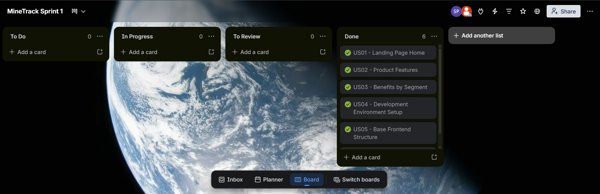

https://trello.com/b/UJwSqATK/minetrack-sprint-1

A continuación se presenta el Sprint Backlog del Sprint 1, con las User Stories seleccionadas del Epic EP07 (Landing Page e Información Pública) y su descomposición en tasks. Cada ítem incluye descripción, estimación en horas, asignación y estado al cierre del Sprint.

| Sprint # | US ID | User Story Title                    | Task ID    | Task Title                | Description                                                                                                              | Estimation (Hours) | Assigned To    | Status |
| -------- | ----- | ----------------------------------- | ---------- | ------------------------- | ------------------------------------------------------------------------------------------------------------------------ | ------------------ | -------------- | ------ |
| 1        | US27  | Landing Page Value Proposition      | US27-T001  | Hero Section              | Implementar sección Hero con título, subtítulo, dos CTAs (Owner / Client) y fondo con gradiente de la paleta MineTrack.  | 4                  | Sebastian      | Done   |
| 1        |       |                                     | US27-T002  | About Us Section          | Implementar sección Sobre Nosotros con descripción del modelo de negocio del marketplace.                                | 2                  | Juan José      | Done   |
| 1        |       |                                     | US27-T003  | Top Bar Sticky            | Implementar barra superior fija con marca, navegación interna y selector de idioma.                                      | 3                  | Sebastian      | Done   |
| 1        | US28  | How-It-Works for Owners and Clients | US28-T001  | How-It-Works Owner Card   | Card con 4 pasos del journey del Propietario: registrar máquinas → recibir solicitudes → aprobar → cobrar por horas.     | 3                  | Sebastian      | Done   |
| 1        |       |                                     | US28-T002  | How-It-Works Client Card  | Card con 4 pasos del journey del Cliente: navegar catálogo → solicitar máquina → aprobación → monitorear en tiempo real. | 3                  | Sebastian      | Done   |
| 1        |       |                                     | US28-T003  | Features Section          | Grid de 6 features principales con íconos de PrimeIcons.                                                                 | 4                  | Zahir Emmanuel | Done   |
| 1        |       |                                     | US28-T004  | Team Section              | Sección Equipo con cards de los 6 integrantes y sus roles en el proyecto.                                                | 2                  | Alvaro         | Done   |
| 1        | US29  | Public Contact Form                 | US29-T001  | FAQ Section               | Sección de Preguntas Frecuentes con 4 ítems collapsables (uso de `<details>` semántico).                                 | 3                  | Sebastian      | Done   |
| 1        |       |                                     | US29-T002  | CTA Section               | Sección final con call-to-action a la plataforma y al contacto.                                                          | 2                  | Sebastian      | Done   |
| 1        |       |                                     | US29-T003  | Footer                    | Footer con información de contacto, redes sociales y datos del curso.                                                    | 2                  | Alvaro         | Done   |
| 1        | INFRA | Project Setup                       | INFRA-T001 | GitHub Organization Setup | Crear organización `minedev-upc-startup`, repositorios y configurar branch protection.                                   | 3                  | Sebastian      | Done   |
| 1        | INFRA |                                     | INFRA-T002 | GitHub Pages Deployment   | Configurar deploy automático de la Landing Page desde rama `main`.                                                       | 1                  | Sebastian      | Done   |
| 1        | i18n  | Internationalization                | i18n-T001  | Translation Dictionary    | Definir diccionario JSON con keys EN/ES para todas las secciones de la Landing.                                          | 3                  | Sebastian      | Done   |
| 1        | i18n  |                                     | i18n-T002  | Language Toggle           | Implementar selector EN/ES con persistencia en `localStorage` y detección automática del idioma del browser.             | 2                  | Sebastian      | Done   |

**Total Story Points: 13**
**Total Estimación: 37 horas**

#### 5.2.1.4. Development Evidence for Sprint Review

Durante el Sprint 1, el equipo se enfocó exclusivamente en el desarrollo de la Landing Page de MineTrack. El objetivo principal fue construir una página pública funcional, visualmente atractiva y completamente responsiva, que comunique eficazmente la propuesta de valor del marketplace de alquiler de maquinaria minera tanto a Propietarios como a empresas mineras.

A lo largo del Sprint se diseñaron e implementaron las secciones clave: Hero con propuesta de valor, Sobre Nosotros, Cómo Funciona (con cards separados para Owner y Client), Características principales, Equipo, Preguntas Frecuentes y Footer con información de contacto y redes sociales.

| Repository   | Branch | Commit Id | Commit Message                                   | Committed By | Date       |
| ------------ | ------ | --------- | ------------------------------------------------ | ------------ | ---------- |
| landing-page | main   | f482a0d   | feat(i18n): Add i18n feature english and spanish | S-aiquipa    | 2026-05-13 |
| landing-page | main   | 00ff82f   | doc: define styles for the landing page          | S-aiquipa    | 2026-05-13 |
| landing-page | main   | 6d37432   | doc: define index html structure                 | S-aiquipa    | 2026-05-13 |
| landing-page | main   | e6fe707   | initial commit                                   | S-aiquipa    | 2026-05-13 |

#### 5.2.1.5. Execution Evidence for Sprint Review

Al cierre del Sprint 1 se obtuvo una Landing Page completamente funcional, desplegada en un entorno público mediante GitHub Pages. La página presenta de manera coherente la propuesta de MineTrack y permite navegar fluidamente entre todas sus secciones mediante scroll y enlaces de anclaje en la barra superior.

**Evidencias visuales:**

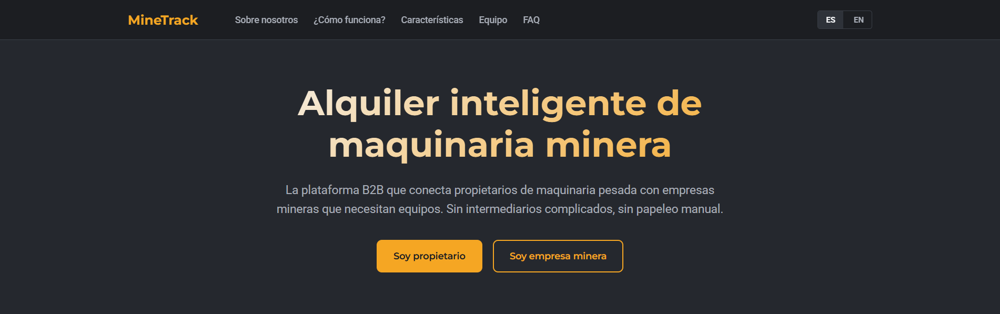

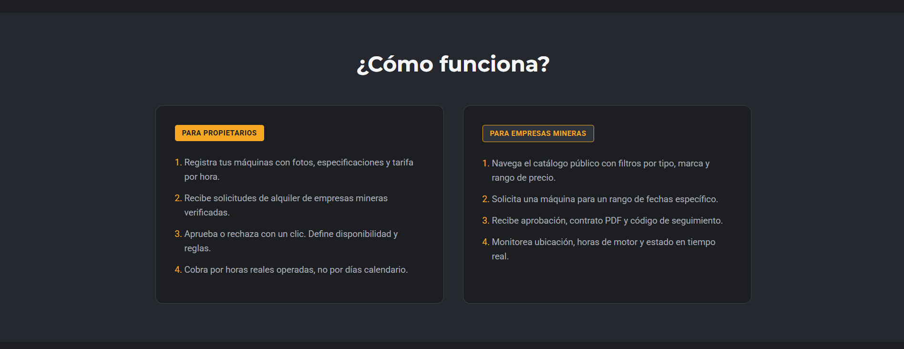

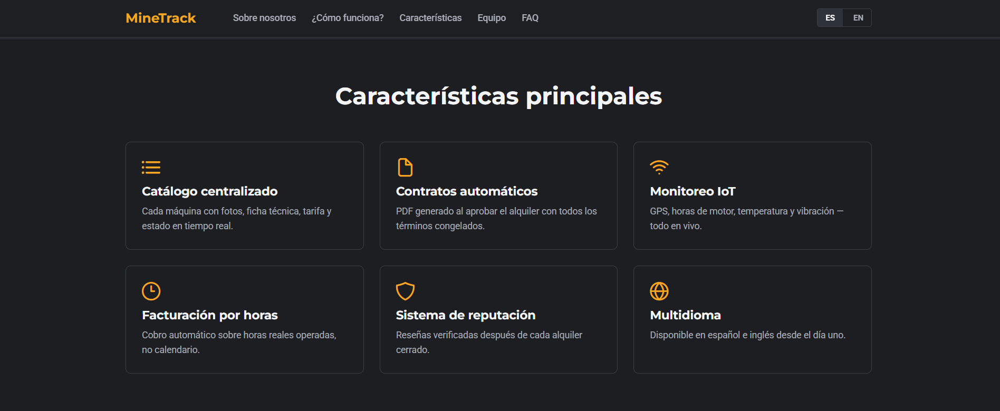

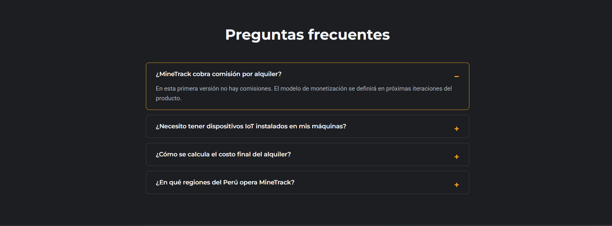

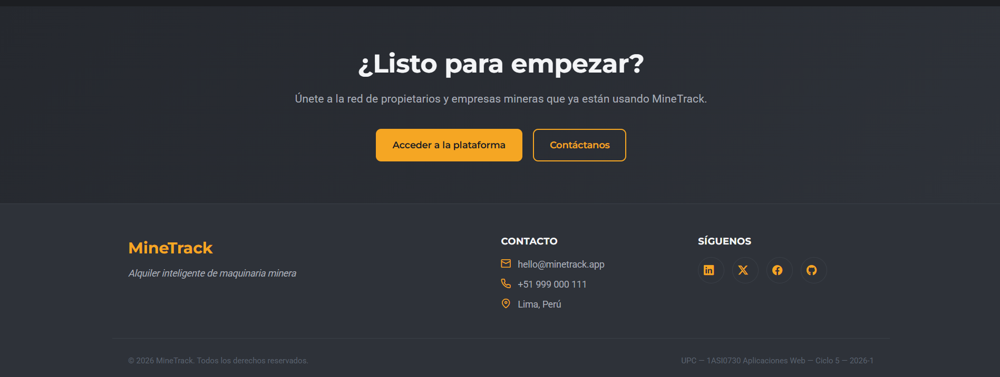

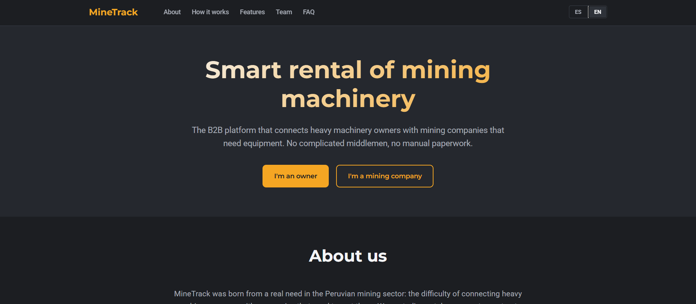

**Validación funcional:**

- La Landing carga correctamente en navegadores Chrome, Firefox y Safari
- El selector de idioma EN/ES actualiza todos los textos sin recargar la página
- La preferencia de idioma persiste entre visitas mediante `localStorage`
- Todas las secciones se adaptan a viewports móviles (≤600px), tablets (≤900px) y desktop
- Los enlaces de la barra superior navegan correctamente a las secciones internas
- Los CTAs apuntan a las URLs públicas correctas (plataforma y email de contacto)

#### 5.2.1.6. Services Documentation Evidence for Sprint Review

Durante el Sprint 1 no se implementaron servicios backend del lado servidor, ya que el alcance del Sprint se limitó a la Landing Page (sitio estático). La documentación de servicios se enfocará en los Sprints siguientes, cuando se implementen los Web Services del Frontend Web Application sobre la Fake API y, posteriormente, los servicios C# del backend real en TB2.

Sin embargo, durante el Sprint 1 se documentó la siguiente decisión técnica relevante: **separación de productos digitales en repositorios independientes**, lo cual permite que cada producto (Landing Page, Frontend Web App, Web Services) tenga su propio ciclo de despliegue, control de versiones y estrategia de hosting, en línea con las buenas prácticas de arquitectura distribuida orientada a servicios.

#### 5.2.1.7. Software Deployment Evidence for Sprint Review

La Landing Page se desplegó exitosamente en GitHub Pages, integrada con CI/CD automático desde la rama `main`. Cada commit a `main` activa un nuevo build y publicación, sin pasos manuales adicionales.

**URLs de despliegue:**

- **Landing Page (producción):** https://minedev-upc-startup.github.io/landing-page/
- **Repositorio:** https://github.com/minedev-upc-startup/landing-page

**Configuración aplicada:**

- **Source:** Deploy from a branch
- **Branch:** `main` / `/ (root)`
- **HTTPS:** Habilitado automáticamente por GitHub Pages
- **CDN:** Distribución global vía CDN de GitHub
- **Build time:** ~30 segundos por commit

**Evidencias visuales del despliegue:**

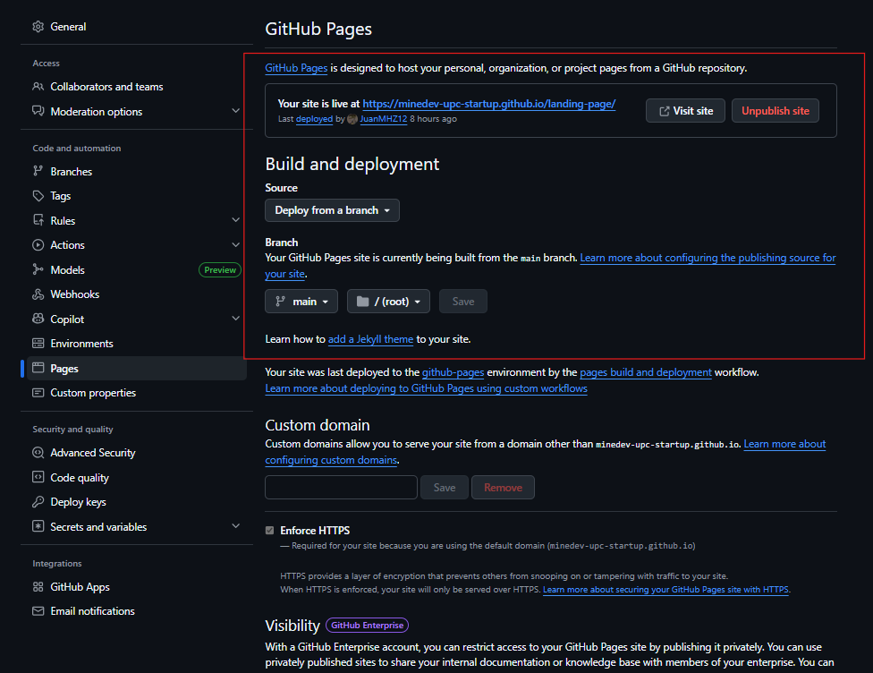

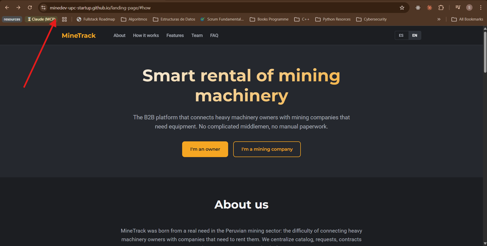

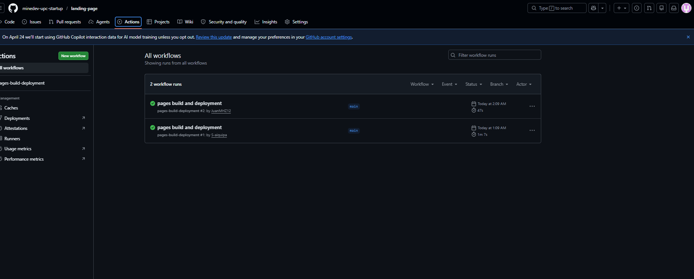

#### 5.2.1.8. Team Collaboration Insights during Sprint

Durante el Sprint 1, el equipo demostró una colaboración efectiva centrada en la implementación práctica de la Landing Page y el establecimiento de la base técnica del proyecto. La división clara de responsabilidades vía la LACX permitió que cada integrante asumiera al menos un aspecto de liderazgo.

**Logros destacados:**

- Despliegue exitoso de la Landing Page en GitHub Pages con CI/CD automático
- Implementación de internacionalización EN/ES desde el primer Sprint, anticipando el requerimiento de accesibilidad multilingüe del producto
- Establecimiento de la organización GitHub `minedev-upc-startup` con tres repositorios separados (Landing, Frontend, Report) que permite trabajo paralelo del equipo
- Configuración de branch protection en las ramas críticas (`main` y `develop`) y aplicación rigurosa de GitFlow con Conventional Commits
- Definición de design tokens (paleta amber/slate, tipografías Montserrat + Roboto) consistentes entre Landing Page y Frontend Web App, lo que asegura coherencia visual entre productos digitales

**Lecciones aprendidas:**

- La separación de la Landing Page en su propio repositorio simplifica el deployment y permite que evolucione independientemente del Frontend Web App
- GitHub Pages resultó suficiente para una Landing estática, evitando complejidad innecesaria de servicios pagos
- La definición temprana de los design tokens del Frontend Web App permitió que la Landing los reutilizara, manteniendo coherencia visual entre productos sin duplicación de decisiones de diseño
- El trabajo distribuido en repositorios separados redujo conflictos de merge significativamente durante el Sprint

## 

### 5.2.2. Sprint 2

En esta sección se documenta el Sprint 2 del proyecto MineTrack, orientado a la implementación del Frontend Web Application. El equipo desarrolló la arquitectura base del proyecto bajo el patrón Domain-Driven Design, los bounded contexts de IAM (autenticación) y Equipment (catálogo de maquinaria), el sistema de layouts diferenciados por rol, y el despliegue público en Firebase Hosting.

#### 5.2.2.1. Sprint Planning 2

| Sprint #                         | Sprint 2                                                                                                                                                                                                                                                                                                                                                                                                                                                                                                                                                                                                                                                                  |
| -------------------------------- | ------------------------------------------------------------------------------------------------------------------------------------------------------------------------------------------------------------------------------------------------------------------------------------------------------------------------------------------------------------------------------------------------------------------------------------------------------------------------------------------------------------------------------------------------------------------------------------------------------------------------------------------------------------------------- |
| **Sprint Planning Background**   |                                                                                                                                                                                                                                                                                                                                                                                                                                                                                                                                                                                                                                                                           |
| Date                             | 2026-05-08                                                                                                                                                                                                                                                                                                                                                                                                                                                                                                                                                                                                                                                                |
| Time                             | 8:00 PM (GMT-5)                                                                                                                                                                                                                                                                                                                                                                                                                                                                                                                                                                                                                                                           |
| Location                         | Reunión virtual vía Discord                                                                                                                                                                                                                                                                                                                                                                                                                                                                                                                                                                                                                                               |
| Prepared By                      | Aiquipa Poma, Sebastian Andres                                                                                                                                                                                                                                                                                                                                                                                                                                                                                                                                                                                                                                            |
| Attendees                        | Aiquipa Poma, Sebastian Andres / Mendoza Machoa, Lionel / Meza Huanacuna, Juan José / Figueroa Sanchez, Alvaro / Sanchez Arenas, Zahir Emmanuel / Molina Umeres, Nestor                                                                                                                                                                                                                                                                                                                                                                                                                                                                                                   |
| Sprint 1 — Review Summary        | Se completó la Landing Page de MineTrack con todas las secciones requeridas (Hero, Cómo Funciona, Características, Equipo, FAQ, Footer), internacionalización EN/ES y despliegue público en GitHub Pages. Sprint Goal cumplido al 100%.                                                                                                                                                                                                                                                                                                                                                                                                                                   |
| Sprint 1 — Retrospective Summary | El equipo identificó que la separación en repositorios independientes facilitó el trabajo paralelo. Se acordó aplicar Conventional Commits con mayor rigor en Sprint 2 y documentar evidencias en tiempo real en lugar de al final del Sprint.                                                                                                                                                                                                                                                                                                                                                                                                                            |
| **Sprint Goal & User Stories**   |                                                                                                                                                                                                                                                                                                                                                                                                                                                                                                                                                                                                                                                                           |
| Sprint 2 Goal                    | **Nuestro propósito es** implementar el Frontend Web Application de MineTrack utilizando Vue.js 3, PrimeVue y una Fake API con json-server, desarrollando los bounded contexts core del producto bajo una arquitectura Domain-Driven Design. **Creemos que esto aportará** una aplicación web funcional que demuestre el flujo principal del negocio: autenticación por roles, gestión del catálogo de maquinaria y navegación diferenciada por rol. **Esto se confirmará cuando** los usuarios puedan registrarse, autenticarse con roles diferenciados (Owner / Client), navegar el catálogo de máquinas y el dashboard del Owner, todo desplegado en Firebase Hosting. |
| Sprint 2 Velocity                | 34 puntos                                                                                                                                                                                                                                                                                                                                                                                                                                                                                                                                                                                                                                                                 |
| Sum of Story Points              | 34 puntos                                                                                                                                                                                                                                                                                                                                                                                                                                                                                                                                                                                                                                                                 |

#### 5.2.2.2. Aspect Leaders and Collaborators

| Team Member                    | GitHub Username       | Arquitectura DDD / Scaffold (L/C) | IAM Bounded Context (L/C) | Layouts & Navigation (L/C) | Equipment/Catalog Bounded Context (L/C) | Documentación (L/C) |
| ------------------------------ | --------------------- | --------------------------------- | ------------------------- | -------------------------- | --------------------------------------- | ------------------- |
| Aiquipa Poma, Sebastian Andres | S-aiquipa             | **L**                             | **L**                     | **L**                      | C                                       | C                   |
| Mendoza Machoa, Lionel         | mendozalionel745-ctrl | C                                 | C                         | C                          | C                                       | **L**               |
| Meza Huanacuna, Juan José      | JuanMHZ12             | C                                 | C                         | C                          | C                                       | **L**               |
| Figueroa Sanchez, Alvaro       | 2003V616              | C                                 | C                         | C                          | C                                       | C                   |
| Sanchez Arenas, Zahir Emmanuel | Zahir210206           | C                                 | C                         | C                          | C                                       | C                   |
| Molina Umeres, Nestor          | Nesthoro              | C                                 | C                         | C                          | **L**                                   | C                   |

#### 5.2.2.3. Sprint Backlog 2

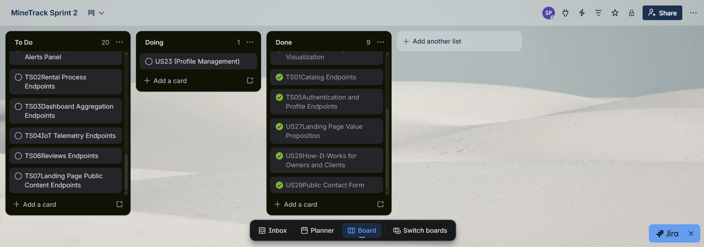

https://trello.com/b/YZ5VLjG8/minetrack-sprint-2

| Sprint # | US ID | User Story Title             | Task ID    | Task Title                        | Description                                                                                                                                                        | Estimation (Hours) | Assigned To        | Status |
| -------- | ----- | ---------------------------- | ---------- | --------------------------------- | ------------------------------------------------------------------------------------------------------------------------------------------------------------------ | ------------------ | ------------------ | ------ |
| 2        | INFRA | Project Scaffold             | INFRA-T001 | Vite + Vue 3 + PrimeVue setup     | Inicializar proyecto con Vite, instalar PrimeVue, PrimeFlex, Pinia, Vue Router, Vue I18n y configurar main.js con todos los plugins.                               | 3                  | Sebastian          | Done   |
| 2        | INFRA |                              | INFRA-T002 | DDD folder structure + \_template | Crear estructura de carpetas por bounded context con capas domain/application/infrastructure/presentation. Crear contexto \_template como scaffold para teammates. | 4                  | Sebastian          | Done   |
| 2        | INFRA |                              | INFRA-T003 | Fake API with json-server         | Crear server/db.json con seed data para los 7 bounded contexts. Configurar routes.json y start.sh.                                                                 | 4                  | Sebastian          | Done   |
| 2        | INFRA |                              | INFRA-T004 | Design tokens + style.css         | Definir variables CSS del design system: paleta amber/slate, tipografías Montserrat + Roboto, radii, spacing scale.                                                | 2                  | Sebastian          | Done   |
| 2        | INFRA |                              | INFRA-T005 | i18n EN/ES setup                  | Configurar vue-i18n con locales en.json y es.json, namespaced por bounded context.                                                                                 | 2                  | Sebastian          | Done   |
| 2        | INFRA |                              | INFRA-T006 | Shared BaseApi + BaseEndpoint     | Implementar BaseApi con Axios e interceptor JWT. Implementar BaseEndpoint con CRUD genérico.                                                                       | 3                  | Sebastian          | Done   |
| 2        | INFRA |                              | INFRA-T007 | Role guard + Auth guard           | Implementar authenticationGuard y roleGuard en Vue Router.                                                                                                         | 2                  | Sebastian          | Done   |
| 2        | INFRA |                              | INFRA-T008 | Role-based layouts                | Implementar topbar.vue, dashboard-sidebar.vue y dashboard-layout.vue con navegación diferenciada por rol.                                                          | 5                  | Sebastian / Nestor | Done   |
| 2        | INFRA |                              | INFRA-T009 | CONVENTIONS.md + README.md        | Documentar convenciones del proyecto: naming, layer rules, GitFlow, Conventional Commits, i18n.                                                                    | 3                  | Sebastian          | Done   |
| 2        | INFRA |                              | INFRA-T010 | Firebase Hosting deploy           | Configurar firebase.json, generar build de producción con Vite y deployar a Firebase Hosting.                                                                      | 2                  | Sebastian          | Done   |
| 2        | US21  | Account Creation             | US21-T001  | User entity + SignUp command      | Crear User entity en domain, SignUpCommand, UserAssembler y IamApi.createUser().                                                                                   | 3                  | Sebastian          | Done   |
| 2        | US22  | Authenticated Login          | US22-T001  | SignIn flow + JWT storage         | Implementar SignInCommand, IamApi.findByEmail(), iam.store con persistSession() y restoreSession().                                                                | 4                  | Sebastian          | Done   |
| 2        | US22  |                              | US22-T002  | Sign-in + Sign-up views           | Implementar sign-in-form.vue y sign-up-form.vue con validación y i18n.                                                                                             | 3                  | Sebastian          | Done   |
| 2        | US01  | Public Catalog Visualization | US01-T001  | Machine entity + assembler        | Crear Machine entity, MachineAssembler y EquipmentApi.                                                                                                             | 3                  | Nestor             | Done   |
| 2        | US01  |                              | US01-T002  | Catalog grid view                 | Implementar catalog-view.vue con grid de máquinas disponibles.                                                                                                     | 5                  | Nestor             | Done   |
| 2        | US01  |                              | US01-T003  | Owner machines view               | Implementar owner-machines-view.vue con listado de flota del Owner.                                                                                                | 4                  | Nestor             | Done   |
| 2        | US01  |                              | US01-T004  | Dashboard shell + sidebar         | Implementar dashboard shell con sidebar colapsable y rutas por rol.                                                                                                | 5                  | Nestor             | Done   |

#### 5.2.2.4. Development Evidence for Sprint Review

| Repository         | Branch                      | Commit Id | Commit Message                                                           | Committed By | Date       |
| ------------------ | --------------------------- | --------- | ------------------------------------------------------------------------ | ------------ | ---------- |
| minetrack-frontend | develop                     | 6ee2a36   | Merge pull request #3 from minedev-upc-startup/feature/equipment-context | Nesthoro     | 2026-05-12 |
| minetrack-frontend | feature/equipment-context   | 7408d56   | chore(seed): extend json-server users for all roles                      | Nesthoro     | 2026-05-12 |
| minetrack-frontend | feature/equipment-context   | 877949b   | feat(equipment): add catalog grid and owner fleet views                  | Nesthoro     | 2026-05-12 |
| minetrack-frontend | feature/equipment-context   | 4ec74cc   | feat(i18n): add copy for dashboard, equipment and catalog                | Nesthoro     | 2026-05-12 |
| minetrack-frontend | feature/equipment-context   | 01c8477   | feat(shared): localize coming-soon and add profile view                  | Nesthoro     | 2026-05-12 |
| minetrack-frontend | feature/equipment-context   | 288eb42   | feat(router): add role-scoped dashboard routes                           | Nesthoro     | 2026-05-12 |
| minetrack-frontend | feature/equipment-context   | 6f4cc00   | feat(ui): add dashboard shell with collapsible sidebar                   | Nesthoro     | 2026-05-12 |
| minetrack-frontend | feature/equipment-context   | c468e0f   | feat(auth): normalize roles and sync session before navigation           | Nesthoro     | 2026-05-12 |
| minetrack-frontend | feature/spine-three-layouts | ee79ef5   | feat(shared): add owner and client layouts with role-based sidebar       | S-aiquipa    | 2026-05-12 |
| minetrack-frontend | main                        | 1683f80   | chore(docs): add bounded-context template and conventions                | S-aiquipa    | 2026-05-08 |
| minetrack-frontend | main                        | d151220   | feat(iam): add authentication bounded context end-to-end                 | S-aiquipa    | 2026-05-08 |
| minetrack-frontend | main                        | 5570e98   | feat(shared): add design tokens, layout, http client and role guard      | S-aiquipa    | 2026-05-08 |
| minetrack-frontend | main                        | c5474ca   | chore(infra): add project config (vite, env, gitignore)                  | S-aiquipa    | 2026-05-08 |
| minetrack-frontend | feature/rentals-core        | [HASH]    | chore(deploy): add firebase hosting configuration                        | S-aiquipa    | 2026-05-13 |
| landing-page       | main                        | 9a2d545   | fix(landing): update CTA link to production Firebase URL                 | S-aiquipa    | 2026-05-13 |

#### 5.2.2.5. Execution Evidence for Sprint Review

Durante el Sprint 2 se implementó y desplegó el Frontend Web Application de MineTrack. Las siguientes evidencias muestran el sistema en funcionamiento con la Fake API ejecutándose localmente mediante json-server.

**Flujos implementados y verificados:**

- Registro de cuenta con selección de rol (Owner / Client)
- Autenticación con credenciales y redirección por rol
- Dashboard del Owner con sidebar colapsable
- Catálogo de máquinas disponibles para el Cliente
- Vista de flota del Owner con sus máquinas registradas
- Navegación diferenciada según el rol activo


#### 5.2.2.6. Services Documentation Evidence for Sprint Review

El Fake API basado en json-server expone los siguientes endpoints durante el desarrollo local:

| Endpoint                  | Método soportado      | Descripción                         |
| ------------------------- | --------------------- | ----------------------------------- |
| /api/v1/users             | GET, POST, PUT        | Gestión de usuarios y autenticación |
| /api/v1/machines          | GET, POST, PUT, PATCH | Catálogo de maquinaria              |
| /api/v1/rentalRequests    | GET, POST, PATCH      | Solicitudes de alquiler             |
| /api/v1/rentals           | GET, POST, PATCH      | Alquileres activos y cerrados       |
| /api/v1/telemetryReadings | GET, POST             | Lecturas de telemetría IoT          |
| /api/v1/reviews           | GET, POST             | Reseñas post-alquiler               |

**Nota sobre el Fake API en producción:** Durante el Sprint 2 se evaluaron opciones para desplegar el Fake API públicamente (MockAPI, Beeceptor, Render). MockAPI alcanzó el límite del plan gratuito y Beeceptor tiene restricción de 50 requests/día insuficiente para demo. El despliegue del Fake API como servicio público se planifica para TB2, cuando será reemplazado por los Web Services reales en ASP.NET Core C#. Para la demo de TB1, el Fake API se ejecuta localmente con json-server en `http://localhost:3000`.

#### 5.2.2.7. Software Deployment Evidence for Sprint Review

**Frontend Web Application — Firebase Hosting**

| Item              | Detalle                            |
| ----------------- | ---------------------------------- |
| URL de producción | https://minetrack-upc-2026.web.app |
| Proyecto Firebase | minetrack-upc-2026                 |
| Fecha de deploy   | 2026-05-13                         |
| Build tool        | Vite 8.0.11                        |
| Comando de build  | `npm run build`                    |
| Comando de deploy | `firebase deploy --only hosting`   |

Pasos ejecutados para el despliegue:

1. `npm install -g firebase-tools` — instalación del Firebase CLI
2. `firebase login` — autenticación con cuenta Google
3. `firebase init hosting` — configuración del proyecto (public dir: `dist`, SPA rewrite: sí)
4. `npm run build` — generación del bundle de producción (646 módulos, 696ms)
5. `firebase deploy --only hosting` — publicación en Firebase Hosting

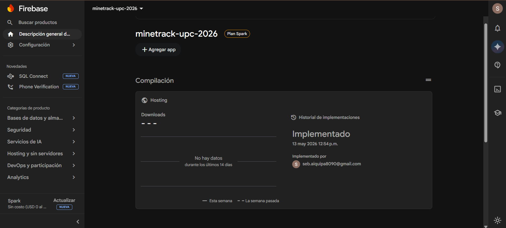

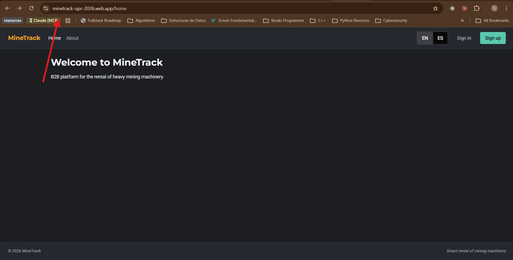

**Landing Page — GitHub Pages**

| Item              | Detalle                                             |
| ----------------- | --------------------------------------------------- |
| URL de producción | https://minedev-upc-startup.github.io/landing-page/ |
| Plataforma        | GitHub Pages                                        |
| Branch            | main / root                                         |
| Deploy            | Automático en cada push a main                      |

#### 5.2.2.8. Team Collaboration Insights during Sprint

Durante el Sprint 2 el equipo demostró una distribución efectiva del trabajo bajo el modelo de bounded contexts. Sebastian Aiquipa lideró la construcción del spine arquitectónico del proyecto (scaffold DDD, IAM, layouts, design tokens, fake API, Firebase deploy), mientras que Nestor Molina lideró la implementación del bounded context de Equipment (catálogo de máquinas, dashboard shell, sidebar colapsable, rutas por rol).

**Contribuciones por integrante:**

| Integrante                     | GitHub Username       | Contribución principal                          | Commits   |
| ------------------------------ | --------------------- | ----------------------------------------------- | --------- |
| Aiquipa Poma, Sebastian        | S-aiquipa             | Arquitectura DDD, IAM, layouts, deploy Firebase | 6 commits |
| Molina Umeres, Nestor          | Nesthoro              | Equipment context, dashboard, catalog views     | 8 commits |
| Mendoza Machoa, Lionel         | mendozalionel745-ctrl | Documentación Sprint 2                          | -         |
| Meza Huanacuna, Juan José      | JuanMHZ12             | Documentación Sprint 2                          | -         |
| Figueroa Sanchez, Alvaro       | 2003V616              | -                                               | -         |
| Sanchez Arenas, Zahir Emmanuel | Zahir210206           | -                                               | -         |

`[LLENAR: screenshot de GitHub Insights → Contributors del repo minetrack-frontend]`

**Lecciones aprendidas del Sprint 2:**

- La distribución por bounded context demostró ser más efectiva que la distribución por capas (comparando con experiencias previas del equipo en otros proyectos del ciclo)
- El scaffold con `_template/` permitió que Nestor implementara el bounded context de Equipment siguiendo el mismo patrón arquitectónico sin necesidad de coordinación constante
- El deploy a Firebase fue más directo de lo esperado una vez configurado el proyecto en la consola web
- El Fake API con json-server funcionó correctamente para el desarrollo local; para TB2 se planifica el reemplazo por los Web Services reales en ASP.NET Core C#

---
### 5.2.3. Sprint 3

En esta sección se documenta el avance técnico y la dinámica de trabajo colaborativo correspondiente al Sprint 3 del proyecto MineTrack. Durante esta iteración, el equipo se concentró en el desarrollo de capacidades transaccionales esenciales para el negocio, tales como el registro de maquinaria, la búsqueda avanzada de equipos y la gestión de solicitudes de alquiler. De manera complementaria, se implementó el módulo de monitoreo IoT en tiempo real, con el propósito de consolidar la propuesta de valor que distingue a la plataforma en el ecosistema minero.

#### 5.2.3.1. Sprint Planning 3

| Sprint #                         | Sprint 3                                                                                                                                                                                                                                                                                                                                                                                                                                                                                                                                                                                                                                                                  |
| -------------------------------- | ------------------------------------------------------------------------------------------------------------------------------------------------------------------------------------------------------------------------------------------------------------------------------------------------------------------------------------------------------------------------------------------------------------------------------------------------------------------------------------------------------------------------------------------------------------------------------------------------------------------------------------------------------------------------- |
| **Sprint Planning Background**   |                                                                                                                                                                                                                                                                                                                                                                                                                                                                                                                                                                                                                                                                           |
| Date                             | 2026-05-20                                                                                                                                                                                                                                                                                                                                                                                                                                                                                                                                                                                                                                                                |
| Time                             | 8:00 PM (GMT-5)                                                                                                                                                                                                                                                                                                                                                                                                                                                                                                                                                                                                                                                           |
| Location                         | Reunión virtual vía Discord                                                                                                                                                                                                                                                                                                                                                                                                                                                                                                                                                                                                                                               |
| Prepared By                      | Aiquipa Poma, Sebastian Andres                                                                                                                                                                                                                                                                                                                                                                                                                                                                                                                                                                                                                                            |
| Attendees                        | Aiquipa Poma, Sebastian Andres / Mendoza Machoa, Lionel / Meza Huanacuna, Juan José / Figueroa Sanchez, Alvaro / Sanchez Arenas, Zahir Emmanuel / Molina Umeres, Nestor                                                                                                                                                                                                                                                                                                                                                                                                                                                                                                   |
| Sprint 2 — Review Summary        | Se completó la Frontend Web Application con arquitectura DDD y bounded contexts de IAM y Equipment. Se entregaron flujos de autenticación por roles, catálogo de maquinaria y dashboard del Owner. El despliegue en Firebase Hosting fue exitoso. Sprint Goal cumplido al 100% con 34 Story Points completados.                                                                                                                                                                                                                                                                                                                                                            |
| Sprint 2 — Retrospective Summary | El equipo validó que la arquitectura DDD facilita el desarrollo paralelo. Se acordó mantener el scaffold template para nuevos bounded contexts y mejorar la coordinación en las integraciones entre layers. El Fake API con json-server permitió desarrollar sin bloqueos.                                                                                                                                                                                                                                                                                                                                                                                                  |
| **Sprint Goal & User Stories**   |                                                                                                                                                                                                                                                                                                                                                                                                                                                                                                                                                                                                                                                                           |
| Sprint 3 Goal                    | Nuestro enfoque está en ofrecer a los propietarios de maquinaria pesada, a las empresas mineras y constructoras, y al equipo operativo de MineTrack una experiencia completa del ciclo de alquiler: publicar equipos de la flota, explorar el catálogo de maquinaria disponible, solicitar un alquiler y aprobar solicitudes dentro de la plataforma. Creemos que esto entrega a los propietarios de maquinaria la capacidad de gestionar su flota de forma digital y reducir los tiempos de ociosidad de sus equipos, a las empresas mineras y constructoras el acceso a maquinaria pesada verificada con un proceso formal de solicitud, y al equipo operativo de MineTrack las herramientas para gestionar y aprobar los arrendamientos en tiempo real. Esto se confirmará cuando un propietario registre una cuenta, publique una máquina pesada con sus especificaciones técnicas completas y tarifa por hora, una empresa minera o constructora explore el catálogo, filtre por tipo de equipo y envíe una solicitud de alquiler, y el equipo operativo de MineTrack pueda revisar y aprobar dicha solicitud con todos los cambios reflejados en la base de datos de producción. |
| Sprint 3 Velocity                | 34 puntos                                                                                                                                                                                                                                                                                                                                                                                                                                                                                                                                                                                                                                                                 |
| Sum of Story Points              | 34 puntos                                                                                                                                                                                                                                                                                                                                                                                                                                                                                                                                                                                                                                                                 |

#### 5.2.3.2  . Aspect Leaders and Collaborators

| Team Member | GitHub Username | IAM Bounded Context (L/C) | Equipment/Catalog Bounded Context (L/C) | Rental Bounded Context (L/C) | IoT Telemetry Bounded Context (L/C) | Shared Kernel (L/C) | Backend Platform (L/C) |
|-------------|-----------------|---------------------------|-----------------------------------------|------------------------------|-------------------------------------|---------------------|------------------------|
| **Aiquipa Poma, Sebastian** | `S-aiquipa` | C | C | C | C | **L** | **L** |
| **Mendoza Machoa, Lionel** | `mendozalionel745-ctrl` | C | C | C | C | C | C |
| **Meza Huanacuna, Juan José** | `JuanMHZ12` | C | C | C | **L** | C | C |
| **Figueroa Sanchez, Alvaro** | `2003V616` | C | C | **L** | C | **L** | C |
| **Sanchez Arenas, Zahir** | `Zahir210206` | **L** | C | C | C | C | **L** |
| **Molina Umeres, Nestor** | `Nesthoro` | C | **L** | C | C | C | C |

#### 5.2.3.3. Sprint Backlog 3

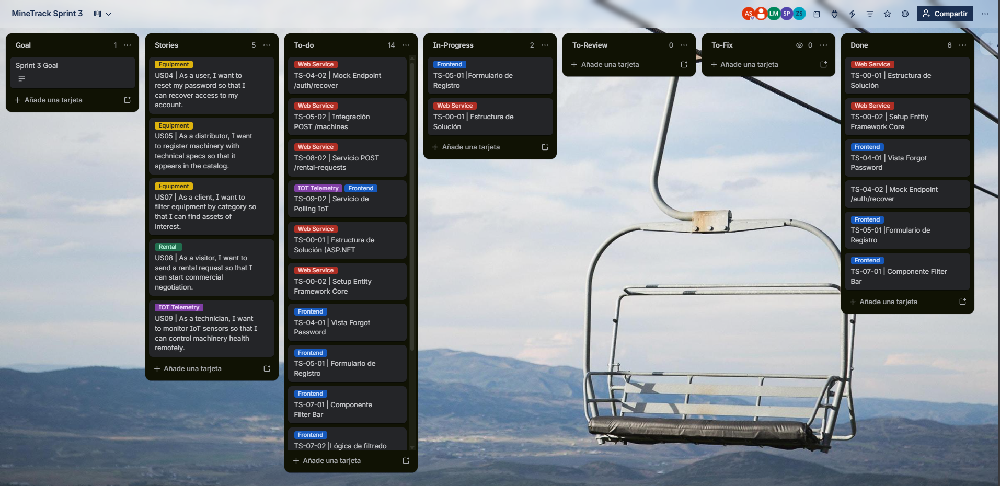

https://trello.com/b/aP44UAmY/minetrack-sprint-3

| Sprint # | User Story Id | User Story Title | Task Id | Task Title | Description | Estimation (Hours) | Assigned To | Status |
|:---:|:---:|:---|:---:|:---|:---|:---:|:---|:---|
| 3 | US21 | Registro de nuevo usuario con rol | TS-21-01 | Implementación completa de registro de usuario: formulario Vue, validación de correo único, asignación de rol e integración con endpoint POST /api/v1/authentication/sign-up | Desarrollar componente Vue con formulario de registro, integración con store Pinia de IAM y llamada al endpoint de sign-up desplegado en Render | 6h | Sanchez Arenas, Zahir | Done |
| 3 | US22 | Inicio de sesión con credenciales | TS-22-01 | Implementación completa de autenticación: formulario Vue, validación de credenciales, integración con endpoint POST /api/v1/authentication/sign-in con retorno de JWT y redirección por rol | Desarrollar componente Vue de login, integración con store Pinia de IAM, almacenamiento de JWT y lógica de redirección según rol del usuario autenticado | 6h | Sanchez Arenas, Zahir | Done |
| 3 | US04 | Registro de una máquina nueva | TS-04-01 | Frontend: Vista completa de registro de máquina con formulario de especificaciones técnicas, fotos y tarifa por hora, integración con store Pinia de Machinery | Desarrollar vista new-machine-view.vue con todos los campos obligatorios, validaciones y llamada al endpoint POST /api/v1/machines | 6h | Aiquipa Poma, Sebastian | Done |
| 3 | US04 | Registro de una máquina nueva | TS-04-02 | Backend: Bounded Context Machinery con entidad Machine, repositorio, servicio de aplicación y endpoint POST /api/v1/machines con validación de campos obligatorios | Implementar capas Domain/Application/Infrastructure/Interfaces del BC Machinery siguiendo patrón DDD, configurar EF Core y exponer endpoint en MachinesController | 6h | Aiquipa Poma, Sebastian | Done |
| 3 | US01 | Visualización del catálogo público de máquinas | TS-01-01 | Frontend: Vista de catálogo con listado de máquinas disponibles, tarjetas con imagen, tipo, marca, modelo y tarifa, integración con API real | Desarrollar catalog-view.vue con llamada al endpoint GET /api/v1/machines, manejo de estados de carga y vista vacía | 5h | Meza Huanacune, Juan José | Done |
| 3 | US01 | Visualización del catálogo público de máquinas | TS-01-02 | Backend: Endpoint GET /api/v1/machines que retorna listado completo de máquinas registradas con todos sus campos | Implementar query handler y endpoint en MachinesController con retorno de lista de MachineResource | 5h | Aiquipa Poma, Sebastian | Done |
| 3 | US02 | Filtrado y búsqueda de máquinas | TS-02-01 | Frontend: Barra de filtros por tipo, marca y rango de tarifa con lógica de filtrado reactivo en Pinia y actualización dinámica del catálogo | Desarrollar componente FilterBar.vue con selectores, integración con catalog store en Pinia y computed properties para filtrado en cliente | 6h | Meza Huanacune, Juan José | Done |
| 3 | US03 | Consulta del detalle de una máquina | TS-03-01 | Frontend: Vista de detalle de máquina con ficha técnica completa, fotos y opción de solicitar alquiler, integración con endpoint GET /api/v1/owners/{ownerId}/machines | Desarrollar machine-detail-view.vue con todos los campos de la ficha técnica, manejo de estado de máquina y botón de solicitud condicionado al estado Available | 5h | Meza Huanacune, Juan José | Done |
| 3 | US06 | Solicitud de alquiler de una máquina | TS-06-01 | Frontend: Modal de solicitud de alquiler con selección de fechas, ubicación de obra y llamada al endpoint POST /api/v1/rental-requests | Desarrollar RentalRequestModal.vue con campos de fechas y ubicación, integración con rentals store en Pinia y manejo de respuesta del endpoint | 6h | Mendoza Machoa, Lionel | Done |
| 3 | US06 | Solicitud de alquiler de una máquina | TS-06-02 | Backend: Bounded Context Rentals con entidad RentalRequest, repositorio, servicio de aplicación y endpoint POST /api/v1/rental-requests con validación de disponibilidad de máquina | Implementar capas DDD del BC Rentals, configurar EF Core para RentalRequest y exponer endpoint en RentalsController con validación de estado Available de la máquina | 6h | Aiquipa Poma, Sebastian | Done |
| 3 | US08 | Aprobación o rechazo de solicitudes de alquiler | TS-08-01 | Frontend: Vista de bandeja de solicitudes del Intermediario con listado de solicitudes pendientes y acciones de aprobación y rechazo con motivo | Desarrollar rental-requests-view.vue con listado filtrado por estado Pending, botones de acción y modal de rechazo con campo de motivo | 6h | Mendoza Machoa, Lionel | Done |
| 3 | US08 | Aprobación o rechazo de solicitudes de alquiler | TS-08-02 | Backend: Endpoint PATCH /api/v1/rental-requests/{id} que actualiza estado de solicitud a Approved o Rejected y cambia estado de máquina según corresponda | Implementar comando UpdateRentalRequestStatus, handler en RentalRequestCommandService y endpoint en RentalsController con actualización transaccional de solicitud y máquina | 6h | Aiquipa Poma, Sebastian | Done |
| 3 | INFRA | Infraestructura Backend ASP.NET Core | TS-00-01 | Backend: Configuración de solución ASP.NET Core con estructura DDD por bounded context, capas Domain/Application/Infrastructure/Interfaces, AppDbContext y registro de dependencias | Crear solución MineDev.MineTrack.Platform con proyectos por BC, configurar AppDbContext con DbSets de todas las entidades y registrar servicios en Program.cs | 6h | Aiquipa Poma, Sebastian | Done |
| 3 | INFRA | Infraestructura Backend ASP.NET Core | TS-00-02 | Backend: Configuración de Entity Framework Core con MySQL en Filess.io, migración InitialCreate y despliegue del backend en Render con variables de entorno de producción | Instalar EF Core + Pomelo MySQL, configurar cadena de conexión, generar migración única InitialCreate y configurar despliegue en Render con connection string de producción | 5h | Aiquipa Poma, Sebastian | Done |

**Total Story Points: 13 SP** | **Total Estimación: 37 horas**
#### 5.2.3.4. Development Evidence for Sprint Review

Durante el Sprint 3, el equipo dividió los esfuerzos técnicos en dos grandes frentes: la implementación de las vistas transaccionales e IoT en el Frontend (Vue 3) y la configuración inicial de la arquitectura del Backend real utilizando ASP.NET Core y Entity Framework. 

A continuación, se presenta el registro de los commits más representativos que evidencian el desarrollo de ambas capas.


| Repository | Branch | Commit Id | Commit Message | Type | Author | Date |
| ---------- | ------ | --------- | --------------- | ---- | ------ | ---- |
| minedev-upc-startup/MineDev.MineTrack.Platform | develop | `8c849f7` | feat(migrations): add initial migrations for Machinery and Users bounded contexts | Nueva funcionalidad | Aiquipa Poma, Sebastian Andres | 19/06/2026 |
| minedev-upc-startup/MineDev.MineTrack.Platform | develop | `3829bf5` | chore(config): update connection string in production settings to enable connection pooling | Mantenimiento / configuración | Aiquipa Poma, Sebastian Andres | 19/06/2026 |
| minedev-upc-startup/MineDev.MineTrack.Platform | develop | `0cd2e0b` | Merge branch 'feature/machinery-post' into develop | Integración de rama | Aiquipa Poma, Sebastian Andres | 19/06/2026 |
| minedev-upc-startup/MineDev.MineTrack.Platform | develop | `52dfbcd` | feat(machinery): update DbContext with `Machine` entity and adjust date properties in `RentalRequest` entity | Nueva funcionalidad | Aiquipa Poma, Sebastian Andres | 19/06/2026 |
| minedev-upc-startup/MineDev.MineTrack.Platform | develop | `29f0a48` | feat(machinery): configure Machinery bounded context in DbContext and Dependency Injection | Nueva funcionalidad | Aiquipa Poma, Sebastian Andres | 19/06/2026 |
| minedev-upc-startup/MineDev.MineTrack.Platform | develop | `3e6385d` | feat(machinery): add `MachinesActionResultAssembler` for assembling API action results | Nueva funcionalidad | Aiquipa Poma, Sebastian Andres | 19/06/2026 |
| minedev-upc-startup/MineDev.MineTrack.Platform | develop | `670fb3a` | feat(machinery): add assemblers for transforming between machine resources and domain models | Nueva funcionalidad | Aiquipa Poma, Sebastian Andres | 19/06/2026 |
| minedev-upc-startup/MineDev.MineTrack.Platform | develop | `acd1799` | feat(machinery): add `MachineResource` and `MachineLocationResource` records for machine data representation | Nueva funcionalidad | Aiquipa Poma, Sebastian Andres | 19/06/2026 |
| minedev-upc-startup/MineDev.MineTrack.Platform | develop | `cfe02b8` | feat(machinery): add `UpdateMachineStatusResource` record for machine status updates | Nueva funcionalidad | Aiquipa Poma, Sebastian Andres | 19/06/2026 |
| minedev-upc-startup/MineDev.MineTrack.Platform | develop | `c0a16f1` | feat(machinery): add `CreateMachineResource` record for machine creation requests | Nueva funcionalidad | Aiquipa Poma, Sebastian Andres | 19/06/2026 |
| minedev-upc-startup/MineDev.MineTrack.Platform | develop | `7fc4bb4` | feat(machinery): add `MachinesController` for REST API endpoints to manage machines | Nueva funcionalidad | Aiquipa Poma, Sebastian Andres | 19/06/2026 |
| minedev-upc-startup/MineDev.MineTrack.Platform | develop | `2166846` | feat(machinery): add `ModelBuilderExtensions` for configuring `Machine` entity in EF Core | Nueva funcionalidad | Aiquipa Poma, Sebastian Andres | 19/06/2026 |
| minedev-upc-startup/MineDev.MineTrack.Platform | develop | `4353330` | feat(machinery): implement `MachineRepository` with method for finding machines by owner ID | Nueva funcionalidad | Aiquipa Poma, Sebastian Andres | 19/06/2026 |
| minedev-upc-startup/MineDev.MineTrack.Platform | develop | `d3f641a` | feat(machinery): implement `MachineQueryService` for handling machine data queries | Nueva funcionalidad | Aiquipa Poma, Sebastian Andres | 19/06/2026 |
| minedev-upc-startup/MineDev.MineTrack.Platform | develop | `1823c21` | feat(machinery): implement `MachineCommandService` to handle machine creation and status updates | Nueva funcionalidad | Aiquipa Poma, Sebastian Andres | 19/06/2026 |
| minedev-upc-startup/MineDev.MineTrack.Platform | develop | `7f7e96c` | feat(machinery): add `UpdateMachineError` enum for machine update error handling | Nueva funcionalidad | Aiquipa Poma, Sebastian Andres | 19/06/2026 |
| minedev-upc-startup/MineDev.MineTrack.Platform | develop | `30fe83b` | feat(machinery): add `CreateMachineError` enum for machine creation error handling | Nueva funcionalidad | Aiquipa Poma, Sebastian Andres | 19/06/2026 |
| minedev-upc-startup/MineDev.MineTrack.Platform | develop | `2fc4de8` | feat(machinery): add `IMachineQueryService` interface for querying machine data | Nueva funcionalidad | Aiquipa Poma, Sebastian Andres | 19/06/2026 |
| minedev-upc-startup/MineDev.MineTrack.Platform | develop | `7a25735` | feat(machinery): add `IMachineCommandService` interface for handling machine commands | Nueva funcionalidad | Aiquipa Poma, Sebastian Andres | 19/06/2026 |
| minedev-upc-startup/MineDev.MineTrack.Platform | develop | `1545e5f` | feat(machinery): add `IMachineRepository` interface with method for finding machines by owner ID | Nueva funcionalidad | Aiquipa Poma, Sebastian Andres | 19/06/2026 |
| minedev-upc-startup/MineDev.MineTrack.Platform | develop | `c7f59a5` | feat(machinery): add `MachineStatus` value object with predefined status constants and validation | Nueva funcionalidad | Aiquipa Poma, Sebastian Andres | 19/06/2026 |
| minedev-upc-startup/MineDev.MineTrack.Platform | develop | `8827a90` | feat(machinery): add `GetMachinesByOwnerIdQuery` record for querying machines by owner ID | Nueva funcionalidad | Aiquipa Poma, Sebastian Andres | 19/06/2026 |
| minedev-upc-startup/MineDev.MineTrack.Platform | develop | `4531ebc` | feat(machinery): add `GetMachineByIdQuery` record for querying machine details by ID | Nueva funcionalidad | Aiquipa Poma, Sebastian Andres | 19/06/2026 |
| minedev-upc-startup/MineDev.MineTrack.Platform | develop | `854d6e0` | feat(machinery): add `GetAllMachinesQuery` record for querying all machines | Nueva funcionalidad | Aiquipa Poma, Sebastian Andres | 19/06/2026 |
| minedev-upc-startup/MineDev.MineTrack.Platform | develop | `8fd441b` | feat(machinery): add `UpdateMachineStatusCommand` record for status updates | Nueva funcionalidad | Aiquipa Poma, Sebastian Andres | 19/06/2026 |
| minedev-upc-startup/MineDev.MineTrack.Platform | develop | `39bb318` | feat(machinery): add `CreateMachineCommand` record for machine creation | Nueva funcionalidad | Aiquipa Poma, Sebastian Andres | 19/06/2026 |
| minedev-upc-startup/MineDev.MineTrack.Platform | develop | `877c2de` | feat(machinery): introduce `MachineAudit` for command-driven status updates | Nueva funcionalidad | Aiquipa Poma, Sebastian Andres | 19/06/2026 |
| minedev-upc-startup/MineDev.MineTrack.Platform | develop | `0c8b402` | feat(machinery): add `Machine` aggregate with properties, constructors, and status update behavior | Nueva funcionalidad | Aiquipa Poma, Sebastian Andres | 19/06/2026 |
| minedev-upc-startup/MineDev.MineTrack.Platform | develop | `56c3c7e` | chore: stop tracking appsettings.Development.json (already gitignored) | Mantenimiento / configuración | Aiquipa Poma, Sebastian Andres | 19/06/2026 |
| minedev-upc-startup/MineDev.MineTrack.Platform | develop | `cc633a2` | Merge remote-tracking branch 'origin/main' into develop | Integración de rama | Aiquipa Poma, Sebastian Andres | 19/06/2026 |
| minedev-upc-startup/MineDev.MineTrack.Platform | develop | `fbcfa23` | Merge branch 'feature/auth' into develop | Integración de rama | Sanchez Arenas, Zahir Emmanuel | 19/06/2026 |
| minedev-upc-startup/MineDev.MineTrack.Platform | develop | `fe35ac6` | refactor: added new fields for User entity and implementing DI pattern | Refactorización | Sanchez Arenas, Zahir Emmanuel | 19/06/2026 |
| minedev-upc-startup/MineDev.MineTrack.Platform | develop | `018c22a` | Merge branch 'release/0.12.0' into main | Integración de rama | Aiquipa Poma, Sebastian Andres | 18/06/2026 |
| minedev-upc-startup/MineDev.MineTrack.Platform | develop | `8f69677` | fix(rental): ensure `CompleteAsync` is awaited in RentalRequestCommandService | Corrección de error | Aiquipa Poma, Sebastian Andres | 18/06/2026 |
| minedev-upc-startup/MineDev.MineTrack.Platform | develop | `698505b` | Merge branch 'release/0.11.0' into main | Integración de rama | Aiquipa Poma, Sebastian Andres | 18/06/2026 |
| minedev-upc-startup/MineDev.MineTrack.Platform | develop | `3c5b15d` | feat(rental): add DateOnly to DateTime conversion for StartDate and EndDate properties | Nueva funcionalidad | Aiquipa Poma, Sebastian Andres | 18/06/2026 |
| minedev-upc-startup/MineDev.MineTrack.Platform | develop | `9f9c666` | Merge branch 'release/0.9.0' into main | Integración de rama | Aiquipa Poma, Sebastian Andres | 18/06/2026 |
| minedev-upc-startup/MineDev.MineTrack.Platform | develop | `b292d97` | refactor(rental): rename RentalRequestsController to RentalsController and update endpoints accordingly | Refactorización | Aiquipa Poma, Sebastian Andres | 18/06/2026 |
| minedev-upc-startup/MineDev.MineTrack.Platform | develop | `238f66f` | feat: configure CORS with policy to allow frontend origins | Nueva funcionalidad | Aiquipa Poma, Sebastian Andres | 18/06/2026 |
| minedev-upc-startup/MineDev.MineTrack.Platform | develop | `f662ae9` | feat: rest interfaces & resources layer added | Nueva funcionalidad | Sanchez Arenas, Zahir Emmanuel | 16/06/2026 |
| minedev-upc-startup/MineDev.MineTrack.Platform | develop | `083a347` | feat: infrastructure, application & acl interface layer added | Nueva funcionalidad | Sanchez Arenas, Zahir Emmanuel | 16/06/2026 |
| minedev-upc-startup/MineDev.MineTrack.Platform | develop | `de23129` | build: jwt related packages added | Actualización de dependencias | Sanchez Arenas, Zahir Emmanuel | 16/06/2026 |
| minedev-upc-startup/MineDev.MineTrack.Platform | develop | `e8ae1d3` | build: "bcrypt.net-next" package | Actualización de dependencias | Sanchez Arenas, Zahir Emmanuel | 16/06/2026 |
| minedev-upc-startup/MineDev.MineTrack.Platform | develop | `18273ed` | feat: iam domain layer | Nueva funcionalidad | Sanchez Arenas, Zahir Emmanuel | 16/06/2026 |
| minedev-upc-startup/MineDev.MineTrack.Platform | develop | `c840e04` | Merge branch 'release/0.7.0' into main | Integración de rama | Aiquipa Poma, Sebastian Andres | 16/06/2026 |
| minedev-upc-startup/MineDev.MineTrack.Platform | develop | `aeb4134` | fix: resolve merge conflict in Program.cs | Corrección de error | Aiquipa Poma, Sebastian Andres | 16/06/2026 |
| minedev-upc-startup/MineDev.MineTrack.Platform | develop | `ded2f77` | feat(rental): add Spanish resource file for RentalMessages with localized messages | Nueva funcionalidad | Aiquipa Poma, Sebastian Andres | 16/06/2026 |
| minedev-upc-startup/MineDev.MineTrack.Platform | develop | `ac525ea` | feat(rental): add resource file for RentalMessages with predefined message keys | Nueva funcionalidad | Aiquipa Poma, Sebastian Andres | 16/06/2026 |
| minedev-upc-startup/MineDev.MineTrack.Platform | develop | `c1252d2` | feat(rental): add placeholder for RentalMessages class in resources | Nueva funcionalidad | Aiquipa Poma, Sebastian Andres | 16/06/2026 |
| minedev-upc-startup/MineDev.MineTrack.Platform | develop | `31dea44` | feat(rental): add EF Core migration for RentalRequest entity and enable DI for rental services | Nueva funcionalidad | Aiquipa Poma, Sebastian Andres | 16/06/2026 |
| minedev-upc-startup/MineDev.MineTrack.Platform | develop | `597b5c9` | feat(rental): implement RentalRequestsController with endpoints for managing rental requests | Nueva funcionalidad | Aiquipa Poma, Sebastian Andres | 16/06/2026 |
| minedev-upc-startup/MineDev.MineTrack.Platform | develop | `6c27942` | refactor(rental): move assembler classes to Rest/Transform namespace | Refactorización | Aiquipa Poma, Sebastian Andres | 16/06/2026 |
| minedev-upc-startup/MineDev.MineTrack.Platform | develop | `1729bcd` | feat(rental): add assembler for transforming Result&lt;RentalRequest&gt; to IActionResult | Nueva funcionalidad | Aiquipa Poma, Sebastian Andres | 16/06/2026 |
| minedev-upc-startup/MineDev.MineTrack.Platform | develop | `9314b24` | feat(rental): add assembler for transforming RentalRequest entity to RentalRequestResource | Nueva funcionalidad | Aiquipa Poma, Sebastian Andres | 16/06/2026 |
| minedev-upc-startup/MineDev.MineTrack.Platform | develop | `cc7efca` | feat(rental): add assembler for transforming CreateRentalRequestResource to CreateRentalRequestCommand | Nueva funcionalidad | Aiquipa Poma, Sebastian Andres | 16/06/2026 |
| minedev-upc-startup/MineDev.MineTrack.Platform | develop | `91e37e0` | feat(rental): add CreateRentalRequestResource record for API request handling | Nueva funcionalidad | Aiquipa Poma, Sebastian Andres | 16/06/2026 |
| minedev-upc-startup/MineDev.MineTrack.Platform | develop | `5742e11` | feat(rental): add RentalRequestResource record for API data representation | Nueva funcionalidad | Aiquipa Poma, Sebastian Andres | 16/06/2026 |
| minedev-upc-startup/MineDev.MineTrack.Platform | develop | `71f1a5a` | feat(rental): apply RentalRequest entity configuration in AppDbContext | Nueva funcionalidad | Aiquipa Poma, Sebastian Andres | 16/06/2026 |
| minedev-upc-startup/MineDev.MineTrack.Platform | develop | `2b5d15a` | feat(rental): add ModelBuilderExtensions for RentalRequest entity configuration | Nueva funcionalidad | Aiquipa Poma, Sebastian Andres | 16/06/2026 |
| minedev-upc-startup/MineDev.MineTrack.Platform | develop | `be9a521` | feat(rental): implement RentalRequestRepository with client and owner filtering | Nueva funcionalidad | Aiquipa Poma, Sebastian Andres | 16/06/2026 |
| minedev-upc-startup/MineDev.MineTrack.Platform | develop | `174cd6e` | feat(rental): implement RentalRequestQueryService for handling rental request queries | Nueva funcionalidad | Aiquipa Poma, Sebastian Andres | 16/06/2026 |
| minedev-upc-startup/MineDev.MineTrack.Platform | develop | `17b9d75` | feat(rental): introduce RentalRequestCommandService with handling for create, approve, and reject rental requests | Nueva funcionalidad | Aiquipa Poma, Sebastian Andres | 16/06/2026 |
| minedev-upc-startup/MineDev.MineTrack.Platform | develop | `0452497` | feat(rental): add UpdateRentalRequestError enum for handling update rental request error types | Nueva funcionalidad | Aiquipa Poma, Sebastian Andres | 16/06/2026 |
| minedev-upc-startup/MineDev.MineTrack.Platform | develop | `30cfe59` | feat(rental): add CreateRentalRequestError enum for handling rental request error types | Nueva funcionalidad | Aiquipa Poma, Sebastian Andres | 16/06/2026 |
| minedev-upc-startup/MineDev.MineTrack.Platform | develop | `7861bb4` | feat(rental): add IRentalRequestQueryService interface with methods for handling rental request queries | Nueva funcionalidad | Aiquipa Poma, Sebastian Andres | 16/06/2026 |


A continuación, la evidencia de desarrollo del Frontend correspondiente al mismo periodo, en el repositorio
`minetrack-frontend`, rama `main`:

| Repository | Branch | Commit Id | Commit Message | Type | Author | Date |
| ---------- | ------ | --------- | --------------- | ---- | ------ | ---- |
| minedev-upc-startup/minetrack-frontend | main | `20f4ec9` | refactor(shared): remove horizontal top navigation | Refactorización | Aiquipa Poma, Sebastian Andres | 18/06/2026 |
| minedev-upc-startup/minetrack-frontend | main | `209017c` | refactor(shared): remove horizontal top navigation | Refactorización | Aiquipa Poma, Sebastian Andres | 18/06/2026 |
| minedev-upc-startup/minetrack-frontend | main | `d31b100` | refactor(topbar): Remove role-based navigation logic and simplify component structure | Refactorización | Aiquipa Poma, Sebastian Andres | 18/06/2026 |
| minedev-upc-startup/minetrack-frontend | main | `4242ccc` | feat(rentals): connect rentals BC to real backend | Nueva funcionalidad | Aiquipa Poma, Sebastian Andres | 18/06/2026 |
| minedev-upc-startup/minetrack-frontend | main | `fa0c975` | feat(rentals): connect rentals BC to real backend | Nueva funcionalidad | Aiquipa Poma, Sebastian Andres | 18/06/2026 |
| minedev-upc-startup/minetrack-frontend | main | `592ccf7` | feat(rentals): connect rentals BC to real backend | Nueva funcionalidad | Aiquipa Poma, Sebastian Andres | 18/06/2026 |
| minedev-upc-startup/minetrack-frontend | main | `a8fb5c4` | refactor(rentals): Improve request handling logic and streamline API integrations | Refactorización | Aiquipa Poma, Sebastian Andres | 18/06/2026 |
| minedev-upc-startup/minetrack-frontend | main | `0c901cf` | refactor(rentals): Replace BaseEndpoint with direct HTTP methods and expand rental request handling | Refactorización | Aiquipa Poma, Sebastian Andres | 18/06/2026 |
| minedev-upc-startup/minetrack-frontend | main | `e39591b` | refactor(iam): Replace BaseApi with in-memory user registry and simplify methods | Refactorización | Aiquipa Poma, Sebastian Andres | 18/06/2026 |
| minedev-upc-startup/minetrack-frontend | main | `1995a16` | chore(deployment): Update API URL in environment files for production and development | Mantenimiento / configuración | Aiquipa Poma, Sebastian Andres | 18/06/2026 |
| minedev-upc-startup/minetrack-frontend | main | `bd637e7` | feature/ merge improveds | Nueva funcionalidad | Mendoza Machoa, Lionel | 16/06/2026 |
| minedev-upc-startup/minetrack-frontend | main | `3f96090` | feature/ merge improveds | Nueva funcionalidad | Mendoza Machoa, Lionel | 16/06/2026 |
| minedev-upc-startup/minetrack-frontend | main | `ed87892` | feature/merge update, user maintenance | Nueva funcionalidad | Mendoza Machoa, Lionel | 16/06/2026 |


---

#### 5.2.3.5. Execution Evidence for Sprint Review

Al cierre del Sprint 3, se lograron avances significativos en la interfaz de usuario, completando las vistas de recuperación de contraseña, registro de activos, filtros dinámicos y el Command Center IoT. En paralelo, se levantó la infraestructura del backend para procesar estas solicitudes.


**Evidencias de Ejecución - Backend (API y Base de Datos):**

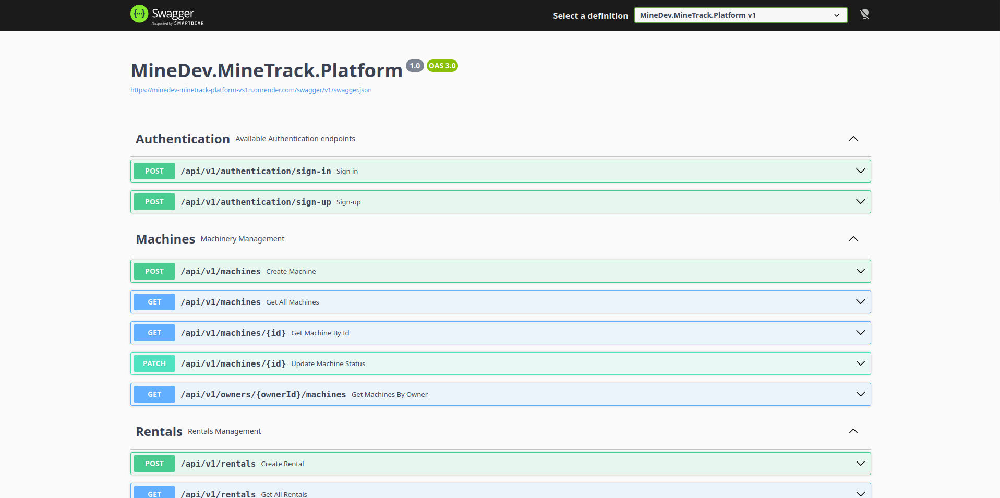

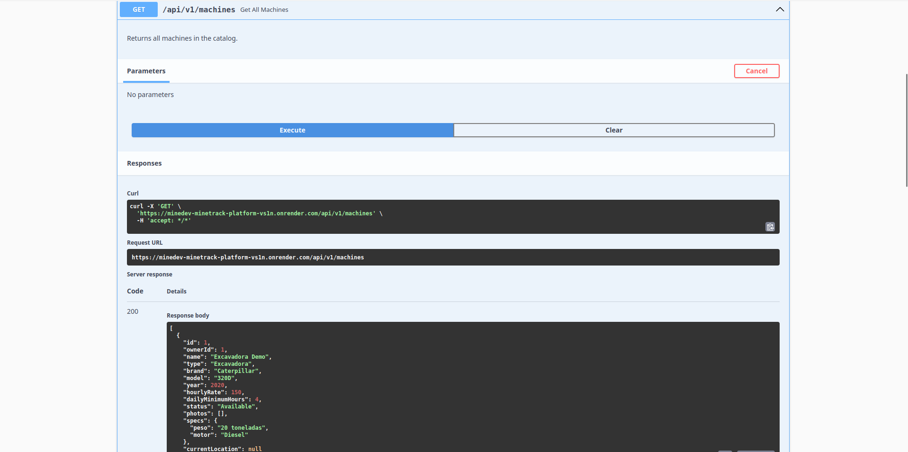

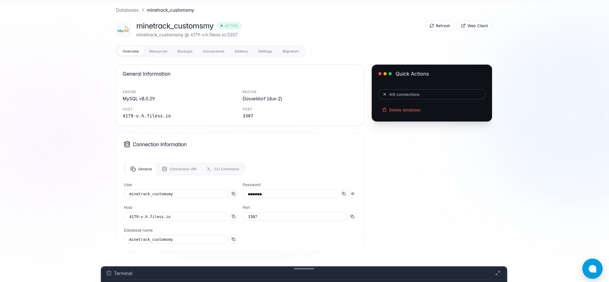
---

#### 5.2.3.6. Services Documentation Evidence for Sprint Review

Durante esta iteración, se inició la transición desde la Fake API (json-server) hacia una arquitectura de microservicios reales construidos en ASP.NET Core. Se documentaron los endpoints críticos correspondientes a los Bounded Contexts abordados en el sprint.

**Documentación de Endpoints (Swagger / OpenAPI):**

 Recurso | Acción implementada | Método HTTP | URL / Endpoint | Link de repositorio |
| --- | --- | --- | --- | --- |
| Machinery | Crear máquina | POST | `/api/v1/machines` | [minedev-upc-startup/MineDev.MineTrack.Platform](https://github.com/minedev-upc-startup/MineDev.MineTrack.Platform) |
| Machinery | Listar catálogo completo | GET | `/api/v1/machines` | [minedev-upc-startup/MineDev.MineTrack.Platform](https://github.com/minedev-upc-startup/MineDev.MineTrack.Platform) |
| Machinery | Consultar detalle por id | GET | `/api/v1/machines/{id}` | [minedev-upc-startup/MineDev.MineTrack.Platform](https://github.com/minedev-upc-startup/MineDev.MineTrack.Platform) |
| Machinery | Consultar flota por Propietario | GET | `/api/v1/owners/{ownerId}/machines` | [minedev-upc-startup/MineDev.MineTrack.Platform](https://github.com/minedev-upc-startup/MineDev.MineTrack.Platform) |
| Machinery | Actualizar estado de máquina | PATCH | `/api/v1/machines/{id}` | [minedev-upc-startup/MineDev.MineTrack.Platform](https://github.com/minedev-upc-startup/MineDev.MineTrack.Platform) |

Documentación interactiva (Swagger UI) publicada en:
https://minedev-minetrack-platform-vs1n.onrender.com/swagger

---

#### 5.2.3.7. Software Deployment Evidence for Sprint Review

En este Sprint, el equipo mantuvo el pipeline de despliegue continuo (CI/CD) para el Frontend en Firebase Hosting y procedió con el primer despliegue del Backend real para permitir la integración entre ambas capas en un entorno de producción.

**Despliegue del Frontend (Firebase):**
* El código del frontend con las nuevas vistas IoT y transaccionales se desplegó exitosamente en Firebase.

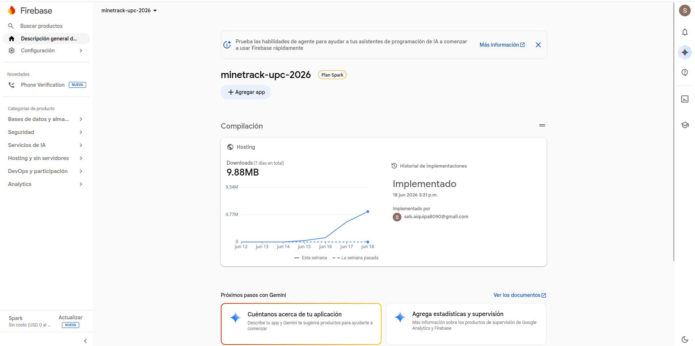

**Despliegue del Backend (API REST en la Nube):**

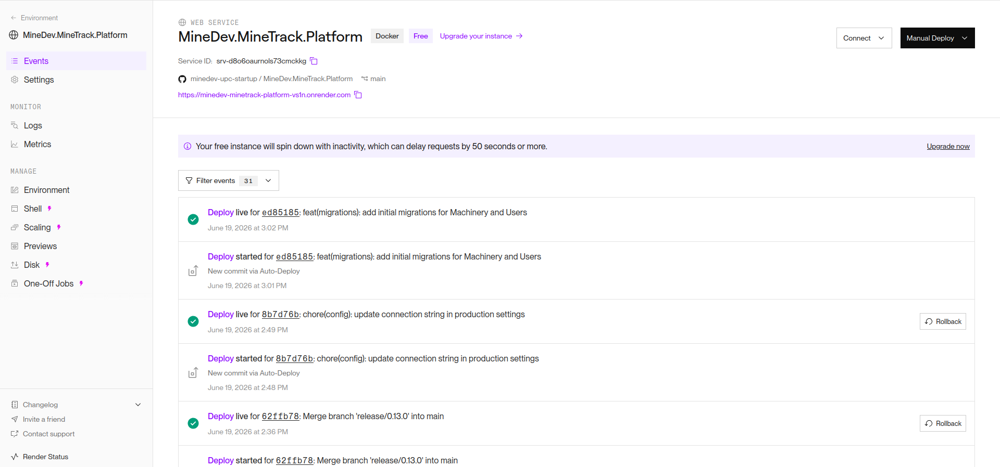

Documentación interactiva (Swagger UI) publicada en:
https://minedev-minetrack-platform-vs1n.onrender.com/swagger

---

#### 5.2.3.8. Team Collaboration Insights during Sprint

Durante el Sprint 3, la colaboración del equipo se caracterizó por una fuerte sincronización interdisciplinaria, dado que fue el primer sprint donde se integró código Frontend (Vue) de forma concurrente con el desarrollo de la API real en Backend (ASP.NET Core).

**Logros destacados:**
* Se logró implementar con éxito librerías complejas en el frontend, como Chart.js, para visualizar la telemetría simulada (vibración, temperatura y presión) cumpliendo con las expectativas del negocio.
* El equipo de Backend configuró rápidamente la estructura base (Controllers, Services, Repositories) y la conexión a la base de datos PostgreSQL utilizando Entity Framework Core, estableciendo los cimientos para reemplazar por completo la Fake API.
* Se mantuvo una comunicación constante a través de Discord para alinear los modelos de datos (DTOs) que el Frontend enviaría y el Backend recibiría (por ejemplo, en el registro de maquinaria y solicitudes de alquiler).

**Lecciones aprendidas:**
* **Integración Continua:** Nos dimos cuenta de que coordinar el trabajo cuando se desarrollan ambas capas en paralelo requiere acuerdos muy estrictos sobre los contratos de las APIs (JSONs) para no bloquear a los desarrolladores de Frontend mientras Backend termina los endpoints.
* **Gestión de Tiempos:** Tareas como la configuración de Entity Framework y los despliegues en plataformas en la nube (como Render) tomaron un poco más de lo estimado debido a configuraciones de variables de entorno, lo cual nos enseñó a asignar buffers de tiempo mayores para tareas de DevOps en futuros sprints.


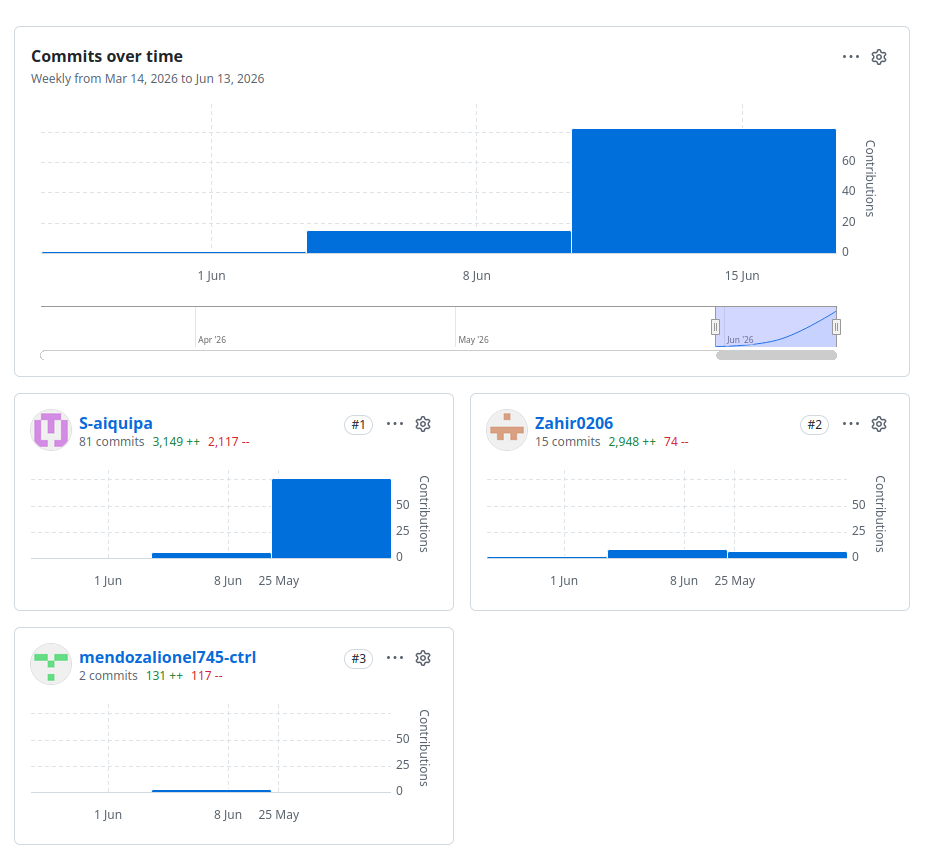
### 5.3. Validation Interviews

Para esta etapa del proyecto, tras la culminación del Sprint 3, se procedió a realizar entrevistas de validación con nuestros segmentos de usuarios objetivo: **Distribuidores de Maquinaria Pesada** y **Empresas de Servicios de Mantenimiento**. El propósito principal es recopilar *feedback* cualitativo sobre las nuevas funcionalidades implementadas, tales como la recuperación de contraseñas, registro de maquinaria, gestión de solicitudes de alquiler y el monitoreo telemétrico IoT en tiempo real.

#### 5.3.1. Diseño de Entrevistas

El guion de la entrevista se ha estructurado en tres secciones: una introducción general y preguntas específicas divididas por el segmento de usuario, enfocadas en validar los flujos desarrollados durante el Sprint 3.

**Preguntas Generales (Ambos Segmentos)**
1. ¿Fue sencillo el proceso para recuperar su contraseña en caso de olvido mediante la plataforma?
2. ¿Cómo percibe la fluidez y el diseño visual de la aplicación al navegar entre sus diferentes paneles de gestión?

**Preguntas para el Segmento: Distribuidores de Maquinaria Pesada**
1. **(US04 - Recuperación de credenciales):** ¿El flujo para recuperar o restablecer su contraseña en la plataforma le pareció intuitivo y seguro?
2. **(US05 - Registro de activos):** Al registrar una nueva máquina en su catálogo, ¿los campos solicitados le parecieron claros y suficientes para detallar las especificaciones de su equipo?
3. **(US07 - Búsqueda y Filtros):** ¿Considera que la organización visual de su flota y el uso de filtros facilitan la búsqueda rápida de un equipo en particular?
4. **(US08 - Solicitudes de Alquiler):** Cuando recibe una solicitud de alquiler por parte de un cliente, ¿la información mostrada en las tarjetas le permite tomar una decisión rápida para aprobar o rechazar el contrato?
5. **(UI/UX y Mejora):** ¿Hubo algún paso durante la navegación, el registro o la aprobación de alquileres que le resultara confuso o que cree que podría simplificarse aún más?

**Preguntas para el Segmento: Empresas de Servicios de Mantenimiento**
1. **(US04 - Accesibilidad):** ¿Tuvo algún inconveniente al momento de ingresar a su cuenta de taller o al utilizar la funcionalidad de recuperación de contraseña?
2. **(US09, US10 - Monitoreo IoT y Temperatura):** ¿El panel de monitoreo IoT le genera confianza al mostrar en tiempo real la temperatura del motor de los equipos en operación?
3. **(US12 - Indicadores de Presión):** ¿Los indicadores visuales (como los gráficos de medidores o semáforos) son lo suficientemente claros para identificar rápidamente si la presión de una máquina requiere atención inmediata?
4. **(US09 - Despacho de Técnicos):** Como proveedor de mantenimiento, ¿considera que el "Command Center" centralizado le aporta el valor y la información necesaria para decidir si debe enviar a un técnico al campo?
5. **(UI/UX y Mejora):** ¿Qué dato o indicador adicional le gustaría ver en el Dashboard IoT que actualmente no se encuentra visible y que facilitaría el diagnóstico de sus mecánicos?

---

#### 5.3.2. Registro de Entrevistas

A continuación, se detalla el registro de las entrevistas realizadas a los representantes de cada segmento objetivo. Las sesiones se grabaron con el consentimiento de los participantes para su posterior análisis y evaluación.

**Segmento 1: Propietarios de Maquinaria Pesada**

| Detalle | Información |
| :--- | :--- |
| **Entrevistado** |  Alonso Gutierrez|
| **Perfil** | Gerente Comercial en distribuidora de maquinaria pesada. |
| **Fecha y Duración** | 19/06/2026 - 5 minutos |
| **Evidencia (Link)** | https://1drv.ms/v/c/191e2f4b07143ce2/IQCnzQnvJHCfToLrra0_lzwuAYfOQxT60oTMCyWMjdeKECQ|
| |
| **Resumen y Feedback** | El usuario logró registrar un camión minero sin dificultades, destacando que el formulario es directo y adaptado al sector. Valoró muy positivamente el panel de solicitudes, mencionando que le ahorra tiempo en papeleo. Sugirió agregar la opción de subir múltiples fotos y documentos técnicos en formato PDF al registrar la máquina. |

| Detalle | Información |
| :--- | :--- |
| **Entrevistado** | Italo Pancorbo |
| **Perfil** | Asesor de Flota y Ventas B2B. |
| **Fecha y Duración** | 19/06/2026 - 5 minutos |
| **Evidencia (Link)** |  https://1drv.ms/v/c/191e2f4b07143ce2/IQBPN8VZ-lWSRqpwAcN3vNi8Ad8l-H_hazeiXrNOl9pdW9c  |
| |
| **Resumen y Feedback** | Probó exitosamente el flujo de recuperación de contraseña comprobando la recepción del correo. Al revisar el panel de alquileres activos, indicó que las tarjetas son claras, pero le gustaría que el sistema calcule automáticamente una proyección de ganancias antes de aprobar el contrato. Considera que la interfaz oscura le da un aspecto premium al sistema. |

**Segmento 2:  Empresas Mineras y Constructoras**

| Detalle | Información |
| :--- | :--- |
| **Entrevistado** | Tomas Mendoza |
| **Perfil** | Jefe de Taller en empresa de soporte pesado. |
| **Fecha y Duración** | 19/06/2026 - 5 minutos |
| **Evidencia (Link)** | https://1drv.ms/v/c/191e2f4b07143ce2/IQBPN8VZ-lWSRqpwAcN3vNi8Ad8l-H_hazeiXrNOl9pdW9c |
|   |
| **Resumen y Feedback** | La interacción con el *IoT Command Center* fue muy fluida. Mencionó que visualizar la telemetría en vivo (temperatura y presión) es un diferenciador enorme, ya que les permite anticiparse a fallas catastróficas del motor. Sugirió que, al presionar el botón de "Enviar Técnico", el sistema permita adjuntar una nota rápida sobre la anomalía detectada. |

### 5.3.3. Evaluaciones según heurísticas

**UX Heuristics & Principles Evaluation**
**Usability – Inclusive Design – Information Architecture**

**Carrera:** Ingeniería de Software
**Curso:** Aplicaciones Web
**Sección:** 1ASI0730
**Equipo Auditor:** Aiquipa Poma Sebastian, Mendoza Machoa Lionel, Meza Huanacuna Juan José, Figueroa Sanchez Alvaro, Sanchez Arenas Zahir, Molina Umeres Nestor.
**Site o APP a evaluar:** MineTrack (Web Application)

#### Tareas a Evaluar (Sprint 3)
*   Recuperar credenciales / contraseña.
*   Registro de activos y maquinaria pesada.
*   Búsqueda de maquinaria por filtros en el catálogo.
*   Creación y envío de solicitud de alquiler.
*   Monitoreo telemétrico de temperatura y presión en el Dashboard IoT.
*   Despacho de técnicos desde el IoT Command Center.

#### No están incluidas en esta versión de la evaluación las siguientes tareas:
*   Pasarela de pagos y facturación.
*   Historial histórico de mantenimientos pasados.
*   Chat integrado en tiempo real entre cliente y distribuidor.
*   Gestión de perfiles de usuario y configuración de notificaciones externas (SMS).

---

#### Escala de Severidad

| Nivel | Descripción |
| :---: | :--- |
| **1** | **Problema superficial:** Puede ser fácilmente superado por el usuario u ocurre con muy poca frecuencia. No necesita ser arreglado a no ser que exista disponibilidad de tiempo. |
| **2** | **Problema menor:** Puede ocurrir un poco más frecuentemente o es un poco más difícil de superar para el usuario. Se le debería asignar una prioridad baja para resolverlo de cara al siguiente release. |
| **3** | **Problema mayor:** Ocurre frecuentemente o los usuarios no son capaces de resolverlos. Es importante que sean corregidos y se les debe asignar una prioridad alta. |
| **4** | **Problema muy grave:** Un error de gran impacto que impide al usuario continuar con el uso de la herramienta. Es imperativo que sea corregido antes del lanzamiento. |

---

#### Tabla Resumen

| # | Problema | Escala de severidad | Heurística/Principio violada(o) |
| :---: | :--- | :---: | :--- |
| **1** | Falta de feedback visual al ingresar un correo no registrado al recuperar credenciales | 3 | Usabilidad: Visibilidad del estado del sistema |
| **2** | Ausencia de indicador de progreso al subir imágenes en el registro de maquinaria | 2 | Usabilidad: Visibilidad del estado del sistema |
| **3** | Pantalla vacía sin sugerencias cuando los filtros del catálogo no arrojan resultados | 2 | Usabilidad: Ayuda a diagnosticar y recuperarse de errores |
| **4** | Falta de opción para deshacer/cancelar una solicitud de alquiler recién enviada | 3 | Usabilidad: Control y libertad del usuario |
| **5** | Medidores IoT dependen únicamente del color, dificultando lectura para daltónicos | 2 | Diseño Inclusivo y Prevención de Errores |
| **6** | Ausencia de botón para silenciar alertas visuales/sonoras en el Dashboard IoT | 2 | Usabilidad: Control y libertad del usuario |
| **7** | Falta de indicación clara del rol/empresa activa en la barra de navegación superior | 2 | Usabilidad: Consistencia y estándares |

---

#### Descripción de problemas:

**PROBLEMA #1: Falta de feedback visual al ingresar un correo no registrado al recuperar credenciales**
*   **Severidad:** 3
*   **Heurística Violada:** Usabilidad - Visibilidad del estado del sistema.
*   **Problema:** En la vista de "Forgot Password", si el usuario ingresa un correo que no existe en la base de datos, el sistema no muestra un mensaje claro de error, dejando al usuario esperando un correo que nunca llegará.
*   **Recomendación:** Implementar un mensaje de alerta tipo "Toast" o texto en rojo debajo del input indicando que el correo no está registrado en el sistema.

**PROBLEMA #2: Ausencia de indicador de progreso al subir imágenes en el registro de maquinaria**
*   **Severidad:** 2
*   **Heurística Violada:** Usabilidad - Visibilidad del estado del sistema.
*   **Problema:** Al completar el formulario de registro de un activo pesado, el botón de guardado se bloquea mientras la imagen sube, pero no hay un "spinner" o barra de carga. El usuario puede pensar que la plataforma se ha colgado.
*   **Recomendación:** Añadir un componente de carga (spinner o progress bar) dentro del botón "Registrar" mientras se realiza la petición HTTP.

**PROBLEMA #3: Pantalla vacía sin sugerencias cuando los filtros del catálogo no arrojan resultados**
*   **Severidad:** 2
*   **Heurística Violada:** Usabilidad - Ayuda a los usuarios a reconocer, diagnosticar y recuperarse de errores.
*   **Problema:** Cuando un cliente utiliza la barra de filtros y no hay maquinaria que coincida con esos criterios, la pantalla muestra un fondo vacío (`0 machines found`), generando un punto ciego en la navegación.
*   **Recomendación:** Mostrar una ilustración amigable tipo "Empty State" acompañada de un botón que diga "Limpiar filtros" para que el usuario pueda volver al catálogo completo fácilmente.

**PROBLEMA #4: Falta de opción para deshacer/cancelar una solicitud de alquiler recién enviada**
*   **Severidad:** 3
*   **Heurística Violada:** Usabilidad - Control y libertad del usuario.
*   **Problema:** Si un arrendatario selecciona fechas incorrectas en el modal y envía la solicitud, no tiene una forma inmediata de cancelarla desde su panel; depende de que el propietario la rechace manualmente.
*   **Recomendación:** Incluir un botón de "Cancelar Solicitud" en el panel de *My Requests*, que esté disponible mientras el estado de la solicitud siga siendo "Pendiente".

**PROBLEMA #5: Medidores IoT dependen únicamente del color, dificultando lectura para daltónicos**
*   **Severidad:** 2
*   **Heurística Violada:** Diseño Inclusivo y Prevención de Errores.
*   **Problema:** Los gráficos de tipo *gauge* para medir la presión hidráulica y temperatura cambian de verde a rojo cuando hay peligro, pero no alteran su iconografía ni muestran textos de advertencia explícitos, lo cual afecta la accesibilidad visual.
*   **Recomendación:** Acompañar el cambio de color con un icono de alerta (triángulo de advertencia) y una etiqueta de texto que diga "Estado Crítico" o "Normal".

**PROBLEMA #6: Ausencia de botón para silenciar alertas visuales/sonoras en el Dashboard IoT**
*   **Severidad:** 2
*   **Heurística Violada:** Usabilidad - Control y libertad del usuario.
*   **Problema:** Si múltiples sensores entran en estado crítico, el Command Center muestra las alertas constantemente, pero el Jefe de Taller no tiene una opción rápida para silenciar la notificación visual en la pantalla principal mientras gestiona el problema.
*   **Recomendación:** Agregar un icono de campana en el Dashboard IoT que permita mutear las alertas activas temporalmente ("Snooze").

**PROBLEMA #7: Falta de indicación clara del rol/empresa activa en la barra de navegación superior**
*   **Severidad:** 2
*   **Heurística Violada:** Usabilidad - Consistencia y estándares.
*   **Problema:** Dado que la plataforma soporta múltiples Bounded Contexts, al iniciar sesión, la barra superior (TopBar) no muestra de forma prominente si el usuario está conectado como "Owner" o "Maintenance", lo que puede confundir en cuentas de prueba o usuarios duales.
*   **Recomendación:** Incluir una etiqueta tipo "Badge" junto al nombre del usuario en la esquina superior derecha que indique el rol actual (ej. `[Distribuidor]` o `[Taller]`).


## Conclusiones

A partir del desarrollo y análisis integral del proyecto **MineTrack**, se establecen las siguientes conclusiones fundamentales que validan la viabilidad y el impacto de la plataforma:

1. **Resolución de una Brecha Crítica en el Mercado:** La investigación de mercado y las entrevistas a usuarios evidencian una desconexión significativa entre los propietarios de maquinaria pesada subutilizada y las empresas constructoras o mineras con necesidades temporales de equipos. MineTrack se consolida como una solución de economía colaborativa B2B  que optimiza el uso de activos de alto valor, transformando costos hundidos en nuevas líneas de ingresos para los arrendadores y ofreciendo flexibilidad operativa a los arrendatarios.

2. **Integración de IoT como Diferenciador Estratégico:** A diferencia de los modelos tradicionales de alquiler, la implementación de tecnología IoT  para la telemetría en tiempo real constituye la ventaja competitiva central de MineTrack. La capacidad de monitorear horas de uso, consumo de combustible, ubicación GPS y alertas de mantenimiento preventivo no solo garantiza la transparencia y seguridad de los activos, sino que también permite un modelo de facturación dinámico basado en el uso real , reduciendo fricciones entre las partes.

3. **Arquitectura Escalable y Robusta:** El diseño técnico bajo una arquitectura respaldada por *Domain-Driven Design*  garantiza que la plataforma pueda escalar horizontalmente. La clara separación de *Bounded Contexts* (IAM, Catalog, Rentals, IoT, Reviews) permite que el sistema maneje volúmenes crecientes de transacciones, perfiles de usuario y datos telemétricos sin comprometer el rendimiento ni la integridad de la información.

4. **Experiencia de Usuario (UX) Centrada en la Confianza:** El desarrollo de la interfaz a través de metodologías ágiles y *Design Thinking* ha dado como resultado una plataforma intuitiva. La inclusión de perfiles verificados, un sistema de calificaciones cruzadas (Reviews) y pasarelas de pago seguras aborda la principal preocupación de los usuarios: la confianza y la seguridad al transaccionar con equipos de alto valor monetario.

5. **Viabilidad Comercial a Corto y Mediano Plazo:** El análisis preliminar, apoyado en la validación del *Lean UX* y los *User Journeys*, confirma que existe una disposición a pagar por parte del segmento *Early Adopter*. Esto perfila a MineTrack como una *startup* con alto potencial de penetración en el mercado de construcción y minería, con un modelo de ingresos escalable basado en comisiones por transacción y suscripciones premium para análisis avanzados de flota.
                                                                              
## Bibliografía


### Tecnologías Frontend (Vue.js, Pinia, Axios)
1. You, E. (2024). *Vue.js: The Progressive JavaScript Framework*. Vue.js Official Documentation. https://vuejs.org/guide/introduction.html
2. Posva, E. (2024). *Pinia: The intuitive store for Vue.js*. Pinia Official Documentation. https://pinia.vuejs.org/
3. Zabriskie, M. (2024). *Axios: Promise based HTTP client for the browser and node.js*. Axios Docs. https://axios-http.com/docs/intro
4. Mozilla Developer Network [MDN]. (2024). *JavaScript modules*. MDN Web Docs. https://developer.mozilla.org/en-US/docs/Web/JavaScript/Guide/Modules

### Tecnologías Backend y Base de Datos (.NET, C#, MySQL)
5. Microsoft. (2024). *Introducción a ASP.NET Core*. Microsoft Learn. https://learn.microsoft.com/es-es/aspnet/core/introduction-to-aspnet-core
6. Microsoft. (2024). *Información general sobre Entity Framework Core*. Microsoft Learn. https://learn.microsoft.com/es-es/ef/core/
7. Oracle. (2024). *MySQL 8.0 Reference Manual*. MySQL Documentation. https://dev.mysql.com/doc/refman/8.0/en/
8. SmartBear Software. (2024). *OpenAPI Specification*. Swagger. https://swagger.io/specification/
9. Bradley, J., Natarajan, N., Sakimura, N., & Jones, M. (2015). *JSON Web Token (JWT)*. Internet Engineering Task Force (IETF). https://datatracker.ietf.org/doc/html/rfc7519

### Arquitectura de Software y Patrones (DDD, CQRS, REST)
10. Evans, E. (2003). *Domain-Driven Design: Tackling Complexity in the Heart of Software*. Addison-Wesley Professional. https://www.oreilly.com/library/view/domain-driven-design-tackling/0321125215/
11. Martin, R. C. (2017). *Clean Architecture: A Craftsman's Guide to Software Structure and Design*. Prentice Hall. https://www.oreilly.com/library/view/clean-architecture-a/9780134494272/
12. Fowler, M. (2011). *CQRS*. MartinFowler.com. https://martinfowler.com/bliki/CQRS.html
13. Newman, S. (2015). *Building Microservices: Designing Fine-Grained Systems*. O'Reilly Media. https://www.oreilly.com/library/view/building-microservices/9781491950340/
14. Fielding, R. T. (2000). *Architectural Styles and the Design of Network-based Software Architectures* [Disertación doctoral, University of California, Irvine]. https://www.ics.uci.edu/~fielding/pubs/dissertation/top.htm

### Metodologías Ágiles y Experiencia de Usuario (Scrum, Lean UX)
15. Schwaber, K., & Sutherland, J. (2020). *The Scrum Guide*. Scrum.org. https://scrumguides.org/scrum-guide.html
16. Beck, K., Beedle, M., van Bennekum, A., Cockburn, A., Cunningham, W., Fowler, M., ... & Thomas, D. (2001). *Manifesto for Agile Software Development*. Agile Alliance. https://agilemanifesto.org/
17. Gothelf, J., & Seiden, J. (2016). *Lean UX: Designing Great Products with Agile Teams* (2da ed.). O'Reilly Media. https://www.oreilly.com/library/view/lean-ux-2nd/9781491953594/
18. Brown, T. (2008). Design Thinking. *Harvard Business Review*. https://hbr.org/2008/06/design-thinking

### IoT y Modelos de Negocio (B2B, Economía Colaborativa)
19. Greengard, S. (2015). *The Internet of Things*. MIT Press. https://mitpress.mit.edu/9780262527736/the-internet-of-things/
20. Botsman, R., & Rogers, R. (2010). *What's Mine Is Yours: The Rise of Collaborative Consumption*. HarperBusiness. https://www.harpercollins.com/products/whats-mine-is-yours-rachel-botsmanroo-rogers

## Anexos

- **Landing Page (deployed):** https://minedev-upc-startup.github.io/landing-page/
- **Repositorio Landing:** https://github.com/minedev-upc-startup/landing-page
- **Repositorio Frontend Web App:** https://github.com/minedev-upc-startup/minetrack-frontend
- **Repositorio Project Report:** https://github.com/minedev-upc-startup/upc-pre-202610-1asi0730-report
- **Trello Sprint 1:** https://trello.com/b/UJwSqATK/minetrack-sprint-1

- **Trello Sprint 2:** https://trello.com/b/YZ5VLjG8/minetrack-sprint-2
