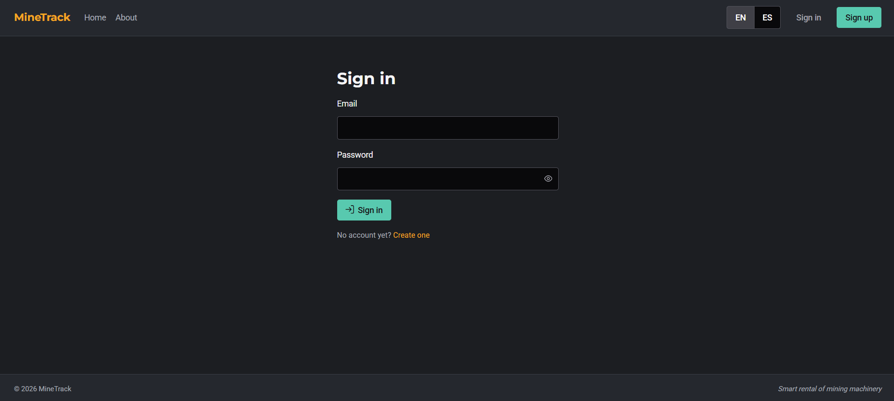
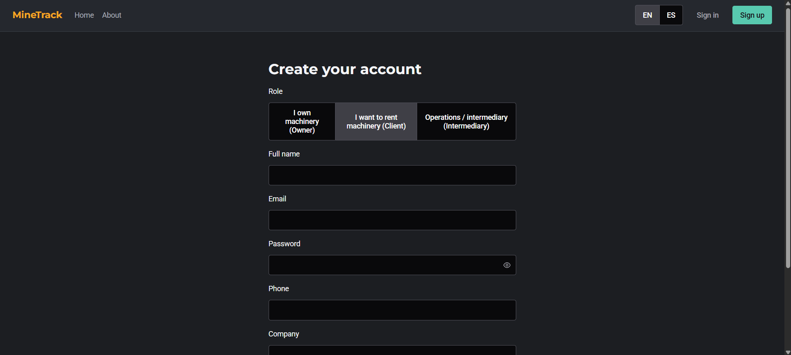
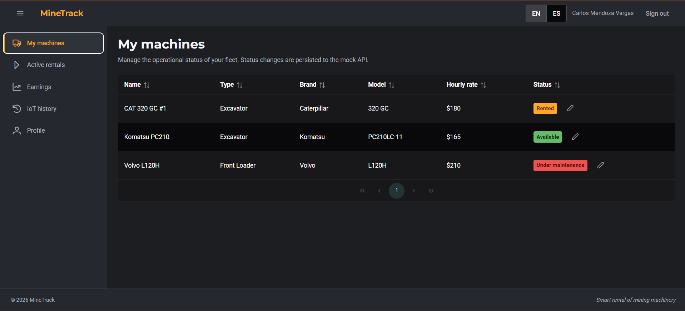
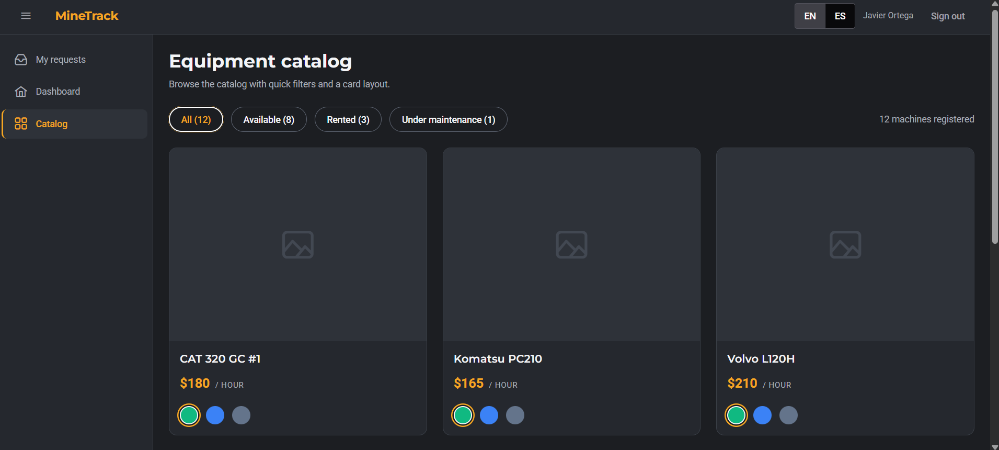

# Capítulo V: Product Implementation, Validation & Deployment

## 5.1. Software Configuration Management

Para el desarrollo de MineTrack se aplicó una gestión de configuración de software ordenada que permite al equipo trabajar sobre una misma base, mantener la trazabilidad de los cambios y soportar la integración progresiva de los productos digitales del alcance: Landing Page, Frontend Web Application y, en sprints posteriores, los Web Services basados en ASP.NET Core C#.

MineTrack es una plataforma B2B para el alquiler de maquinaria minera pesada que conecta a Propietarios de equipos con Clientes (empresas mineras y constructoras), apoyada por una capa compartida de telemetría IoT. Por esta naturaleza multi-producto y multi-rol, las decisiones de configuración descritas a continuación buscan garantizar consistencia técnica y trazabilidad entre los repositorios del proyecto.

### 5.1.1. Software Development Environment Configuration

Desde el inicio del proyecto, el equipo acordó un entorno de desarrollo común para todos los integrantes, alineado con el stack oficial del curso 1ASI0730 Aplicaciones Web. Esto evita problemas de compatibilidad y facilita la integración del trabajo individual.

| Actividad                   | Herramienta / Guía  | Propósito                                      | Tipo de acceso / Ruta                            |
| --------------------------- | ------------------- | ---------------------------------------------- | ------------------------------------------------ |
| Gestión de proyecto         | Trello              | Organizar y dar seguimiento a tasks por sprint | [Trello](https://trello.com)                     |
| Gestión de requerimientos   | Gherkin Conventions | Definir criterios de aceptación claros         | [Gherkin](https://cucumber.io/docs/gherkin/)     |
| Producto UI/UX              | Figma               | Diseño de wireframes y mock-ups                | [Figma](https://figma.com)                       |
| Desarrollo Frontend Web App | WebStorm            | Edición y desarrollo del proyecto Vue.js       | [WebStorm](https://www.jetbrains.com/webstorm/)  |
| Desarrollo Landing Page     | Visual Studio Code  | Edición de HTML/CSS/JavaScript de la Landing   | [VS Code](https://code.visualstudio.com/)        |
| Control de versiones        | Git                 | Gestión de versiones del código fuente         | [Git](https://git-scm.com/)                      |
| Hosting de repositorios     | GitHub              | Repositorios remotos del equipo                | [GitHub](https://github.com/minedev-upc-startup) |
| Despliegue Landing Page     | GitHub Pages        | Publicación pública de la Landing              | [GitHub Pages](https://pages.github.com/)        |
| Despliegue Frontend Web App | Firebase Hosting    | Publicación pública de la Web App              | [Firebase](https://firebase.google.com/)         |
| Despliegue Fake API         | Beeceptor           | Mock público del backend para TB1              | [Beeceptor](https://beeceptor.com/)              |
| Event Storming              | Miro                | Modelado colaborativo del dominio              | [Miro](https://miro.com/)                        |
| Diagramas                   | PlantUML            | Generación de diagramas UML del dominio        | [PlantUML](https://plantuml.com/)                |

**Stack tecnológico del producto:**

- **Landing Page:** HTML5, CSS3 y JavaScript vanilla (sin framework, optimizado para GitHub Pages)
- **Frontend Web Application:** Vue.js 3 + Vite + Pinia + Vue Router + Vue I18n + PrimeVue + PrimeFlex
- **Backend (planificado para TB2):** ASP.NET Core 10 con C#, Entity Framework Core, PostgreSQL
- **Fake API (TB1):** JSON Server, desplegado mediante Beeceptor para acceso público

### 5.1.2. Source Code Management

La gestión de código fuente se realiza sobre repositorios independientes hospedados en la organización GitHub `minedev-upc-startup`, uno por cada producto digital del alcance:

| Producto                 | Repositorio                      | URL                                                                   |
| ------------------------ | -------------------------------- | --------------------------------------------------------------------- |
| Frontend Web Application | `minetrack-frontend`             | https://github.com/minedev-upc-startup/minetrack-frontend             |
| Landing Page             | `landing-page`                   | https://github.com/minedev-upc-startup/landing-page                   |
| Project Report           | `upc-pre-202610-1asi0730-report` | https://github.com/minedev-upc-startup/upc-pre-202610-1asi0730-report |

Para la gestión del código fuente se aplica el modelo de ramificación GitFlow, el versionado semántico y las convenciones de mensajes de commit que se detallan a continuación.

**GitFlow Workflow**

Se utiliza el modelo de ramificación propuesto por Vincent Driessen ("A successful Git branching model"). Las ramas principales son:

- **main**: contiene siempre el código en producción. Solo recibe merges desde `develop` en hitos de entrega (TB1, TB2).
- **develop**: rama de integración principal donde se consolidan las funcionalidades antes de pasar a producción.
- **feature/\***: ramas creadas a partir de `develop` para nuevas funcionalidades. Convención: `feature/<descripción-corta>` (ejemplo: `feature/spine-three-layouts`, `feature/rentals-core`).
- **fix/\***: ramas creadas para corrección de errores. Convención: `fix/<descripción-corta>`.

Las ramas `main` y `develop` cuentan con reglas de protección configuradas en GitHub: requieren pull request con al menos una aprobación, bloquean force-push y restringen eliminación.

**Versionado Semántico**

Se aplica Semantic Versioning 2.0.0, con el formato `MAJOR.MINOR.PATCH`. Ejemplo: `v0.1.0` corresponde al cierre del Sprint 1.

**Convenciones de Commits**

Se emplea el estándar Conventional Commits, facilitando la trazabilidad y la futura automatización de changelogs. Los tipos utilizados son `feat`, `fix`, `chore`, `docs`, `refactor`, `style`. El scope coincide con el bounded context o aspecto afectado (`iam`, `shared`, `infra`, `landing`, `rentals`).

Ejemplos de mensajes empleados en el proyecto:

feat(landing): add complete landing page with i18n EN/ES support
feat(shared): add owner and client layouts with role-based sidebar
feat(iam): add authentication bounded context end-to-end
chore(infra): add scaffold (shared layer, iam context, template, docs)

### 5.1.3. Source Code Style Guide & Conventions

#### Landing Page Style Guide & Conventions

**Estructura del proyecto**

landing-page/
├── index.html
├── styles.css
├── script.js
└── assets/
├── images/
└── icons/

**HTML**

- Uso de etiquetas semánticas (`header`, `nav`, `main`, `section`, `article`, `footer`)
- Accesibilidad: atributos `alt` en imágenes, `aria-label` en enlaces sin texto, orden lógico del DOM
- SEO: `<title>`, `<meta name="description">`, `lang="es"` en `<html>`
- Convenciones de nombres: kebab-case para clases CSS, IDs solo para anclas de navegación

**CSS**

- Nomenclatura BEM: `.block__element--modifier`
- Variables de diseño definidas en `:root`, alineadas con los design tokens del Frontend Web App:

```css
--mt-color-primary: #f5a623;
--mt-color-bg-base: #1c1e22;
--mt-color-text-primary: #f4f5f7;
--mt-font-display: "Montserrat", sans-serif;
```

- Arquitectura mobile-first con breakpoints en 600px y 900px
- Uso de `rem` para tipografía y `clamp()` para tamaños fluidos

**JavaScript**

- Diseño modular, un único punto de entrada (`script.js`)
- camelCase para variables y funciones
- Persistencia de preferencias de usuario mediante `localStorage`
- Uso de `addEventListener` (sin `onclick` inline)

#### Frontend Web Application Style Guide & Conventions

El Frontend Web Application sigue un patrón arquitectónico de **Domain-Driven Design (DDD)** con bounded contexts, replicando la estructura propuesta por el profesor en el proyecto de referencia `learning-center`.

**Estructura por bounded context**

Cada bounded context vive bajo `src/` con cuatro capas:

src/<context>/
├── domain/
│ ├── _.command.js
│ └── model/
│ └── _.entity.js
├── application/
│ └── _.store.js
├── infrastructure/
│ ├── _-api.js
│ ├── _.resource.js
│ └── _.assembler.js
└── presentation/
├── components/
├── views/
└── \*-routes.js

**Regla de dependencia (hard rule):**

presentation → application → infrastructure → domain

El layer `domain` no importa nada de los otros layers. El layer `infrastructure` no importa Vue. El layer `presentation` nunca importa Axios directamente — todo HTTP pasa por el API gateway del bounded context.

**Naming conventions:**

| Elemento              | Convención               | Ejemplo                          |
| --------------------- | ------------------------ | -------------------------------- |
| Archivos              | kebab-case con sufijo    | `rental-request.entity.js`       |
| Clases                | PascalCase               | `RentalRequest`, `IamApi`        |
| Variables y funciones | camelCase                | `submitRentalRequest`            |
| Pinia store hook      | `useXxxStore`            | `useRentalsStore`                |
| Vue route names       | `<context>-<action>`     | `owner-incoming-requests`        |
| i18n keys             | `<context>.<area>.<key>` | `iam.signIn.title`               |
| Componentes PrimeVue  | prefijo `pv-`            | `<pv-button>`, `<pv-data-table>` |

Estas convenciones se documentan formalmente en el archivo `CONVENTIONS.md` del repositorio frontend, que sirve como referencia para todo el equipo durante code reviews.

### 5.1.4. Software Deployment Configuration

El despliegue de los productos digitales de MineTrack se realiza sobre proveedores cloud especializados, cada uno seleccionado según las características técnicas del producto.

#### Landing Page — GitHub Pages

La Landing Page se implementa con HTML, CSS y JavaScript nativo. Todos los archivos se ubican en la raíz del repositorio `landing-page`, asegurando que `index.html` sea reconocido automáticamente por GitHub Pages como punto de entrada.

**Activación de GitHub Pages:**

1. Acceder al repositorio `minedev-upc-startup/landing-page` en GitHub
2. Ir a la pestaña **Settings**
3. En el menú lateral, seleccionar **Pages**
4. En **Source**, configurar: rama `main`, carpeta `/ (root)`
5. Guardar los cambios

**Publicación**

GitHub genera automáticamente una URL pública con el formato:

https://minedev-upc-startup.github.io/landing-page/

Cualquier commit en la rama `main` se despliega automáticamente sin pasos adicionales.

#### Frontend Web Application — Firebase Hosting

El Frontend Web Application se construye mediante Vite y se despliega a Firebase Hosting. La generación de la build de producción se realiza con:

```bash
npm run build
```

Este comando produce un directorio `dist/` optimizado que se sube a Firebase. La configuración de Firebase Hosting se gestiona vía Firebase CLI con el archivo `firebase.json` en la raíz del proyecto.

**URL pública de despliegue:** https://minetrack-upc-2026.web.app

#### Fake API — Beeceptor

Mientras el backend C# se entrega en TB2, el Frontend Web Application se conecta a un mock público de la API hospedado en Beeceptor. Este servicio expone los endpoints de `db.json` como URLs HTTP públicas, permitiendo que el Frontend desplegado en Firebase haga peticiones reales sin depender de un servidor local.

**URL pública del Fake API:** `[LLENAR: URL de Beeceptor después del deploy de mañana]`

---

## 5.2. Landing Page, Services & Applications Implementation

### 5.2.1. Sprint 1

En esta sección se documenta el Sprint 1 del proyecto MineTrack, orientado principalmente a la construcción de la Landing Page de la plataforma. En esta primera fase, el equipo definió la meta del Sprint, priorizó las User Stories del Epic EP07 (Landing Page e Información Pública) y determinó los entregables esenciales que harán posible presentar una versión inicial pública del producto.

Esta planificación busca garantizar una visión común entre todos los integrantes del equipo y establecer un punto de partida sólido para transmitir con claridad el valor de MineTrack a los visitantes — tanto Propietarios de maquinaria como Clientes (empresas mineras) potenciales.

#### 5.2.1.1. Sprint Planning 1

| Sprint #                         | Sprint 1                                                                                                                                                                                                                                                                                                                                                                                                                                                                                                                                                                                                                                                                                                   |
| -------------------------------- | ---------------------------------------------------------------------------------------------------------------------------------------------------------------------------------------------------------------------------------------------------------------------------------------------------------------------------------------------------------------------------------------------------------------------------------------------------------------------------------------------------------------------------------------------------------------------------------------------------------------------------------------------------------------------------------------------------------- |
| **Sprint Planning Background**   |                                                                                                                                                                                                                                                                                                                                                                                                                                                                                                                                                                                                                                                                                                            |
| Date                             | 2026-05-27                                                                                                                                                                                                                                                                                                                                                                                                                                                                                                                                                                                                                                                                                                 |
| Time                             | 8:00 PM (GMT-5)                                                                                                                                                                                                                                                                                                                                                                                                                                                                                                                                                                                                                                                                                            |
| Location                         | Reunión virtual vía Discord                                                                                                                                                                                                                                                                                                                                                                                                                                                                                                                                                                                                                                                                                |
| Prepared By                      | Meza Huanacuna, Juan José                                                                                                                                                                                                                                                                                                                                                                                                                                                                                                                                                                                                                                                                                  |
| Attendees                        | Aiquipa Poma, Sebastian Andres / Mendoza Machoa, Lionel / Meza Huanacuna, Juan José / Figueroa Sanchez, Alvaro / Sanchez Arenas, Zahir Emmanuel / Molina Umeres, Nestor                                                                                                                                                                                                                                                                                                                                                                                                                                                                                                                                    |
| Sprint 0 — Review Summary        | Dado que este es el sprint inicial, no se presenta un resumen del sprint anterior.                                                                                                                                                                                                                                                                                                                                                                                                                                                                                                                                                                                                                         |
| Sprint 0 — Retrospective Summary | Dado que este es el sprint inicial, no se presenta una retroalimentación del sprint anterior.                                                                                                                                                                                                                                                                                                                                                                                                                                                                                                                                                                                                              |
| **Sprint Goal & User Stories**   |                                                                                                                                                                                                                                                                                                                                                                                                                                                                                                                                                                                                                                                                                                            |
| Sprint 1 Goal                    | **Nuestro propósito es** diseñar y entregar una primera versión pública de la Landing Page de MineTrack, comunicando claramente la propuesta de valor del marketplace de alquiler de maquinaria minera tanto a Propietarios como a empresas mineras. **Creemos que esto aportará** claridad y confianza inicial a los visitantes, permitiendo que comprendan el modelo de negocio y se sientan motivados a registrarse en la plataforma. **Esto se confirmará cuando** la Landing Page se encuentre desplegada en una URL pública accesible, presente todas las secciones requeridas (Hero, Cómo funciona, Características, Equipo, FAQ y Contacto) y soporte internacionalización entre español e inglés. |
| Sprint 1 Velocity                | 13 puntos                                                                                                                                                                                                                                                                                                                                                                                                                                                                                                                                                                                                                                                                                                  |
| Sum of Story Points              | 13 puntos                                                                                                                                                                                                                                                                                                                                                                                                                                                                                                                                                                                                                                                                                                  |

#### 5.2.1.2. Aspect Leaders and Collaborators

En esta sección se presenta la **Leadership-and-Collaboration Matrix (LACX)** correspondiente al Sprint 1. Cada aspecto se relaciona con tareas clave del Sprint, asignando un **líder (L)** responsable principal y **colaboradores (C)** que apoyan en su ejecución.

| Team Member                    | GitHub Username         | Landing Page Implementation (L/C) | Diseño UI/UX (L/C) | Configuración de Repositorios (L/C) | Internacionalización i18n (L/C) | Documentación (L/C) |
| ------------------------------ | ----------------------- | --------------------------------- | ------------------ | ----------------------------------- | ------------------------------- | ------------------- |
| Aiquipa Poma, Sebastian Andres | `S-aiquipa`             | **L**                             | C                  | **L**                               | **L**                           | C                   |
| Mendoza Machoa, Lionel         | `mendozalionel745-ctrl` | C                                 | C                  | C                                   | C                               | **L**               |
| Meza Huanacuna, Juan José      | `JuanMHZ12`             | C                                 | **L**              | C                                   | C                               | C                   |
| Figueroa Sanchez, Alvaro       | `2003V616`              | C                                 | C                  | C                                   | C                               | **L**               |
| Sanchez Arenas, Zahir Emmanuel | `Zahir210206`           | C                                 | **L**              | C                                   | C                               | C                   |
| Molina Umeres, Nestor          | `Nesthoro`              | C                                 | C                  | C                                   | C                               | C                   |

**Notas:**

- Cada integrante asume liderazgo en al menos un aspecto para distribuir responsabilidades equitativamente
- Los colaboradores apoyan al líder en la ejecución, revisión y validación de las tareas correspondientes
- Sebastian Aiquipa lideró la implementación técnica de la Landing y la configuración inicial de los repositorios de la organización GitHub `minedev-upc-startup`
- Lionel Mendoza y Alvaro Figueroa lideraron la documentación del Capítulo 5 y la coordinación de evidencias del Sprint
- Juan Meza y Zahir Sanchez lideraron el diseño UI/UX, definiendo la paleta de colores (slate oscuro + amber industrial) y la estructura de secciones de la Landing

#### 5.2.1.3. Sprint Backlog 1


https://trello.com/b/UJwSqATK/minetrack-sprint-1

A continuación se presenta el Sprint Backlog del Sprint 1, con las User Stories seleccionadas del Epic EP07 (Landing Page e Información Pública) y su descomposición en tasks. Cada ítem incluye descripción, estimación en horas, asignación y estado al cierre del Sprint.

| Sprint # | US ID | User Story Title                    | Task ID    | Task Title                | Description                                                                                                              | Estimation (Hours) | Assigned To    | Status |
| -------- | ----- | ----------------------------------- | ---------- | ------------------------- | ------------------------------------------------------------------------------------------------------------------------ | ------------------ | -------------- | ------ |
| 1        | US27  | Landing Page Value Proposition      | US27-T001  | Hero Section              | Implementar sección Hero con título, subtítulo, dos CTAs (Owner / Client) y fondo con gradiente de la paleta MineTrack.  | 4                  | Sebastian      | Done   |
| 1        |       |                                     | US27-T002  | About Us Section          | Implementar sección Sobre Nosotros con descripción del modelo de negocio del marketplace.                                | 2                  | Juan José      | Done   |
| 1        |       |                                     | US27-T003  | Top Bar Sticky            | Implementar barra superior fija con marca, navegación interna y selector de idioma.                                      | 3                  | Sebastian      | Done   |
| 1        | US28  | How-It-Works for Owners and Clients | US28-T001  | How-It-Works Owner Card   | Card con 4 pasos del journey del Propietario: registrar máquinas → recibir solicitudes → aprobar → cobrar por horas.     | 3                  | Sebastian      | Done   |
| 1        |       |                                     | US28-T002  | How-It-Works Client Card  | Card con 4 pasos del journey del Cliente: navegar catálogo → solicitar máquina → aprobación → monitorear en tiempo real. | 3                  | Sebastian      | Done   |
| 1        |       |                                     | US28-T003  | Features Section          | Grid de 6 features principales con íconos de PrimeIcons.                                                                 | 4                  | Zahir Emmanuel | Done   |
| 1        |       |                                     | US28-T004  | Team Section              | Sección Equipo con cards de los 6 integrantes y sus roles en el proyecto.                                                | 2                  | Alvaro         | Done   |
| 1        | US29  | Public Contact Form                 | US29-T001  | FAQ Section               | Sección de Preguntas Frecuentes con 4 ítems collapsables (uso de `<details>` semántico).                                 | 3                  | Sebastian      | Done   |
| 1        |       |                                     | US29-T002  | CTA Section               | Sección final con call-to-action a la plataforma y al contacto.                                                          | 2                  | Sebastian      | Done   |
| 1        |       |                                     | US29-T003  | Footer                    | Footer con información de contacto, redes sociales y datos del curso.                                                    | 2                  | Alvaro         | Done   |
| 1        | INFRA | Project Setup                       | INFRA-T001 | GitHub Organization Setup | Crear organización `minedev-upc-startup`, repositorios y configurar branch protection.                                   | 3                  | Sebastian      | Done   |
| 1        | INFRA |                                     | INFRA-T002 | GitHub Pages Deployment   | Configurar deploy automático de la Landing Page desde rama `main`.                                                       | 1                  | Sebastian      | Done   |
| 1        | i18n  | Internationalization                | i18n-T001  | Translation Dictionary    | Definir diccionario JSON con keys EN/ES para todas las secciones de la Landing.                                          | 3                  | Sebastian      | Done   |
| 1        | i18n  |                                     | i18n-T002  | Language Toggle           | Implementar selector EN/ES con persistencia en `localStorage` y detección automática del idioma del browser.             | 2                  | Sebastian      | Done   |

**Total Story Points: 13**
**Total Estimación: 37 horas**

#### 5.2.1.4. Development Evidence for Sprint Review

Durante el Sprint 1, el equipo se enfocó exclusivamente en el desarrollo de la Landing Page de MineTrack. El objetivo principal fue construir una página pública funcional, visualmente atractiva y completamente responsiva, que comunique eficazmente la propuesta de valor del marketplace de alquiler de maquinaria minera tanto a Propietarios como a empresas mineras.

A lo largo del Sprint se diseñaron e implementaron las secciones clave: Hero con propuesta de valor, Sobre Nosotros, Cómo Funciona (con cards separados para Owner y Client), Características principales, Equipo, Preguntas Frecuentes y Footer con información de contacto y redes sociales.

| Repository   | Branch | Commit Id | Commit Message                                   | Committed By | Date       |
| ------------ | ------ | --------- | ------------------------------------------------ | ------------ | ---------- |
| landing-page | main   | f482a0d   | feat(i18n): Add i18n feature english and spanish | S-aiquipa    | 2026-05-13 |
| landing-page | main   | 00ff82f   | doc: define styles for the landing page          | S-aiquipa    | 2026-05-13 |
| landing-page | main   | 6d37432   | doc: define index html structure                 | S-aiquipa    | 2026-05-13 |
| landing-page | main   | e6fe707   | initial commit                                   | S-aiquipa    | 2026-05-13 |

#### 5.2.1.5. Execution Evidence for Sprint Review

Al cierre del Sprint 1 se obtuvo una Landing Page completamente funcional, desplegada en un entorno público mediante GitHub Pages. La página presenta de manera coherente la propuesta de MineTrack y permite navegar fluidamente entre todas sus secciones mediante scroll y enlaces de anclaje en la barra superior.

**Evidencias visuales:**


**Validación funcional:**

- La Landing carga correctamente en navegadores Chrome, Firefox y Safari
- El selector de idioma EN/ES actualiza todos los textos sin recargar la página
- La preferencia de idioma persiste entre visitas mediante `localStorage`
- Todas las secciones se adaptan a viewports móviles (≤600px), tablets (≤900px) y desktop
- Los enlaces de la barra superior navegan correctamente a las secciones internas
- Los CTAs apuntan a las URLs públicas correctas (plataforma y email de contacto)

#### 5.2.1.6. Services Documentation Evidence for Sprint Review

Durante el Sprint 1 no se implementaron servicios backend del lado servidor, ya que el alcance del Sprint se limitó a la Landing Page (sitio estático). La documentación de servicios se enfocará en los Sprints siguientes, cuando se implementen los Web Services del Frontend Web Application sobre la Fake API y, posteriormente, los servicios C# del backend real en TB2.

Sin embargo, durante el Sprint 1 se documentó la siguiente decisión técnica relevante: **separación de productos digitales en repositorios independientes**, lo cual permite que cada producto (Landing Page, Frontend Web App, Web Services) tenga su propio ciclo de despliegue, control de versiones y estrategia de hosting, en línea con las buenas prácticas de arquitectura distribuida orientada a servicios.

#### 5.2.1.7. Software Deployment Evidence for Sprint Review

La Landing Page se desplegó exitosamente en GitHub Pages, integrada con CI/CD automático desde la rama `main`. Cada commit a `main` activa un nuevo build y publicación, sin pasos manuales adicionales.

**URLs de despliegue:**

- **Landing Page (producción):** https://minedev-upc-startup.github.io/landing-page/
- **Repositorio:** https://github.com/minedev-upc-startup/landing-page

**Configuración aplicada:**

- **Source:** Deploy from a branch
- **Branch:** `main` / `/ (root)`
- **HTTPS:** Habilitado automáticamente por GitHub Pages
- **CDN:** Distribución global vía CDN de GitHub
- **Build time:** ~30 segundos por commit

**Evidencias visuales del despliegue:**


#### 5.2.1.8. Team Collaboration Insights during Sprint

Durante el Sprint 1, el equipo demostró una colaboración efectiva centrada en la implementación práctica de la Landing Page y el establecimiento de la base técnica del proyecto. La división clara de responsabilidades vía la LACX permitió que cada integrante asumiera al menos un aspecto de liderazgo.

**Logros destacados:**

- Despliegue exitoso de la Landing Page en GitHub Pages con CI/CD automático
- Implementación de internacionalización EN/ES desde el primer Sprint, anticipando el requerimiento de accesibilidad multilingüe del producto
- Establecimiento de la organización GitHub `minedev-upc-startup` con tres repositorios separados (Landing, Frontend, Report) que permite trabajo paralelo del equipo
- Configuración de branch protection en las ramas críticas (`main` y `develop`) y aplicación rigurosa de GitFlow con Conventional Commits
- Definición de design tokens (paleta amber/slate, tipografías Montserrat + Roboto) consistentes entre Landing Page y Frontend Web App, lo que asegura coherencia visual entre productos digitales

**Lecciones aprendidas:**

- La separación de la Landing Page en su propio repositorio simplifica el deployment y permite que evolucione independientemente del Frontend Web App
- GitHub Pages resultó suficiente para una Landing estática, evitando complejidad innecesaria de servicios pagos
- La definición temprana de los design tokens del Frontend Web App permitió que la Landing los reutilizara, manteniendo coherencia visual entre productos sin duplicación de decisiones de diseño
- El trabajo distribuido en repositorios separados redujo conflictos de merge significativamente durante el Sprint

## 

### 5.2.2. Sprint 2

En esta sección se documenta el Sprint 2 del proyecto MineTrack, orientado a la implementación del Frontend Web Application. El equipo desarrolló la arquitectura base del proyecto bajo el patrón Domain-Driven Design, los bounded contexts de IAM (autenticación) y Equipment (catálogo de maquinaria), el sistema de layouts diferenciados por rol, y el despliegue público en Firebase Hosting.

#### 5.2.2.1. Sprint Planning 2

| Sprint #                         | Sprint 2                                                                                                                                                                                                                                                                                                                                                                                                                                                                                                                                                                                                                                                                  |
| -------------------------------- | ------------------------------------------------------------------------------------------------------------------------------------------------------------------------------------------------------------------------------------------------------------------------------------------------------------------------------------------------------------------------------------------------------------------------------------------------------------------------------------------------------------------------------------------------------------------------------------------------------------------------------------------------------------------------- |
| **Sprint Planning Background**   |                                                                                                                                                                                                                                                                                                                                                                                                                                                                                                                                                                                                                                                                           |
| Date                             | 2026-05-08                                                                                                                                                                                                                                                                                                                                                                                                                                                                                                                                                                                                                                                                |
| Time                             | 8:00 PM (GMT-5)                                                                                                                                                                                                                                                                                                                                                                                                                                                                                                                                                                                                                                                           |
| Location                         | Reunión virtual vía Discord                                                                                                                                                                                                                                                                                                                                                                                                                                                                                                                                                                                                                                               |
| Prepared By                      | Aiquipa Poma, Sebastian Andres                                                                                                                                                                                                                                                                                                                                                                                                                                                                                                                                                                                                                                            |
| Attendees                        | Aiquipa Poma, Sebastian Andres / Mendoza Machoa, Lionel / Meza Huanacuna, Juan José / Figueroa Sanchez, Alvaro / Sanchez Arenas, Zahir Emmanuel / Molina Umeres, Nestor                                                                                                                                                                                                                                                                                                                                                                                                                                                                                                   |
| Sprint 1 — Review Summary        | Se completó la Landing Page de MineTrack con todas las secciones requeridas (Hero, Cómo Funciona, Características, Equipo, FAQ, Footer), internacionalización EN/ES y despliegue público en GitHub Pages. Sprint Goal cumplido al 100%.                                                                                                                                                                                                                                                                                                                                                                                                                                   |
| Sprint 1 — Retrospective Summary | El equipo identificó que la separación en repositorios independientes facilitó el trabajo paralelo. Se acordó aplicar Conventional Commits con mayor rigor en Sprint 2 y documentar evidencias en tiempo real en lugar de al final del Sprint.                                                                                                                                                                                                                                                                                                                                                                                                                            |
| **Sprint Goal & User Stories**   |                                                                                                                                                                                                                                                                                                                                                                                                                                                                                                                                                                                                                                                                           |
| Sprint 2 Goal                    | **Nuestro propósito es** implementar el Frontend Web Application de MineTrack utilizando Vue.js 3, PrimeVue y una Fake API con json-server, desarrollando los bounded contexts core del producto bajo una arquitectura Domain-Driven Design. **Creemos que esto aportará** una aplicación web funcional que demuestre el flujo principal del negocio: autenticación por roles, gestión del catálogo de maquinaria y navegación diferenciada por rol. **Esto se confirmará cuando** los usuarios puedan registrarse, autenticarse con roles diferenciados (Owner / Client), navegar el catálogo de máquinas y el dashboard del Owner, todo desplegado en Firebase Hosting. |
| Sprint 2 Velocity                | 34 puntos                                                                                                                                                                                                                                                                                                                                                                                                                                                                                                                                                                                                                                                                 |
| Sum of Story Points              | 34 puntos                                                                                                                                                                                                                                                                                                                                                                                                                                                                                                                                                                                                                                                                 |

#### 5.2.2.2. Aspect Leaders and Collaborators

| Team Member                    | GitHub Username       | Arquitectura DDD / Scaffold (L/C) | IAM Bounded Context (L/C) | Layouts & Navigation (L/C) | Equipment/Catalog Bounded Context (L/C) | Documentación (L/C) |
| ------------------------------ | --------------------- | --------------------------------- | ------------------------- | -------------------------- | --------------------------------------- | ------------------- |
| Aiquipa Poma, Sebastian Andres | S-aiquipa             | **L**                             | **L**                     | **L**                      | C                                       | C                   |
| Mendoza Machoa, Lionel         | mendozalionel745-ctrl | C                                 | C                         | C                          | C                                       | **L**               |
| Meza Huanacuna, Juan José      | JuanMHZ12             | C                                 | C                         | C                          | C                                       | **L**               |
| Figueroa Sanchez, Alvaro       | 2003V616              | C                                 | C                         | C                          | C                                       | C                   |
| Sanchez Arenas, Zahir Emmanuel | Zahir210206           | C                                 | C                         | C                          | C                                       | C                   |
| Molina Umeres, Nestor          | Nesthoro              | C                                 | C                         | C                          | **L**                                   | C                   |

#### 5.2.2.3. Sprint Backlog 2


https://trello.com/b/YZ5VLjG8/minetrack-sprint-2

| Sprint # | US ID | User Story Title             | Task ID    | Task Title                        | Description                                                                                                                                                        | Estimation (Hours) | Assigned To        | Status |
| -------- | ----- | ---------------------------- | ---------- | --------------------------------- | ------------------------------------------------------------------------------------------------------------------------------------------------------------------ | ------------------ | ------------------ | ------ |
| 2        | INFRA | Project Scaffold             | INFRA-T001 | Vite + Vue 3 + PrimeVue setup     | Inicializar proyecto con Vite, instalar PrimeVue, PrimeFlex, Pinia, Vue Router, Vue I18n y configurar main.js con todos los plugins.                               | 3                  | Sebastian          | Done   |
| 2        | INFRA |                              | INFRA-T002 | DDD folder structure + \_template | Crear estructura de carpetas por bounded context con capas domain/application/infrastructure/presentation. Crear contexto \_template como scaffold para teammates. | 4                  | Sebastian          | Done   |
| 2        | INFRA |                              | INFRA-T003 | Fake API with json-server         | Crear server/db.json con seed data para los 7 bounded contexts. Configurar routes.json y start.sh.                                                                 | 4                  | Sebastian          | Done   |
| 2        | INFRA |                              | INFRA-T004 | Design tokens + style.css         | Definir variables CSS del design system: paleta amber/slate, tipografías Montserrat + Roboto, radii, spacing scale.                                                | 2                  | Sebastian          | Done   |
| 2        | INFRA |                              | INFRA-T005 | i18n EN/ES setup                  | Configurar vue-i18n con locales en.json y es.json, namespaced por bounded context.                                                                                 | 2                  | Sebastian          | Done   |
| 2        | INFRA |                              | INFRA-T006 | Shared BaseApi + BaseEndpoint     | Implementar BaseApi con Axios e interceptor JWT. Implementar BaseEndpoint con CRUD genérico.                                                                       | 3                  | Sebastian          | Done   |
| 2        | INFRA |                              | INFRA-T007 | Role guard + Auth guard           | Implementar authenticationGuard y roleGuard en Vue Router.                                                                                                         | 2                  | Sebastian          | Done   |
| 2        | INFRA |                              | INFRA-T008 | Role-based layouts                | Implementar topbar.vue, dashboard-sidebar.vue y dashboard-layout.vue con navegación diferenciada por rol.                                                          | 5                  | Sebastian / Nestor | Done   |
| 2        | INFRA |                              | INFRA-T009 | CONVENTIONS.md + README.md        | Documentar convenciones del proyecto: naming, layer rules, GitFlow, Conventional Commits, i18n.                                                                    | 3                  | Sebastian          | Done   |
| 2        | INFRA |                              | INFRA-T010 | Firebase Hosting deploy           | Configurar firebase.json, generar build de producción con Vite y deployar a Firebase Hosting.                                                                      | 2                  | Sebastian          | Done   |
| 2        | US21  | Account Creation             | US21-T001  | User entity + SignUp command      | Crear User entity en domain, SignUpCommand, UserAssembler y IamApi.createUser().                                                                                   | 3                  | Sebastian          | Done   |
| 2        | US22  | Authenticated Login          | US22-T001  | SignIn flow + JWT storage         | Implementar SignInCommand, IamApi.findByEmail(), iam.store con persistSession() y restoreSession().                                                                | 4                  | Sebastian          | Done   |
| 2        | US22  |                              | US22-T002  | Sign-in + Sign-up views           | Implementar sign-in-form.vue y sign-up-form.vue con validación y i18n.                                                                                             | 3                  | Sebastian          | Done   |
| 2        | US01  | Public Catalog Visualization | US01-T001  | Machine entity + assembler        | Crear Machine entity, MachineAssembler y EquipmentApi.                                                                                                             | 3                  | Nestor             | Done   |
| 2        | US01  |                              | US01-T002  | Catalog grid view                 | Implementar catalog-view.vue con grid de máquinas disponibles.                                                                                                     | 5                  | Nestor             | Done   |
| 2        | US01  |                              | US01-T003  | Owner machines view               | Implementar owner-machines-view.vue con listado de flota del Owner.                                                                                                | 4                  | Nestor             | Done   |
| 2        | US01  |                              | US01-T004  | Dashboard shell + sidebar         | Implementar dashboard shell con sidebar colapsable y rutas por rol.                                                                                                | 5                  | Nestor             | Done   |

#### 5.2.2.4. Development Evidence for Sprint Review

| Repository         | Branch                      | Commit Id | Commit Message                                                           | Committed By | Date       |
| ------------------ | --------------------------- | --------- | ------------------------------------------------------------------------ | ------------ | ---------- |
| minetrack-frontend | develop                     | 6ee2a36   | Merge pull request #3 from minedev-upc-startup/feature/equipment-context | Nesthoro     | 2026-05-12 |
| minetrack-frontend | feature/equipment-context   | 7408d56   | chore(seed): extend json-server users for all roles                      | Nesthoro     | 2026-05-12 |
| minetrack-frontend | feature/equipment-context   | 877949b   | feat(equipment): add catalog grid and owner fleet views                  | Nesthoro     | 2026-05-12 |
| minetrack-frontend | feature/equipment-context   | 4ec74cc   | feat(i18n): add copy for dashboard, equipment and catalog                | Nesthoro     | 2026-05-12 |
| minetrack-frontend | feature/equipment-context   | 01c8477   | feat(shared): localize coming-soon and add profile view                  | Nesthoro     | 2026-05-12 |
| minetrack-frontend | feature/equipment-context   | 288eb42   | feat(router): add role-scoped dashboard routes                           | Nesthoro     | 2026-05-12 |
| minetrack-frontend | feature/equipment-context   | 6f4cc00   | feat(ui): add dashboard shell with collapsible sidebar                   | Nesthoro     | 2026-05-12 |
| minetrack-frontend | feature/equipment-context   | c468e0f   | feat(auth): normalize roles and sync session before navigation           | Nesthoro     | 2026-05-12 |
| minetrack-frontend | feature/spine-three-layouts | ee79ef5   | feat(shared): add owner and client layouts with role-based sidebar       | S-aiquipa    | 2026-05-12 |
| minetrack-frontend | main                        | 1683f80   | chore(docs): add bounded-context template and conventions                | S-aiquipa    | 2026-05-08 |
| minetrack-frontend | main                        | d151220   | feat(iam): add authentication bounded context end-to-end                 | S-aiquipa    | 2026-05-08 |
| minetrack-frontend | main                        | 5570e98   | feat(shared): add design tokens, layout, http client and role guard      | S-aiquipa    | 2026-05-08 |
| minetrack-frontend | main                        | c5474ca   | chore(infra): add project config (vite, env, gitignore)                  | S-aiquipa    | 2026-05-08 |
| minetrack-frontend | feature/rentals-core        | [HASH]    | chore(deploy): add firebase hosting configuration                        | S-aiquipa    | 2026-05-13 |
| landing-page       | main                        | 9a2d545   | fix(landing): update CTA link to production Firebase URL                 | S-aiquipa    | 2026-05-13 |

#### 5.2.2.5. Execution Evidence for Sprint Review

Durante el Sprint 2 se implementó y desplegó el Frontend Web Application de MineTrack. Las siguientes evidencias muestran el sistema en funcionamiento con la Fake API ejecutándose localmente mediante json-server.

**Flujos implementados y verificados:**

- Registro de cuenta con selección de rol (Owner / Client)
- Autenticación con credenciales y redirección por rol
- Dashboard del Owner con sidebar colapsable
- Catálogo de máquinas disponibles para el Cliente
- Vista de flota del Owner con sus máquinas registradas
- Navegación diferenciada según el rol activo









#### 5.2.2.6. Services Documentation Evidence for Sprint Review

El Fake API basado en json-server expone los siguientes endpoints durante el desarrollo local:

| Endpoint                  | Método soportado      | Descripción                         |
| ------------------------- | --------------------- | ----------------------------------- |
| /api/v1/users             | GET, POST, PUT        | Gestión de usuarios y autenticación |
| /api/v1/machines          | GET, POST, PUT, PATCH | Catálogo de maquinaria              |
| /api/v1/rentalRequests    | GET, POST, PATCH      | Solicitudes de alquiler             |
| /api/v1/rentals           | GET, POST, PATCH      | Alquileres activos y cerrados       |
| /api/v1/telemetryReadings | GET, POST             | Lecturas de telemetría IoT          |
| /api/v1/reviews           | GET, POST             | Reseñas post-alquiler               |

**Nota sobre el Fake API en producción:** Durante el Sprint 2 se evaluaron opciones para desplegar el Fake API públicamente (MockAPI, Beeceptor, Render). MockAPI alcanzó el límite del plan gratuito y Beeceptor tiene restricción de 50 requests/día insuficiente para demo. El despliegue del Fake API como servicio público se planifica para TB2, cuando será reemplazado por los Web Services reales en ASP.NET Core C#. Para la demo de TB1, el Fake API se ejecuta localmente con json-server en `http://localhost:3000`.

#### 5.2.2.7. Software Deployment Evidence for Sprint Review

**Frontend Web Application — Firebase Hosting**

| Item              | Detalle                            |
| ----------------- | ---------------------------------- |
| URL de producción | https://minetrack-upc-2026.web.app |
| Proyecto Firebase | minetrack-upc-2026                 |
| Fecha de deploy   | 2026-05-13                         |
| Build tool        | Vite 8.0.11                        |
| Comando de build  | `npm run build`                    |
| Comando de deploy | `firebase deploy --only hosting`   |

Pasos ejecutados para el despliegue:

1. `npm install -g firebase-tools` — instalación del Firebase CLI
2. `firebase login` — autenticación con cuenta Google
3. `firebase init hosting` — configuración del proyecto (public dir: `dist`, SPA rewrite: sí)
4. `npm run build` — generación del bundle de producción (646 módulos, 696ms)
5. `firebase deploy --only hosting` — publicación en Firebase Hosting


**Landing Page — GitHub Pages**

| Item              | Detalle                                             |
| ----------------- | --------------------------------------------------- |
| URL de producción | https://minedev-upc-startup.github.io/landing-page/ |
| Plataforma        | GitHub Pages                                        |
| Branch            | main / root                                         |
| Deploy            | Automático en cada push a main                      |

#### 5.2.2.8. Team Collaboration Insights during Sprint

Durante el Sprint 2 el equipo demostró una distribución efectiva del trabajo bajo el modelo de bounded contexts. Sebastian Aiquipa lideró la construcción del spine arquitectónico del proyecto (scaffold DDD, IAM, layouts, design tokens, fake API, Firebase deploy), mientras que Nestor Molina lideró la implementación del bounded context de Equipment (catálogo de máquinas, dashboard shell, sidebar colapsable, rutas por rol).

**Contribuciones por integrante:**

| Integrante                     | GitHub Username       | Contribución principal                          | Commits   |
| ------------------------------ | --------------------- | ----------------------------------------------- | --------- |
| Aiquipa Poma, Sebastian        | S-aiquipa             | Arquitectura DDD, IAM, layouts, deploy Firebase | 6 commits |
| Molina Umeres, Nestor          | Nesthoro              | Equipment context, dashboard, catalog views     | 8 commits |
| Mendoza Machoa, Lionel         | mendozalionel745-ctrl | Documentación Sprint 2                          | -         |
| Meza Huanacuna, Juan José      | JuanMHZ12             | Documentación Sprint 2                          | -         |
| Figueroa Sanchez, Alvaro       | 2003V616              | -                                               | -         |
| Sanchez Arenas, Zahir Emmanuel | Zahir210206           | -                                               | -         |

`[LLENAR: screenshot de GitHub Insights → Contributors del repo minetrack-frontend]`

**Lecciones aprendidas del Sprint 2:**

- La distribución por bounded context demostró ser más efectiva que la distribución por capas (comparando con experiencias previas del equipo en otros proyectos del ciclo)
- El scaffold con `_template/` permitió que Nestor implementara el bounded context de Equipment siguiendo el mismo patrón arquitectónico sin necesidad de coordinación constante
- El deploy a Firebase fue más directo de lo esperado una vez configurado el proyecto en la consola web
- El Fake API con json-server funcionó correctamente para el desarrollo local; para TB2 se planifica el reemplazo por los Web Services reales en ASP.NET Core C#

---
5.2.3. Sprint 3

En esta sección se documenta el avance técnico y la dinámica de trabajo colaborativo correspondiente al Sprint 3 del proyecto MineTrack. Durante esta iteración, el equipo se concentró en el desarrollo de capacidades transaccionales esenciales para el negocio, tales como el registro de maquinaria, la búsqueda avanzada de equipos y la gestión de solicitudes de alquiler. De manera complementaria, se implementó el módulo de monitoreo IoT en tiempo real, con el propósito de consolidar la propuesta de valor que distingue a la plataforma en el ecosistema minero.

5.2.3.1. Sprint Planning 3

| Sprint #                         | Sprint 3                                                                                                                                                                                                                                                                                                                                                                                                                                                                                                                                                                                                                                                                  |
| -------------------------------- | ------------------------------------------------------------------------------------------------------------------------------------------------------------------------------------------------------------------------------------------------------------------------------------------------------------------------------------------------------------------------------------------------------------------------------------------------------------------------------------------------------------------------------------------------------------------------------------------------------------------------------------------------------------------------- |
| **Sprint Planning Background**   |                                                                                                                                                                                                                                                                                                                                                                                                                                                                                                                                                                                                                                                                           |
| Date                             | 2026-05-20                                                                                                                                                                                                                                                                                                                                                                                                                                                                                                                                                                                                                                                                |
| Time                             | 8:00 PM (GMT-5)                                                                                                                                                                                                                                                                                                                                                                                                                                                                                                                                                                                                                                                           |
| Location                         | Reunión virtual vía Discord                                                                                                                                                                                                                                                                                                                                                                                                                                                                                                                                                                                                                                               |
| Prepared By                      | Aiquipa Poma, Sebastian Andres                                                                                                                                                                                                                                                                                                                                                                                                                                                                                                                                                                                                                                            |
| Attendees                        | Aiquipa Poma, Sebastian Andres / Mendoza Machoa, Lionel / Meza Huanacuna, Juan José / Figueroa Sanchez, Alvaro / Sanchez Arenas, Zahir Emmanuel / Molina Umeres, Nestor                                                                                                                                                                                                                                                                                                                                                                                                                                                                                                   |
| Sprint 2 — Review Summary        | Se completó la Frontend Web Application con arquitectura DDD y bounded contexts de IAM y Equipment. Se entregaron flujos de autenticación por roles, catálogo de maquinaria y dashboard del Owner. El despliegue en Firebase Hosting fue exitoso. Sprint Goal cumplido al 100% con 34 Story Points completados.                                                                                                                                                                                                                                                                                                                                                                                                                                 |
| Sprint 2 — Retrospective Summary | El equipo validó que la arquitectura DDD facilita el desarrollo paralelo. Se acordó mantener el scaffold _template para nuevos bounded contexts y mejorar la coordinación en las integraciones entre layers. El Fake API con json-server permitió desarrollar sin bloqueos.                                                                                                                                                                                                                                                                                                                                                                                                                            |
| **Sprint Goal & User Stories**   |                                                                                                                                                                                                                                                                                                                                                                                                                                                                                                                                                                                                                                                                           |
| Sprint 3 Goal                    |Nuestro propósito es implementar capacidades transaccionales de negocio y monitoreo técnico en tiempo real. Creemos que esto aporta eficiencia operativa y toma de decisiones basada en datos a los Owners de maquinaria y a las empresas mineras. Esto se confirmará cuando los Owners registren equipos con especificaciones técnicas completas, los Clientes filtren y soliciten alquileres, y ambos roles visualicen telemetría de sensores actualizada en tiempo real. |
| Sprint 2 Velocity                | 34 puntos                                                                                                                                                                                                                                                                                                                                                                                                                                                                                                                                                                                                                                                                 |
| Sum of Story Points              | 34 puntos                                                                                                                                                                                                                                                                                                                                                                                                                                                                                                                                                                                                                                                                 |

5.2.3.2  . Aspect Leaders and Collaborators

| Team Member | GitHub Username | IAM Bounded Context (L/C) | Equipment/Catalog Bounded Context (L/C) | Rental Bounded Context (L/C) | IoT Telemetry Bounded Context (L/C) | Shared Kernel (L/C) | Backend Platform (L/C) |
|-------------|-----------------|---------------------------|-----------------------------------------|------------------------------|-------------------------------------|---------------------|------------------------|
| **Aiquipa Poma, Sebastian** | `S-aiquipa` | C | C | C | C | **L** | **L** |
| **Mendoza Machoa, Lionel** | `mendozalionel745-ctrl` | C | C | C | C | C | C |
| **Meza Huanacuna, Juan José** | `JuanMHZ12` | C | C | C | **L** | C | C |
| **Figueroa Sanchez, Alvaro** | `2003V616` | C | C | **L** | C | **L** | C |
| **Sanchez Arenas, Zahir** | `Zahir210206` | **L** | C | C | C | C | **L** |
| **Molina Umeres, Nestor** | `Nesthoro` | C | **L** | C | C | C | C |

5.2.3.3. Sprint Backlog 3


https://trello.com/b/aP44UAmY/minetrack-sprint-3

## Conclusiones

- La implementación del Sprint 1 mediante la metodología Scrum permitió organizar el desarrollo de la Landing Page de MineTrack con objetivos claros, backlog priorizado y roles definidos, lo que facilitó el cumplimiento del Sprint Goal y el despliegue público del producto.
- La estrategia de separar los productos digitales en repositorios independientes (Landing Page, Frontend Web App, Project Report) demostró ser eficaz para soportar el trabajo paralelo del equipo y simplificar los pipelines de deployment.
- El trabajo colaborativo del equipo, apoyado en GitHub, Trello y la correcta asignación de responsabilidades vía LACX, permitió mantener un flujo de desarrollo ordenado, cumpliendo con el Student Outcome 5 de la rúbrica ABET.
                                                                              
## Bibliografía

- Schwaber, K., & Sutherland, J. (2020). _The Scrum Guide_. Scrum.org. https://scrumguides.org/
- Driessen, V. (2010). A successful Git branching model. https://nvie.com/posts/a-successful-git-branching-model/
- Conventional Commits Specification. (2024). https://www.conventionalcommits.org/
- Evans, E. (2003). _Domain-Driven Design: Tackling Complexity in the Heart of Software_. Addison-Wesley.
- Cuomo, S. (2024). _Vue.js 3 for Beginners: Learn the essentials of Vue.js 3 and its ecosystem to build modern web applications_. Packt Publishing.
- Pressman, R. S., & Maxim, B. R. (2020). _Software engineering: A practitioner's approach_ (9th ed.). McGraw-Hill.
- Sommerville, I. (2016). _Software engineering_ (10th ed.). Pearson.

## Anexos

- **Landing Page (deployed):** https://minedev-upc-startup.github.io/landing-page/
- **Repositorio Landing:** https://github.com/minedev-upc-startup/landing-page
- **Repositorio Frontend Web App:** https://github.com/minedev-upc-startup/minetrack-frontend
- **Repositorio Project Report:** https://github.com/minedev-upc-startup/upc-pre-202610-1asi0730-report
- **Trello Sprint 1:** https://trello.com/b/UJwSqATK/minetrack-sprint-1

- **Trello Sprint 2:** https://trello.com/b/YZ5VLjG8/minetrack-sprint-2
