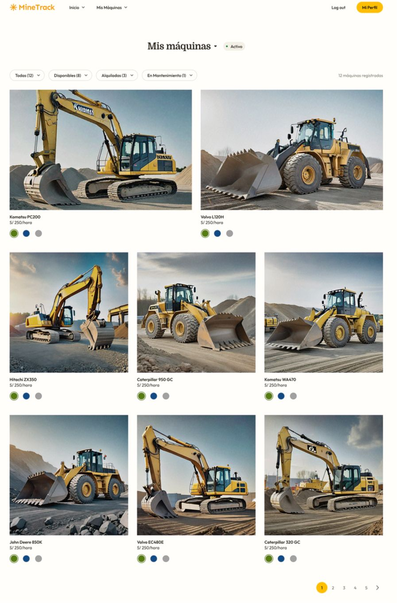

# Capítulo V: Product Implementation, Validation & Deployment

## 5.1 Software Configuration Management

Para el desarrollo de MineTrack se definió una gestión de configuración orientada a mantener orden, trazabilidad y consistencia durante el ciclo de vida del producto. Esta sección documenta las herramientas, repositorios, flujo de trabajo con Git, convenciones de código y configuración de despliegue utilizadas por el equipo.

MineTrack es una solución web orientada a la gestión comercial y técnica de maquinaria pesada minera. La plataforma integra Landing Page, Web Application y RESTful API, con el objetivo de soportar procesos de venta, alquiler, monitoreo IoT, alertas y mantenimiento preventivo.

---

## 5.1.1 Software Development Environment Configuration

Desde el inicio del proyecto se definió un entorno de desarrollo común para todos los integrantes del equipo. Esto permitió reducir problemas de compatibilidad, facilitar la integración de avances y mantener una base técnica coherente para todos los productos de software.

| Categoría | Herramienta / Tecnología | Propósito dentro del proyecto |
|---|---|---|
| Project Management | Trello | Organización de tareas, Sprint Backlog y seguimiento de avance |
| Requirements Management | GitHub Projects / Trello | Gestión de User Stories, tareas y estado de trabajo |
| Product UX/UI Design | Figma | Elaboración de wireframes, mock-ups y prototipos |
| Software Development - Landing Page | HTML5, CSS3, JavaScript | Desarrollo del sitio web estático del producto |
| Software Development - Frontend Web Application | Vue 3 + Vite | Desarrollo de la aplicación web de MineTrack |
| UI Component Library | PrimeVue | Construcción de componentes visuales reutilizables |
| Software Development - Web Services | ASP.NET Core | Implementación del RESTful API |
| Backend Programming Language | C# | Desarrollo de lógica del lado servidor |
| API Documentation | Swagger / OpenAPI | Documentación y prueba de endpoints |
| Version Control | Git | Control de versiones local |
| Source Code Hosting | GitHub | Gestión colaborativa de repositorios |
| IDE | WebStorm / Visual Studio Code | Desarrollo del frontend, documentación y revisión de código |
| Backend IDE | Visual Studio / Rider | Desarrollo del backend con ASP.NET Core |
| Package Manager | npm | Instalación y administración de dependencias frontend |
| Deployment - Landing Page | GitHub Pages | Publicación del Landing Page |
| Deployment - Web Application | Vercel / Render Static Site | Publicación de la aplicación web frontend |
| Deployment - Web Services | Render | Publicación del RESTful API |

### Configuración local del Frontend Web Application

```bash
npm install
npm run dev
```
```Configuración local del Web Service
dotnet restore
dotnet build
dotnet run
```
La selección de herramientas responde a los lineamientos del Project Statement, que establece el uso de Vue Framework para Frontend Web Applications, PrimeVue como biblioteca de componentes UI, ASP.NET Core con C# para Web Services, Swagger/OpenAPI para documentación de servicios, GitHub para control de versiones, GitFlow Workflow, Conventional Commits y Semantic Versioning.

## 5.1.2 Source Code Management

El proyecto MineTrack se gestionó utilizando GitHub como plataforma principal de control de versiones. Se organizaron repositorios independientes para cada producto de software del alcance del proyecto, permitiendo separar responsabilidades y mantener un flujo de trabajo más ordenado durante el desarrollo.

### Repositorios del proyecto

| Producto | Propósito |
|---|---|
| Landing Page Repository | Desarrollo y despliegue del Landing Page |
| Frontend Web Application Repository | Desarrollo de la aplicación web principal |
| Web Services Repository | Desarrollo del RESTful API |
| Project Report Repository | Gestión del informe y documentación académica |

### GitFlow Workflow

El equipo adoptó GitFlow como estrategia de colaboración y control de versiones. Esta metodología permitió trabajar en nuevas funcionalidades sin afectar la versión estable del proyecto.

Las ramas utilizadas fueron:

| Rama | Descripción |
|---|---|
| `main` | Contiene la versión estable del proyecto |
| `develop` | Rama de integración de funcionalidades |
| `feature/*` | Desarrollo de funcionalidades específicas |
| `release/*` | Preparación de versiones estables |
| `hotfix/*` | Corrección de errores críticos |

### Convención de ramas

```bash
feature/dashboard
feature/iot-monitoring
feature/landing-page
feature/authentication
release/v1.0.0
hotfix/navbar-fix
```
Flujo de trabajo aplicado

El flujo de trabajo utilizado por el equipo fue el siguiente:

Actualizar la rama develop.
Crear una nueva rama feature/*.
Implementar la funcionalidad asignada.
Realizar commits utilizando Conventional Commits.
Publicar la rama en GitHub.
Crear un Pull Request hacia develop.
Revisar y validar cambios antes de integrarlos.
Conventional Commits

Para mantener un historial claro y trazable, el equipo utilizó Conventional Commits.

Formato:
```
<type>: <description>
```
Tipos utilizados:
| Tipo | Uso |
|---|---|
| `feat` | Nueva funcionalidad |
| `fix` | Corrección de errores |
| `docs` | Cambios en documentación |
| `style` | Cambios visuales o de formato |
| `refactor` | Reorganización interna |
| `chore` | Configuración o tareas auxiliares |

Semantic Versioning

El proyecto adoptó Semantic Versioning para organizar las versiones del software.

Formato:
```
MAJOR.MINOR.PATCH
```
Ejemplos:
```
v1.0.0
v1.1.0
v1.1.1
```
| Tipo | Descripción |
|---|---|
| MAJOR | Cambios incompatibles |
| MINOR | Nuevas funcionalidades |
| PATCH | Correcciones de errores |

La utilización de GitFlow, Conventional Commits y Semantic Versioning permitió mejorar la colaboración del equipo, reducir conflictos y mantener trazabilidad sobre los cambios realizados durante el Sprint.

---
## 5.1.3 Source Code Style Guide & Conventions

Para mantener consistencia en el desarrollo de MineTrack, el equipo definió convenciones de código aplicables al Landing Page, Frontend Web Application y Web Services. Estas convenciones permiten que los integrantes trabajen con una misma estructura, mejoren la legibilidad del código y reduzcan errores durante la integración.

Además, se estableció que los nombres de archivos, variables, funciones, clases, componentes y rutas deben escribirse en inglés, siguiendo las buenas prácticas del desarrollo de software.

### Convenciones generales

| Elemento | Convención | Ejemplo |
|---|---|---|
| Variables JavaScript | camelCase | `machineStatus` |
| Funciones JavaScript | camelCase | `calculateHealthScore()` |
| Componentes Vue | PascalCase | `DashboardView.vue` |
| Clases C# | PascalCase | `MachineService` |
| Métodos C# | PascalCase | `GenerateAlert()` |
| Interfaces C# | Prefijo `I` + PascalCase | `IMachineRepository` |
| Archivos CSS | kebab-case | `dashboard-view.css` |
| Ramas Git | kebab-case | `feature/iot-monitoring` |

### Convenciones para HTML y CSS

| Aspecto | Convención aplicada |
|---|---|
| HTML semántico | Uso de etiquetas como `header`, `main`, `section`, `article` y `footer` |
| Nombres de clases | Nombres descriptivos en inglés |
| Organización visual | Separación clara por secciones |
| Responsive design | Uso de media queries y layouts flexibles |
| Accesibilidad | Uso de atributos `alt`, `aria-label` y contraste adecuado |

Ejemplo:

```html
<section class="dashboard-summary" aria-label="Fleet summary">
  <article class="summary-card">
    <h3>Total Machines</h3>
    <p>24 active units</p>
  </article>
</section>
```
### Convenciones para JavaScript y Vue

| Aspecto | Convención aplicada |
|---|---|
| Componentes | Uso de Composition API |
| Variables | camelCase |
| Componentes Vue | PascalCase |
| Archivos de vistas | Sufijo `View.vue` |
| Servicios | Sufijo `Service.js` |
| Datos mockeados | Separados de la lógica visual cuando sea posible |

Ejemplo:
```javascript
const machineStatus = ref('Active');

function calculateHealthScore(machine) {
  return machine.alerts.length === 0 ? 100 : 75;
}
```
### Convenciones para C# y ASP.NET Core

| Aspecto | Convención aplicada |
|---|---|
| Clases | PascalCase |
| Métodos | PascalCase |
| Interfaces | Prefijo `I` |
| Controladores | Sufijo `Controller` |
| Servicios | Sufijo `Service` |
| Repositorios | Sufijo `Repository` |
| DTOs | Sufijo `Dto` |

Ejemplo:
```C#
public interface IMachineRepository
{
    MachineDto GetMachineById(int machineId);
}

public class MachineService
{
    public MachineDto GetMachineStatus(int machineId)
    {
        // Business logic
    }
}
```
### Convenciones de documentación

| Elemento | Convención |
|---|---|
| Commits | Conventional Commits |
| Endpoints | Documentados con Swagger/OpenAPI |
| Sprint evidence | Capturas, tablas y descripción técnica |
| User Stories | Formato “Como..., deseo..., para...” |
| Acceptance Criteria | Formato Given-When-Then |
| Tasks | Descripción, estimación, responsable y estado |

### Accesibilidad e internacionalización

| Aspecto | Aplicación |
|---|---|
| Idioma base | Inglés |
| Segundo idioma | Español latinoamericano |
| i18n | Textos preparados para traducción |
| a11y | Uso de atributos ARIA |
| Contraste | Colores diferenciados para estados y alertas |
| Navegación | Estructura clara y consistente |

Estas convenciones permiten que MineTrack mantenga una base de código ordenada, comprensible y preparada para futuras mejoras en el Landing Page, Frontend Web Application y Web Services.
---

## 5.1.4 Software Deployment Configuration

La configuración de despliegue del proyecto MineTrack fue organizada para permitir que los productos desarrollados puedan ejecutarse fuera del entorno local y ser accesibles públicamente. El objetivo principal fue validar el funcionamiento del Landing Page, Frontend Web Application y Web Services en entornos reales de ejecución.

### Plataformas de despliegue utilizadas

| Producto | Plataforma | Estado |
|---|---|---|
| Landing Page | GitHub Pages | Desplegado |
| Frontend Web Application | Vercel / Render Static Site | En despliegue |
| RESTful API | Render | En despliegue |

### Despliegue del Landing Page

El Landing Page fue desplegado utilizando GitHub Pages para permitir el acceso público al producto.

#### Proceso realizado

1. Desarrollo del Landing Page utilizando HTML5, CSS3 y JavaScript.
2. Organización de assets, imágenes y estilos.
3. Verificación del responsive design.
4. Publicación del repositorio en GitHub.
5. Configuración de GitHub Pages.
6. Validación del acceso público.

#### Comandos utilizados

```bash
npm install
npm run build
```
Despliegue del Frontend Web Application

La aplicación web frontend desarrollada con Vue 3 y Vite fue preparada para despliegue en plataformas cloud.

Proceso realizado
Configuración del proyecto con Vue 3 + Vite.
Instalación de dependencias necesarias.
Configuración de variables de entorno.
Generación del build de producción.
Validación de rutas y navegación.
Preparación para despliegue en Vercel o Render.
```Comandos utilizados
npm install
npm run dev
npm run build
npm run preview
```
Despliegue del RESTful API

El backend desarrollado con ASP.NET Core fue configurado para ser desplegado en Render.

Proceso realizado
Configuración del proyecto ASP.NET Core.
Definición de endpoints RESTful.
Integración de Swagger/OpenAPI.
Configuración de variables de entorno.
Preparación para despliegue cloud.
Validación de endpoints.
```Comandos utilizados
dotnet restore
dotnet build
dotnet run
```
### Variables de entorno utilizadas

| Variable | Propósito |
|---|---|
| `VITE_API_URL` | URL base del backend |
| `ORS_API_KEY` | API Key para servicios externos |
| `ASPNETCORE_ENVIRONMENT` | Configuración del entorno ASP.NET Core |

### Validaciones realizadas

| Validación | Resultado |
|---|---|
| Responsive Design | Correcto |
| Navegación entre secciones | Correcto |
| Carga de assets | Correcto |
| Comunicación frontend-backend | En validación |
| Endpoints REST | En validación |
| Acceso público | Correcto |



## 5.2 Landing Page, Services & Applications Implementation
### 5.2.1 Sprint 1

En esta sección se describe el desarrollo del Sprint 1 del proyecto MineTrack, incluyendo la planificación, organización del equipo, backlog del sprint y evidencias de implementación.

El Sprint 1 se enfocó en la construcción inicial del Landing Page, así como la configuración del entorno de desarrollo y la estructura base del proyecto, permitiendo al equipo establecer una base sólida para los siguientes sprints.

Durante este Sprint, el equipo trabajó de manera colaborativa, distribuyendo responsabilidades y estableciendo objetivos claros, alineados con el cumplimiento del Student Outcome 5, el cual enfatiza la planificación efectiva, liderazgo compartido y trabajo en equipo.

### 5.2.1.1 Sprint Planning 1

En esta sección se describen los aspectos principales del Sprint Planning Meeting correspondiente al Sprint 1, donde el equipo definió los objetivos, alcance y organización del trabajo.

| Sprint # | Sprint 1 |
|----------|---------|
| **Sprint Planning Background** |  |
| Date | 2026-04-20 |
| Time | 08:00 PM |
| Location | Reunión virtual vía Discord|
| Prepared By | Meza Huanacuna, Juan José |
| Attendees (to planning meeting) | Sanchez Arenas, Zahir Emmanuel / Mendoza Machoa, Lionel / Meza Huanacuna, Juan José / Aliquipa Poma, Sebastian Andres / Figueroa Sanchez, Alvaro / Molina Umeres, Nestor |
| Sprint 0 – Review Summary | No aplica, debido a que este es el primer Sprint del proyecto. |
| Sprint 0 – Retrospective Summary | No aplica, al ser el primer Sprint. |
| **Sprint Goal & User Stories** | |
| Sprint 1 Goal | **Our focus is on** developing the initial version of the Landing Page and setting up the development environment. <br> **We believe it delivers** a clear presentation of the value proposition to potential users and a solid base for future development. <br> **This will be confirmed when** the Landing Page is accessible and includes key sections such as Home, Features, and Contact.|
| Sprint 1 Velocity | El equipo definió una capacidad de trabajo de **15 Story Points** para este Sprint, considerando la disponibilidad de los integrantes. | 
| Sum of Story Points| La suma total de Story Points asignados a las User Stories seleccionadas para este Sprint es de: **15 Story Points**  |


### 5.2.1.2 Aspect Leaders and Collaborators

En esta sección se presenta la matriz de liderazgo y colaboración (LACX), la cual define, para cada aspecto del Sprint 1, quién asume el rol de líder (Leader) y quiénes participan como colaboradores (Collaborators).

Los aspectos seleccionados están directamente relacionados con el alcance del Sprint 1, el cual se centró en la implementación inicial del Landing Page y la configuración del entorno de desarrollo del sistema MineTrack.

Los principales aspectos considerados fueron:

- Desarrollo del Landing Page  
- Configuración del entorno de desarrollo  
- Gestión del repositorio en GitHub  
- Diseño de interfaz (UI/UX)  
- Documentación del proyecto  

Esta distribución permite mejorar la organización del equipo, asignando responsabilidades claras y fomentando la colaboración activa, en línea con el cumplimiento del Student Outcome 5.

---

### Leadership and Collaboration Matrix (LACX)

| Team Member (Last Name, First Name) | GitHub Username | Landing Page | Entorno Dev | GitHub | UI/UX | Documentación |
|------------------------------------|----------------|--------------|-------------|--------|-------|--------------|
| Sanchez Arenas, Zahir Emmanuel | zahirsanchez | L | C | C | L | C |
| Mendoza Machoa, Lionel | lionelmendoza | C | L | C | C | L |
| Meza Huanacuna, Juan José | JuanMHZ12 | L | C | L | C | C |
| Aliquipa Poma, Sebastian Andres | sebastianaliquipa | C | C | C | L | C |
| Figueroa Sanchez, Alvaro | alvarofigueroa | C | L | C | C | L |
| Molina Umeres, Nestor | nestormolina | C | C | L | C | C |

---

### Leyenda

- **L (Leader):** Responsable principal del aspecto  
- **C (Collaborator):** Apoyo en la ejecución del aspecto  

---

### Justificación

La asignación de líderes y colaboradores se realizó considerando la distribución equitativa de responsabilidades y la participación activa de todos los integrantes del equipo.

Cada miembro asumió al menos un rol de liderazgo, lo cual permitió fortalecer la coordinación interna y asegurar el cumplimiento de los objetivos del Sprint.

Además, esta organización está alineada con las tareas definidas en el Sprint Backlog, garantizando coherencia entre la planificación y la ejecución del trabajo.

### 5.2.1.3 Sprint Backlog 1

El Sprint Backlog 1 contiene las User Stories seleccionadas para cumplir con el objetivo del Sprint, enfocadas en la implementación inicial del sistema MineTrack, incluyendo la presentación del producto y la simulación del monitoreo de maquinaria.

| ID | User Story | Description | Priority | Story Points |
|----|-----------|------------|----------|--------------|
| US01 | Landing Page - Home | Como usuario, quiero visualizar la propuesta de MineTrack para entender su utilidad | Alta | 3 |
| US02 | Visualización de monitoreo | Como usuario, quiero ver datos de estado de maquinaria para conocer su funcionamiento | Alta | 3 |
| US03 | Sección mantenimiento | Como usuario, quiero entender cómo funciona el mantenimiento preventivo | Alta | 2 |
| US04 | Configuración del entorno | Como desarrollador, quiero configurar el entorno para iniciar el proyecto | Alta | 3 |
| US05 | Estructura base Angular | Como desarrollador, quiero crear la base del sistema | Alta | 2 |
| US06 | Simulación de alertas IoT | Como sistema, quiero mostrar alertas de fallas para validar el monitoreo inteligente | Media | 2 |

**Total Story Points: 15**

### 5.2.1.4 Development Evidence for Sprint Review

Durante el Sprint 1 se desarrollaron los siguientes componentes:

- Implementación de la Landing Page inicial  
- Creación de componentes en Angular (Home, Features, Contact)  
- Configuración del entorno de desarrollo  
- Integración de datos simulados relacionados con monitoreo de maquinaria  

Se utilizaron buenas prácticas de desarrollo, incluyendo modularización del código y uso de componentes reutilizables.

---
### 5.2.1.5 Execution Evidence for Sprint Review

Durante la ejecución del Sprint 1, el equipo trabajó de manera organizada utilizando GitHub como herramienta principal de control de versiones.

Se evidenciaron las siguientes actividades:

- Uso de ramas feature para el desarrollo de funcionalidades específicas  
- Realización de commits constantes y descriptivos  
- Integración progresiva de cambios hacia la rama develop  
- Validación continua del funcionamiento mediante pruebas locales  

El flujo de trabajo permitió mantener un desarrollo ordenado y alineado con los objetivos del Sprint.

---
### 5.2.1.6 Services Documentation Evidence for Sprint Review

Se documentaron los componentes y servicios principales del sistema MineTrack, con el objetivo de entender el flujo de información y la interacción entre sus partes.

Entre los elementos documentados se incluyen:

- Flujo de datos de monitoreo de maquinaria (simulado)  
- Representación de variables como estado, uso y alertas  
- Interacción entre la interfaz de usuario y la lógica del sistema  
- Estructura de componentes del Landing Page  

Esta documentación permite comprender cómo el sistema gestiona la información relacionada con el mantenimiento preventivo y el seguimiento de maquinaria.

---
### 5.2.1.7 Software Deployment Evidence for Sprint Review

Se realizó el despliegue de la aplicación en un entorno local, permitiendo validar su funcionamiento fuera del entorno de desarrollo.

Se logró:

- Ejecutar correctamente la aplicación  
- Visualizar la Landing Page con sus secciones implementadas  
- Verificar la navegación entre componentes  
- Validar la correcta representación de datos simulados  

Este despliegue inicial permitió comprobar la viabilidad del sistema MineTrack como solución digital.

---
### 5.2.1.8 Team Collaboration Insights during Sprint

Durante el Sprint 1, el equipo trabajó de manera colaborativa, distribuyendo responsabilidades y manteniendo una comunicación constante.

Se utilizaron herramientas como GitHub para coordinar el desarrollo y gestionar el código fuente. Además, se realizaron reuniones de seguimiento para revisar avances y resolver dificultades.

Cada integrante participó activamente tanto en tareas de desarrollo como en la toma de decisiones, lo cual permitió avanzar de manera eficiente.

Esta dinámica de trabajo refleja el cumplimiento del Student Outcome 5, evidenciando la capacidad del equipo para colaborar, organizarse y lograr objetivos comunes dentro del proyecto.

## Conclusiones

- La implementación del Sprint 1 mediante la metodología Scrum permitió organizar de manera eficiente el desarrollo del proyecto MineTrack, definiendo objetivos claros, backlog y roles, lo que facilitó el cumplimiento del Sprint Goal.

- El desarrollo de la Landing Page junto con la simulación de monitoreo de maquinaria evidenció la viabilidad de la solución, demostrando cómo el uso de tecnologías IoT puede aportar valor en la gestión de mantenimiento preventivo y postventa.

- El trabajo colaborativo del equipo, apoyado en herramientas como GitHub y en la correcta asignación de responsabilidades (LACX), permitió mantener un flujo de desarrollo ordenado, cumpliendo con el Student Outcome 5.
- 
## Bibliografía

- Schwaber, K., & Sutherland, J. (2020). *The Scrum Guide*. Scrum.org. https://scrumguides.org/

- Pressman, R. S., & Maxim, B. R. (2020). *Software engineering: A practitioner’s approach* (9th ed.). McGraw-Hill.

- Sommerville, I. (2016). *Software engineering* (10th ed.). Pearson.

- Atzori, L., Iera, A., & Morabito, G. (2010). The Internet of Things: A survey. *Computer Networks, 54*(15), 2787–2805. https://doi.org/10.1016/j.comnet.2010.05.010

- Gubbi, J., Buyya, R., Marusic, S., & Palaniswami, M. (2013). Internet of Things (IoT): A vision, architectural elements, and future directions. *Future Generation Computer Systems, 29*(7), 1645–1660. https://doi.org/10.1016/j.future.2013.01.010

- Lee, J., Bagheri, B., & Kao, H. A. (2015). A cyber-physical systems architecture for industry 4.0-based manufacturing systems. *Manufacturing Letters, 3*, 18–23. https://doi.org/10.1016/j.mfglet.2014.12.001

- Porter, M. E., & Heppelmann, J. E. (2014). How smart, connected products are transforming competition. *Harvard Business Review, 92*(11), 64–88. https://hbr.org/2014/11/how-smart-connected-products-are-transforming-competition

- Schwab, K. (2017). *The fourth industrial revolution*. Crown Business.

- Newman, S. (2021). *Building microservices* (2nd ed.). O’Reilly Media.

- Fowler, M. (2018). *Refactoring: Improving the design of existing code* (2nd ed.). Addison-Wesley.
  
## Anexos

Link del repositorio: [Repositorio MineTrack](https://github.com/minedev-upc-startup/upc-pre-202610-1asi0730-report)

