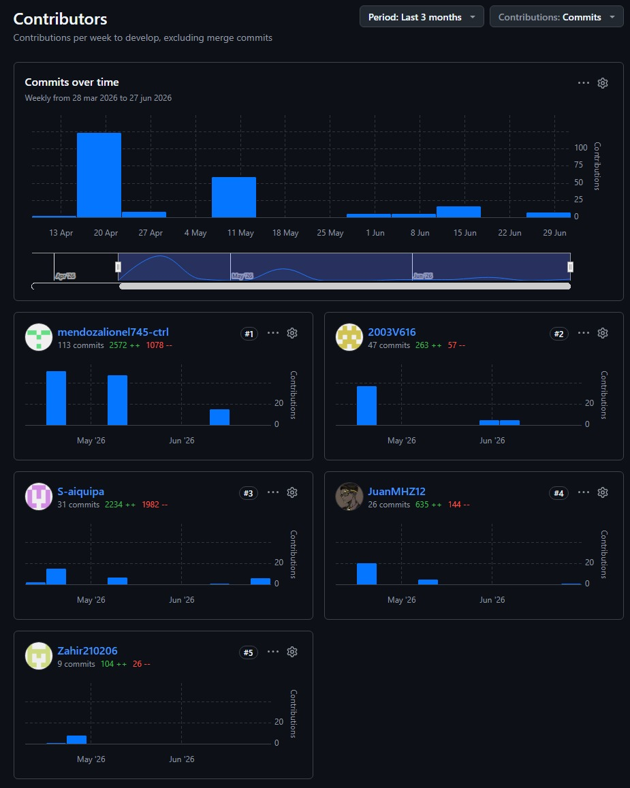
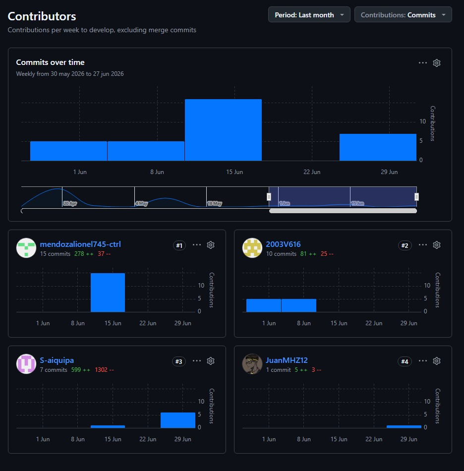
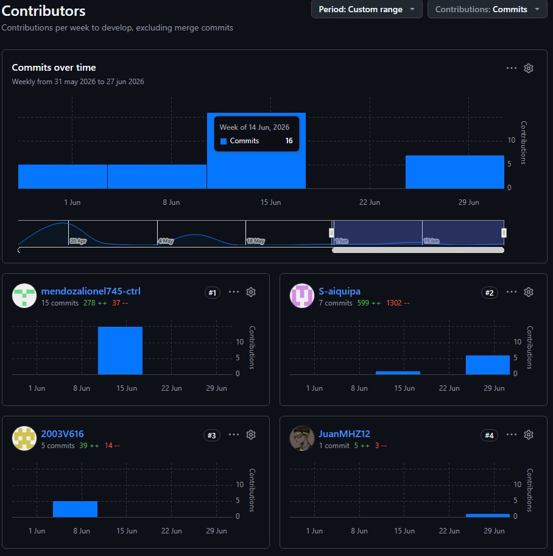

  

Universidad Peruana de Ciencias Aplicadas

Carrera de Ingeniería de Software

 

<strong>1ASI0730</strong>

<strong>Aplicaciones Web</strong>

NRC

<strong>10215</strong>

<strong>Informe del Trabajo Final</strong>

Docente

<strong>Velásquez Núñez, Ángel Augusto</strong>

Equipo

<strong>BrainStorm</strong>

Proyecto

<strong>MineTrack</strong>

<strong>Integrantes</strong>

| **Código** | **Apellidos y Nombres** |
| :--- | :--- |
| U202315324 | Sanchez Arenas, Zahir Emmanuel |
| U202417433 | Mendoza Machoa, Lionel |
| U202320574 | Meza Huanacune, Juan José |
| U201916755 | Aiquipa Poma, Sebastian Andres |
| U20231A269 | Figueroa Sanchez, Alvaro |
| U202317631 | Molina Umeres, Nestor Marcial |

<strong>Período 202610</strong>

<strong>Julio 2026</strong>

## Registro de Versiones del Informe

| Versión | Fecha | Autor | Descripción de modificación |
| :--- | :--- | :--- | :--- |
| 1.0 | 18/04/2026 | Aiquipa Poma, Sebastian Andres | Agregó estructura inicial del informe con carátula y archivos de capítulos |
| 1.1 | 21/04/2026 | Meza Huanacune, Juan José | Agregó perfil del participante Juan Meza y Capítulo V con secciones de implementación y despliegue |
| 1.2 | 21/04/2026 | Meza Huanacune, Juan José | Agregó secciones de gestión de código fuente y convenciones de codificación |
| 1.3 | 21/04/2026 | Meza Huanacune, Juan José | Agregó sección de configuración de despliegue de software |
| 1.4 | 21/04/2026 | Meza Huanacune, Juan José | Agregó Sprint Planning 1, Sprint Backlog 1 y LACX del Sprint 1 |
| 1.5 | 23/04/2026 | Mendoza Machoa, Lionel | Migró contenido de Capítulos 1 y 2 desde borrador del informe |
| 1.6 | 23/04/2026 | Figueroa Sanchez, Alvaro | Agregó diagrama de Event Storming y sección 4.6.1 |
| 1.7 | 23/04/2026 | Figueroa Sanchez, Alvaro | Agregó diagrama de contexto C4 (sección 4.6.2) |
| 1.8 | 24/04/2026 | Aiquipa Poma, Sebastian Andres | Agregó secciones 4.1.1 General Style Guidelines y 4.1.2 hasta 4.5 de Product Design |
| 1.9 | 24/04/2026 | Figueroa Sanchez, Alvaro | Agregó diagramas de contenedores y componentes C4 (secciones 4.6.3 y 4.6.4) |
| 1.10 | 24/04/2026 | Meza Huanacune, Juan José | Agregó Sprint Backlog 1, evidencia de desarrollo, ejecución y despliegue del Sprint 1 |
| 1.11 | 24/04/2026 | Mendoza Machoa, Lionel | Agregó Capítulo 3 con User Stories y Product Backlog |
| 1.12 | 24/04/2026 | Aiquipa Poma, Sebastian Andres | Agregó wireframes y mockups de la Web Application (13 pantallas) con flujos de tareas y usuario |
| 1.13 | 24/04/2026 | Figueroa Sanchez, Alvaro | Agregó diagramas de clases UML (sección 4.7.1) y diagrama de base de datos (sección 4.8.1) |
| 1.14 | 24/04/2026 | Mendoza Machoa, Lionel | Agregó Ubiquitous Language y Event Storming al Capítulo 2 |
| 1.15 | 24/04/2026 | Aiquipa Poma, Sebastian Andres | Agregó assets de Style Guide (colores, tipografía, logo) y actualizó información del equipo en README |
| 1.16 | 24/04/2026 | Mendoza Machoa, Lionel | Actualizó carátula y contenido de Capítulo 1 |
| 1.17 | 24/04/2026 | Meza Huanacune, Juan José | Agregó tabla de integrantes con roles, perfiles y secciones de conclusiones, bibliografía y anexos al README |
| 1.18 | 28/04/2026 | Sanchez Arenas, Zahir Emmanuel | Actualizó Capítulo 2 y subió portadas de entrevistas |
| 1.19 | 01/05/2026 | Sanchez Arenas, Zahir Emmanuel | Corrigió carátula, tabla de contenidos, detalles de integrantes y rutas de imágenes de User Flow |
| 1.20 | 13/05/2026 | Mendoza Machoa, Lionel | Actualizó Capítulos 1, 2 y 3 con correcciones de contenido para entrega TB1 |
| 1.21 | 13/05/2026 | Meza Huanacune, Juan José | Actualizó secciones 5.1.1, 5.1.2, 5.1.3 y 5.1.4 con evidencias de configuración del entorno de desarrollo |
| 1.22 | 13/05/2026 | Aiquipa Poma, Sebastian Andres | Agregó estructura del Sprint 1, imágenes, logs de GitHub y Sprint Planning 2 al Capítulo 5 |
| 1.23 | 13/05/2026 | Aiquipa Poma, Sebastian Andres | Agregó URL de despliegue en Firebase y capturas de ejecución y Trello del Sprint 2 |
| 1.24 | 14/05/2026 | Mendoza Machoa, Lionel | Actualizó Capítulo 3 con ajustes finales para entrega TB1 |
| 1.25 | 02/06/2026 | Figueroa Sanchez, Alvaro | Agregó estructura del Sprint 3 y sección 5.2.3.1 Sprint Planning 3 al Capítulo 5 |
| 1.26 | 04/06/2026 | Figueroa Sanchez, Alvaro | Agregó sección 5.2.3.2 Aspect Leaders and Collaborators del Sprint 3 |
| 1.27 | 11/06/2026 | Figueroa Sanchez, Alvaro | Agregó captura del tablero Trello del Sprint 3 y sección 5.2.3.3 Sprint Backlog 3 |
| 1.28 | 19/06/2026 | Mendoza Machoa, Lionel | Actualizó Capítulos 1 y 5 con contenido del Sprint 3 para entrega AV2 |
| 1.29 | 19/06/2026 | Aiquipa Poma, Sebastian Andres | Agregó evidencia de backend, Swagger API y detalles de despliegue del Sprint 3 al Capítulo 5 |
| 1.30 | 29/06/2026 | Aiquipa Poma, Sebastian Andres | Refinó Capítulo 1 con propuesta de valor actualizada, misión y visión; reestructuró Capítulo 3 con User Stories corregidas y alcance revisado; actualizó README con información del equipo y logo |
| 1.31 | 29/06/2026 | Aiquipa Poma, Sebastian Andres | Refinó análisis competitivo, posicionamiento de mercado y SWOT en Capítulo 2; reestructuró análisis de entrevistas para mayor claridad |
| 1.32 | 30/06/2026 | Aiquipa Poma, Sebastian Andres | Refinó Problem Statements, segmentos objetivo e hipótesis del Lean UX Process en Capítulo 1 |
| 1.33 | 30/06/2026 | Meza Huanacune, Juan José | Actualizó historial de versiones del informe, evidencias de colaboración, Lean UX Assumptions y Sprint 3 Goal |
| 1.34 | 30/06/2026 | Mendoza Machoa, Lionel | Revisó y actualizó Capítulo 1 con detalles de startup y solución; actualizó Capítulo 5 con contenido del Sprint 3 |
| 1.35 | 01/07/2026 | Mendoza Machoa, Lionel | Actualizó Capítulo 5 con ajustes finales del Sprint 3 |
| 1.36 | 02/07/2026 | Aiquipa Poma, Sebastian Andres | Actualizó detalles del Sprint 3 con objetivos refinados, User Stories, evidencias de backend y formatos de tablas en Capítulo 5; actualizó referencia de logo en Capítulo 4 |
| 1.37 | 02/07/2026 | Mendoza Machoa, Lionel | Actualizó README con información del proyecto y equipo |
| 1.38 | 02/07/2026 | Sanchez Arenas, Zahir Emmanuel | Agregó saltos de página, corrigió Student Outcome y configuración de exportación a PDF |
| 1.39 | 06/07/2026 | Aiquipa Poma, Sebastian Andres | Actualizó carátula del informe al formato correcto según el Project Statement |

---

## Project Report Collaboration Insights

### AV1

Durante el Sprint 1 el equipo organizó las actividades iniciales del proyecto utilizando GitHub Projects. Se definieron las tareas principales relacionadas con la planificación, el desarrollo de la primera versión del Landing Page y la documentación inicial.

  

| **Integrante** | **Insight** |
| :--- | :--- |
| Sanchez Arenas, Zahir Emmanuel | Contribuyó en la etapa de configuración inicial, apoyando con la estructura base del repositorio y la documentación temprana. |
| Mendoza Machoa, Lionel | Lideró la carga técnica al inicio del sprint, estableciendo los cimientos del código y manteniendo un flujo de integración constante. |
| Meza Huanacune, Juan José | Concentró sus aportes en hitos clave del desarrollo, logrando integraciones importantes durante la etapa central del sprint. |
| Aiquipa Poma, Sebastian Andres | Tuvo una participación destacada y sostenida, impulsando fuertemente el desarrollo de la Landing Page y los componentes visuales. |
| Figueroa Sanchez, Alvaro | Apoyó de manera continua en la consolidación de la primera versión, colaborando en tareas de revisión y soporte en el desarrollo. |
| Molina Umeres, Nestor Marcial | Colaboró activamente en la organización de las tareas dentro de GitHub Projects y en la estructuración de la planificación inicial. |

---

### TB1

Durante el Sprint 2 se actualizó el tablero del proyecto para incorporar las actividades del Frontend Web Application y la nueva versión del Landing Page. Esto permitió hacer seguimiento al avance del equipo y cumplir con los entregables del trabajo parcial.

  

| **Integrante** | **Insight** |
| :--- | :--- |
| Sanchez Arenas, Zahir Emmanuel | Contribuyó de manera sostenida durante las primeras semanas de junio, apoyando en la estructuración y tareas preliminares del Frontend. |
| Mendoza Machoa, Lionel | Lideró el desarrollo técnico durante la fase central del sprint, con un pico de productividad clave a mediados de junio para la implementación del Frontend Web. |
| Meza Huanacune, Juan José | Realizó aportes técnicos y de configuración muy puntuales al inicio del sprint, sentando las bases operativas para esta iteración. |
| Aiquipa Poma, Sebastian Andres | Concentró sus mayores esfuerzos hacia el final del sprint, asegurando la integración, el diseño y el refinamiento previo a la entrega del trabajo parcial. |
| Figueroa Sanchez, Alvaro | Colaboró activamente en la revisión de código y estabilización de la nueva versión del Landing Page, asegurando la calidad del entregable. |
| Molina Umeres, Nestor Marcial | Enfocó su colaboración en la gestión ágil, actualización del tablero de GitHub Projects y el seguimiento continuo de los entregables del equipo. |

---

### AV2

Durante el Sprint 3 el tablero fue actualizado con las actividades relacionadas con Web Services, entrevistas de validación, videos del proyecto y mejoras de la aplicación web.

  

| **Integrante** | **Insight** |
| :--- | :--- |
| Sanchez Arenas, Zahir Emmanuel | Aportó de forma constante durante las primeras semanas del sprint, colaborando en la estructuración base y configuración de los nuevos requerimientos. |
| Mendoza Machoa, Lionel | Lideró la carga técnica durante la fase central del sprint, enfocándose fuertemente en el desarrollo, integración y despliegue de los Web Services. |
| Meza Huanacune, Juan José | Tuvo intervenciones precisas en la etapa final de la iteración, apoyando en ajustes de código específicos y revisiones de cierre. |
| Aiquipa Poma, Sebastian Andres | Concentró su mayor esfuerzo técnico en la recta final del sprint, asegurando la integración de las mejoras en la aplicación web y estabilizando la versión final. |
| Figueroa Sanchez, Alvaro | Enfocó su contribución en las entregas no orientadas al código, gestionando el desarrollo de las entrevistas de validación y la producción de los videos del proyecto. |

---

# Tabla de contenidos

## [Capítulo I: Introducción](Capitulo_1.md)

- [1.1 Startup Profile](Capitulo_1.md#11-startup-profile)
  - [1.1.1 Descripción de la Startup](Capitulo_1.md#111-descripción-de-la-startup)
  - [1.1.2 Perfiles de integrantes del equipo](Capitulo_1.md#112-perfiles-de-integrantes-del-equipo)
- [1.2 Solution Profile](Capitulo_1.md#12-solution-profile)
  - [1.2.1 Antecedentes y problemática](Capitulo_1.md#121-antecedentes-y-problemática)
  - [1.2.2 Lean UX Process](Capitulo_1.md#122-lean-ux-process)
    - [1.2.2.1 Lean UX Problem Statements](Capitulo_1.md#1221-lean-ux-problem-statements)
    - [1.2.2.2 Lean UX Assumptions](Capitulo_1.md#1222-lean-ux-assumptions)
    - [1.2.2.3 Lean UX Hypothesis Statements](Capitulo_1.md#1223-lean-ux-hypothesis-statements)
    - [1.2.2.4 Lean UX Canvas](Capitulo_1.md#1224-lean-ux-canvas)
- [1.3 Segmentos Objetivo](Capitulo_1.md#13-segmentos-objetivo)

## [Capítulo II: Requirements Elicitation & Analysis](Capitulo_2.md)

- [2.1 Competidores](Capitulo_2.md#21-competidores)
  - [2.1.1 Análisis competitivo](Capitulo_2.md#211-análisis-competitivo)
  - [2.1.2 Estrategias y tácticas frente a competidores](Capitulo_2.md#212-estrategias-y-tácticas-frente-a-competidores)
- [2.2 Entrevistas](Capitulo_2.md#22-entrevistas)
  - [2.2.1 Diseño de entrevistas](Capitulo_2.md#221-diseño-de-entrevistas)
  - [2.2.2 Registro de entrevistas](Capitulo_2.md#222-registro-de-entrevistas)
  - [2.2.3 Análisis de entrevistas](Capitulo_2.md#223-análisis-de-entrevistas)
- [2.3 Needfinding](Capitulo_2.md#23-needfinding)
  - [2.3.1 User Personas](Capitulo_2.md#231-user-personas)
  - [2.3.2 User Task Matrix](Capitulo_2.md#232-user-task-matrix)
  - [2.3.3 User Journey Mapping](Capitulo_2.md#233-user-journey-mapping)
  - [2.3.4 Empathy Mapping](Capitulo_2.md#234-empathy-mapping)
- [2.4 Big Picture EventStorming](Capitulo_2.md#24-big-picture-eventstorming)
- [2.5 Ubiquitous Language](Capitulo_2.md#25-ubiquitous-language)

## [Capítulo III: Requirements Specification](Capitulo_3.md)

- [3.1 User Stories](Capitulo_3.md#31-user-stories)
- [3.2 Impact Mapping](Capitulo_3.md#32-impact-mapping)
- [3.3 Product Backlog](Capitulo_3.md#33-product-backlog)

## [Capítulo IV: Product Design](Capitulo_4.md)

- [4.1 Style Guidelines](Capitulo_4.md#41-style-guidelines)
  - [4.1.1 General Style Guidelines](Capitulo_4.md#411-general-style-guidelines)
  - [4.1.2 Web Style Guidelines](Capitulo_4.md#412-web-style-guidelines)
- [4.2 Information Architecture](Capitulo_4.md#42-information-architecture)
  - [4.2.1 Organization Systems](Capitulo_4.md#421-organization-systems)
  - [4.2.2 Labeling Systems](Capitulo_4.md#422-labeling-systems)
  - [4.2.3 SEO Tags and Meta Tags](Capitulo_4.md#423-seo-tags-and-meta-tags)
  - [4.2.4 Searching Systems](Capitulo_4.md#424-searching-systems)
  - [4.2.5 Navigation Systems](Capitulo_4.md#425-navigation-systems)
- [4.3 Landing Page UI Design](Capitulo_4.md#43-landing-page-ui-design)
  - [4.3.1 Landing Page Wireframe](Capitulo_4.md#431-landing-page-wireframe)
  - [4.3.2 Landing Page Mock-up](Capitulo_4.md#432-landing-page-mock-up)
- [4.4 Web Applications UX/UI Design](Capitulo_4.md#44-web-applications-uxui-design)
  - [4.4.1 Web Applications Wireframes](Capitulo_4.md#441-web-applications-wireframes)
  - [4.4.2 Web Applications Wireflow Diagrams](Capitulo_4.md#442-web-applications-wireflow-diagrams)
  - [4.4.3 Web Applications Mock-ups](Capitulo_4.md#443-web-applications-mock-ups)
  - [4.4.4 Web Applications User Flow Diagrams](Capitulo_4.md#444-web-applications-user-flow-diagrams)
- [4.5 Web Applications Prototyping](Capitulo_4.md#45-web-applications-prototyping)
- [4.6 Domain-Driven Software Architecture](Capitulo_4.md#46-domain-driven-software-architecture)
  - [4.6.1 Design-Level EventStorming](Capitulo_4.md#461-design-level-eventstorming)
  - [4.6.2 Software Architecture Context Diagram](Capitulo_4.md#462-software-architecture-context-diagram)
  - [4.6.3 Software Architecture Container Diagrams](Capitulo_4.md#463-software-architecture-container-diagrams)
  - [4.6.4 Software Architecture Components Diagrams](Capitulo_4.md#464-software-architecture-components-diagrams)
- [4.7 Software Object-Oriented Design](Capitulo_4.md#47-software-object-oriented-design)
  - [4.7.1 Class Diagrams](Capitulo_4.md#471-class-diagrams)
- [4.8 Database Design](Capitulo_4.md#48-database-design)
  - [4.8.1 Database Diagrams](Capitulo_4.md#481-database-diagrams)

## [Capítulo V: Product Implementation, Validation & Deployment](Capitulo_5.md)

- [5.1 Software Configuration Management](Capitulo_5.md#51-software-configuration-management)
  - [5.1.1 Software Development Environment Configuration](Capitulo_5.md#511-software-development-environment-configuration)
  - [5.1.2 Source Code Management](Capitulo_5.md#512-source-code-management)
  - [5.1.3 Source Code Style Guide & Conventions](Capitulo_5.md#513-source-code-style-guide--conventions)
  - [5.1.4 Software Deployment Configuration](Capitulo_5.md#514-software-deployment-configuration)
- [5.2 Landing Page, Services & Applications Implementation](Capitulo_5.md#52-landing-page-services--applications-implementation)
  - [5.2.1 Sprint 1](Capitulo_5.md#521-sprint-1)
    - [5.2.1.1 Sprint Planning 1](Capitulo_5.md#5211-sprint-planning-1)
    - [5.2.1.2 Aspect Leaders and Collaborators](Capitulo_5.md#5212-aspect-leaders-and-collaborators)
    - [5.2.1.3 Sprint Backlog 1](Capitulo_5.md#5213-sprint-backlog-1)
    - [5.2.1.4 Development Evidence for Sprint Review](Capitulo_5.md#5214-development-evidence-for-sprint-review)
    - [5.2.1.5 Execution Evidence for Sprint Review](Capitulo_5.md#5215-execution-evidence-for-sprint-review)
    - [5.2.1.6 Services Documentation Evidence for Sprint Review](Capitulo_5.md#5216-services-documentation-evidence-for-sprint-review)
    - [5.2.1.7 Software Deployment Evidence for Sprint Review](Capitulo_5.md#5217-software-deployment-evidence-for-sprint-review)
    - [5.2.1.8 Team Collaboration Insights during Sprint](Capitulo_5.md#5218-team-collaboration-insights-during-sprint)
- [5.3 Validation Interviews](Capitulo_5.md#53-validation-interviews)
  - [5.3.1 Diseño de Entrevistas](Capitulo_5.md#531-diseño-de-entrevistas)
  - [5.3.2 Registro de Entrevistas](Capitulo_5.md#532-registro-de-entrevistas)
  - [5.3.3 Evaluaciones según heurísticas](Capitulo_5.md#533-evaluaciones-según-heurísticas)
- [5.4 Video About-the-Product](Capitulo_5.md#54-video-about-the-product)

## [Conclusiones](Conclusiones_bibliografia.md#conclusiones)

- [Conclusiones y recomendaciones](Conclusiones_bibliografia.md#conclusiones-y-recomendaciones)
- [Video About-the-Team](Conclusiones_bibliografia.md#video-about-the-team)

## Student Outcome

ABET – EAC - Student Outcome 5 Criterio: La capacidad de funcionar efectivamente en un equipo cuyos miembros juntos proporcionan liderazgo, crean un entorno de colaboración e inclusivo, establecen objetivos, planifican tareas y cumplen objetivos.

| Criterio | Acciones realizadas | Conclusiones |
| :--- | :--- | :--- |
| Trabaja en equipo para proporcionar liderazgo en forma conjunta. | **AV1:**  **Sebastián Aiquipa:** Lideré el desarrollo del Capítulo IV secciones 4.1 a 4.5 (Product Design), definiendo la guía de estilo, arquitectura de información, diseño de la Landing Page y 15 pantallas de la aplicación web para los tres roles (Cliente, Propietario, Intermediario). Establecí las convenciones de GitFlow con commits convencionales que el equipo adoptó, y gestioné los Pull Requests a la rama develop asegurando revisiones previas al merge.  **Lionel Mendoza:** Lideré la integración técnica entre el frontend y el backend, asumiendo la responsabilidad de identificar y solucionar bloqueos críticos de infraestructura y lógica de negocio, como los errores de autenticación (IAM) y la configuración de Middlewares y controladores. Guié al equipo en la correcta sincronización de la base de datos mediante migraciones de Entity Framework, asegurando que los entornos locales de desarrollo estuvieran correctamente alineados con los despliegues en producción y resolviendo las desincronizaciones de tablas para evitar caídas del servidor.  **Juan Meza:** Lideré la investigación y redacción del Estado del Arte y el Benchmarking competitivo (Capítulo 2), definiendo y analizando a los principales competidores del sector. Establecí la estructura inicial para las entrevistas a los usuarios, guiando al equipo en la identificación de los dolores del mercado respecto al alquiler de maquinaria pesada.  **Álvaro Figueroa:** Encabezó la creación del Lean UX Canvas y la definición de los Business Outcomes y User Outcomes. Asumió la responsabilidad de estructurar los perfiles de usuario (User Personas), asegurando que los requerimientos del producto estuvieran sólidamente basados en las necesidades reales de propietarios y contratistas.  **Zahir Sanchez:** Dirigió la estructuración del Capítulo 3, detallando exhaustivamente los requerimientos funcionales y no funcionales de la plataforma. Tomó la iniciativa en la redacción de las User Stories principales, estableciendo el formato y los criterios de aceptación que el resto del equipo utilizó como base para sus respectivos módulos.  **TB1:**  **Sebastián Aiquipa:** Lideré la definición de la arquitectura DDD del frontend en Vue 3, estableciendo el scaffold base de bounded contexts con la estructura Domain/Application/Infrastructure/Interfaces que el equipo adoptó como plantilla para todos los módulos. Coordiné el Sprint Planning 2, distribuí las tareas entre los integrantes según sus bounded contexts asignados y gestioné el despliegue de la primera versión de la Web Application en Firebase Hosting.  **Lionel Mendoza:** Lideré la configuración del enrutamiento global (Vue Router) y el manejo centralizado del estado mediante Pinia para el flujo de la aplicación. Asumí la responsabilidad de estructurar las llamadas a la Fake API con Axios, estableciendo el estándar para el consumo de datos asíncronos en el frontend.  **Juan Meza:** Asumió el desarrollo del Bounded Context de IoT (Telemetría), liderando el diseño y la integración de los componentes visuales para los gráficos de monitoreo de maquinaria. Definió la estructura de los dashboards técnicos para el usuario propietario.  **Álvaro Figueroa:** Lideró la implementación del Bounded Context de Reviews y Catálogo, construyendo los componentes reutilizables de Vue para la visualización de la maquinaria disponible y las vistas de calificación, garantizando un diseño responsive y alineado al prototipo de Figma.  **Zahir Sanchez:** Dirigió la implementación del Bounded Context de IAM en el frontend, creando los formularios de Login y Register. Definió las lógicas de validación de entradas de usuario y la gestión inicial de tokens simulados en el LocalStorage.  **AV2:**  **Sebastián Aiquipa:** Lideré la implementación del backend en ASP.NET Core con .NET 10, estableciendo la arquitectura de la solución con los Bounded Contexts de Machinery y Rentals bajo el patrón DDD. Tomé decisiones técnicas clave sobre la estructura de migraciones, la configuración de Entity Framework Core con MySQL en Filess.io y el despliegue en Render, asegurando que el resto del equipo pudiera integrar sus bounded contexts sin bloqueos de infraestructura.  **Lionel Mendoza:** Encabecé la resolución de conflictos críticos a nivel de Middlewares, asegurando que las directivas `[AllowAnonymous]` y las validaciones de controladores permitieran el correcto flujo de peticiones. Lideré la depuración de excepciones de base de datos, estabilizando el entorno local para todo el equipo.  **Juan Meza:** Desarrolló el Bounded Context de IoT en el backend, diseñando los servicios y repositorios necesarios para el registro de telemetría de las máquinas. Tomó la iniciativa en la validación de los JSON de entrada para los sensores simulados.  **Álvaro Figueroa:** Asumió la implementación del Bounded Context de Reviews en .NET, aplicando estrictamente los principios DDD (Entities, Value Objects). Guió el desarrollo de endpoints para la calificación cruzada entre arrendadores y arrendatarios.  **Zahir Sanchez:** Lideró la capa de seguridad y el Bounded Context de IAM en el backend, configurando la autenticación basada en JWT. Definió las configuraciones del `appsettings.json` y estructuró los servicios de encriptación de contraseñas.  **TB2:**  **Sebastián Aiquipa:** Lideré la corrección integral del informe para la entrega final, reestructurando los Capítulos 1, 2 y 3 para alinearlos con el modelo de negocio real del marketplace de alquiler. Tomé decisiones sobre la redefinición de segmentos, epics, User Stories y Technical Stories, y coordiné con el equipo la actualización del Capítulo 5 con el Sprint 4, incluyendo la implementación del cierre de alquiler con el endpoint PATCH /api/v1/rental-requests/{id}/complete.  **Lionel Mendoza:** Lideró la consolidación final de la plataforma, ejecutando pruebas de integración End-to-End (E2E) para garantizar que el flujo completo (desde el registro hasta el alquiler de maquinaria) operara sin fricciones en el entorno de producción, solucionando los últimos bugs de comunicación HTTP.  **Juan Meza:** Tomó el liderazgo en la documentación de la arquitectura final, elaborando y refinando los diagramas de componentes, contenedores y base de datos relacional para reflejar con exactitud la infraestructura desplegada en el reporte final.  **Álvaro Figueroa:** Encabezó la recopilación de lecciones aprendidas y organizó la redacción de la retrospectiva del equipo. Asumió la actualización final de los wireframes e interfaces en el documento para que coincidieran con la Web Application desplegada.  **Zahir Sanchez:** Dirigió la producción de los entregables audiovisuales finales, elaborando el guion, coordinando las grabaciones de todos los miembros para el video "About the Team" y gestionando la demostración funcional del software para la presentación final del curso. | **AV1:** El liderazgo compartido permitió que cada integrante asumiera responsabilidad sobre un módulo específico del reporte, aportando desde su especialidad sin depender de una figura central. Esta distribución de liderazgo fortaleció la autonomía del equipo y aceleró el avance en paralelo de los capítulos, demostrando que un liderazgo distribuido es viable cuando se establecen convenciones claras. Asumir resolución de problemas de integración y bases de datos demostró que gestionar y destrabar cuellos de botella técnicos agiliza enormemente el trabajo del resto del equipo. Esto garantizó que los compañeros pudieran enfocarse en desarrollar nuevas funcionalidades visuales sin retrasos, evidenciando que un liderazgo técnico proactivo es fundamental para mantener el ritmo del proyecto y asegurar la estabilidad de la plataforma.  **TB1:** La división técnica por *Bounded Contexts* en el frontend permitió que cada integrante operara como dueño de su propio módulo, lo que minimizó los conflictos en el repositorio de GitHub. El liderazgo situacional demostró ser altamente efectivo: mientras unos guiaban la arquitectura global, otros lideraban la conexión de APIs o el enrutamiento, generando un avance técnico equitativo.  **AV2:** La transición hacia un backend robusto con DDD exigió un nivel superior de proactividad. La iniciativa de los miembros para investigar, configurar despliegues en la nube y resolver errores de persistencia demostró que un liderazgo técnico distribuido previene bloqueos generales y asegura una integración fluida de subsistemas complejos.  **TB2:** En la fase de cierre, el liderazgo se centró en la validación y el control de calidad. La capacidad del equipo para tomar la iniciativa en áreas como auditoría de código, refinamiento de diagramas de arquitectura y edición audiovisual garantizó el cumplimiento íntegro de la rúbrica final, demostrando madurez profesional en la entrega de software. |
| Crea un entorno colaborativo e inclusivo, establece metas, planifica tareas y cumple objetivos. | **AV1:**  **Sebastián Aiquipa:** Como equipo establecimos metas semanales alineadas al syllabus del curso, usando GitFlow con ramas feature por integrante para evitar bloqueos. Coordinamos mediante reuniones periódicas donde revisamos el estado de cada Capítulo y ajustamos la distribución de tareas según la carga de trabajo. Se adoptó la práctica de Pull Requests con revisión entre pares antes de integrar cambios a la rama develop, lo que permitió mantener la calidad del entregable y resolver dudas técnicas de forma colaborativa. Cada integrante aportó desde su fortaleza (diseño UX/UI, arquitectura, dominio del negocio, documentación) respetando los tiempos y sugerencias de los demás.  **Lionel Mendoza:** Fomenté un entorno de trabajo colaborativo al organizar sesiones conjuntas de depuración con mis compañeros, alineando la estructura de los datos del frontend con las exigencias estrictas de los controladores en C# para superar errores de comunicación. Planifiqué mis tareas respetando estrictamente el flujo de trabajo del repositorio, actualizando y reconstruyendo mi entorno local constantemente para evitar conflictos al integrar el código de otros. Además, para cumplir con el objetivo final del TB2, me encargué de consolidar el análisis del informe, estructurando las conclusiones del proyecto y garantizando el rigor académico mediante la investigación y formato de las referencias bibliográficas en formato APA 7.  **Juan Meza:** Facilitó un entorno inclusivo al organizar lluvias de ideas (brainstorming) para definir el alcance del proyecto. Cumplió con sus metas de análisis competitivo, integrando la retroalimentación del equipo para seleccionar a las empresas que mejor representaban a nuestra competencia directa.  **Álvaro Figueroa:** Apoyó la planificación estableciendo tableros de control visuales para medir el progreso del diseño. Su apertura a la crítica constructiva permitió que las propuestas de UX/UI fueran refinadas colaborativamente, asegurando que todos estuvieran conformes con la identidad visual del producto.  **Zahir Sanchez:** Garantizó que los objetivos de las User Stories fueran claros y compartidos por todos. Planificó la entrega de su sección con anticipación, lo que dio al equipo tiempo suficiente para enlazar los requerimientos funcionales con el diseño de la base de datos sin presiones de última hora.  **TB1:**  **Sebastián Aiquipa:** Planifiqué y coordiné el Sprint 2 estableciendo metas claras por bounded context para cada integrante del equipo. Definí las convenciones de commits, la estructura de ramas en GitFlow y el proceso de revisión de Pull Requests que el equipo siguió durante todo el ciclo. Verifiqué que cada integrante contara con el entorno de desarrollo configurado correctamente para evitar bloqueos durante la implementación del frontend.  **Lionel Mendoza:** Contribuyó al ambiente colaborativo asistiendo a otros miembros del equipo en la resolución de problemas de CORS y peticiones a la Fake API. Planificó sus desarrollos de configuración base para que estuvieran listos a tiempo, evitando que los desarrollos modulares de sus compañeros se vieran retrasados.  **Juan Meza:** Mantuvo una constante comunicación con el área de diseño al programar las vistas de telemetría en Vue. Estableció metas diarias de avance en sus componentes, cumpliendo con la entrega de interfaces interactivas funcionales para el Sprint Review.  **Álvaro Figueroa:** Promovió la reutilización de código al compartir sus componentes de interfaz con el resto del equipo, ahorrando tiempo de desarrollo general. Cumplió con el objetivo de integrar exitosamente el flujo de calificaciones y reseñas en el plazo acordado.  **Zahir Sanchez:** Diseñó una planificación modular para el sistema de identidades, asegurando que las interfaces de registro de clientes y propietarios estuvieran operativas. Su cumplimiento puntual permitió integrar simulaciones de sesión a nivel de frontend de manera armónica.  **AV2:**  **Sebastián Aiquipa:** Coordiné la integración entre el frontend en Vue 3 y el backend real en ASP.NET Core, reemplazando la Fake API por endpoints REST desplegados. Establecí los contratos de API documentados en Swagger como punto de referencia para todo el equipo, lo que permitió que el desarrollo frontend y backend avanzara en paralelo sin bloqueos. Resolví problemas críticos de autenticación JWT y migración de base de datos que afectaban a todos los bounded contexts, permitiendo que el equipo pudiera integrar sus módulos sin interrupciones.  **Lionel Mendoza:** Estableció metodologías colaborativas para manejar desincronizaciones de base de datos a nivel local (`dotnet ef database drop/update`). Cumplió con sus tareas de estabilización de endpoints, instruyendo pacíficamente a sus compañeros sobre la correcta formulación de JSON payloads para evitar rechazos del servidor (HTTP 400).  **Juan Meza:** Trabajó bajo un modelo de metas semanales integrando la persistencia de datos de IoT. Mantuvo un enfoque inclusivo solicitando feedback continuo sobre la estructura de sus tablas SQL, asegurando que se acoplaran perfectamente con el core del negocio.  **Álvaro Figueroa:** Apoyó al equipo documentando y explicando su implementación del patrón CQRS, lo que sirvió de guía para otros miembros. Planificó la inyección de dependencias de sus servicios, cumpliendo con la entrega de un módulo de Reviews completamente funcional en backend.  **Zahir Sanchez:** Facilitó la labor colaborativa al compartir un entorno base configurado para la validación de tokens JWT. Sus esfuerzos de planificación garantizaron que las capas de seguridad no se convirtieran en un obstáculo para las pruebas individuales de los demás integrantes.  **TB2:**  **Sebastián Aiquipa:** Establecí un plan de corrección integral del informe para la entrega TB2, identificando las inconsistencias entre el modelo de negocio real y el contenido de los Capítulos 1, 2 y 3. Distribuí las correcciones por capítulo entre los integrantes del equipo y definí los criterios de calidad que debía cumplir cada sección según el Project Statement. En el frente técnico, planifiqué y ejecuté el Sprint 4 implementando el cierre del ciclo de alquiler con el endpoint de devolución, cumpliendo el Sprint Goal establecido para la entrega final.  **Lionel Mendoza:** Fomentó un ambiente de responsabilidad cruzada asegurando el correcto ensamble de los apartados finales del informe. Su planificación rigurosa permitió recolectar y formatear la bibliografía a tiempo, logrando un entregable académico coherente y consolidado.  **Juan Meza:** Coordinó con todos los programadores para extraer la versión final de la base de datos y plasmarla en el diagrama relacional. Cumplió su objetivo de documentar la arquitectura final, manteniendo un trato comunicativo e inclusivo durante los ajustes de último minuto.  **Álvaro Figueroa:** Dirigió las sesiones de retrospectiva grupales, asegurando que todos los miembros expresaran sus desafíos y aprendizajes de manera segura y constructiva. Su meta de actualizar las evidencias visuales del proyecto se completó sin incidencias.  **Zahir Sanchez:** Desarrolló un cronograma de grabaciones preciso para no interferir con los exámenes de los integrantes. Logró compilar y editar los videos demostrativos y testimoniales, cumpliendo exitosamente con el objetivo multimedia exigido por el syllabus. | **AV1:** El entorno colaborativo creado permitió cumplir con los objetivos del proyecto dentro del plazo establecido, a pesar de la complejidad de coordinar cinco capítulos en paralelo. La planificación semanal y el uso disciplinado de GitFlow demostraron ser prácticas efectivas para un equipo distribuido, minimizando conflictos de integración y asegurando que cada entregable reflejara el aporte colectivo del grupo. La comunicación transparente durante la resolución de errores creó un ambiente de apoyo donde los fallos del código se solucionaron de forma educativa y conjunta, sin buscar culpables. La disciplina al sincronizar los avances locales y el trabajo en la calidad documental demostraron que la colaboración integral (tanto en el código como en el reporte) es clave para cumplir con los hitos del cronograma y entregar un producto de software robusto dentro de los plazos establecidos.  **TB1:** La implementación de rutinas ágiles como planificaciones de Sprints, revisiones de Pull Requests y estandarización del código creó un espacio de trabajo altamente sincronizado. Al fomentar la ayuda entre pares y compartir soluciones, el equipo mitigó rápidamente los bloqueos de desarrollo frontend, garantizando el cumplimiento de los objetivos técnicos a tiempo.  **AV2:** La estandarización mediante contratos API (Swagger) y el respeto a la arquitectura de software unificó el esfuerzo del grupo. La disposición inclusiva para asistir a compañeros con errores complejos de backend o bases de datos confirmó que, bajo un ambiente de confianza técnica, los desafíos de infraestructura pueden ser superados colaborativamente y sin retrasos.  **TB2:** Las metodologías de comunicación constante y la asignación clara de responsabilidades finales permitieron consolidar meses de trabajo sin fricciones. La ejecución disciplinada de las correcciones, sumada al esfuerzo conjunto para testear el producto final y grabar las demostraciones, evidencia un equipo maduro, inclusivo y orientado al cumplimiento impecable de metas. |
